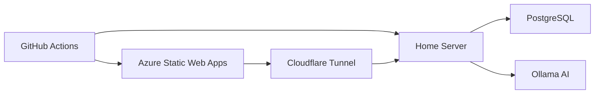

# Menlo GitHub Actions Workflows

This directory contains the CI/CD workflows for the Menlo Home Management application, implementing the hybrid cloud-local architecture defined in [ADR-001](../docs/decisions/adr-001-hosting-strategy.md).

## 🔄 Workflow Overview

### Continuous Integration (CI)

**File**: `ci.yml`

Comprehensive CI pipeline that runs on every push and pull request:

- **Change Detection**: Intelligently detects which parts of the codebase changed
- **Backend Testing**: .NET tests with PostgreSQL, security scanning with CodeQL
- **Frontend Testing**: Angular tests, builds, and Storybook generation
- **Integration Testing**: End-to-end testing across the full stack
- **Documentation**: Markdown linting and link checking
- **Quality Gate**: Ensures all checks pass before allowing merge

### Continuous Deployment (CD)

**Frontend Deployment**: `cd-frontend.yml`
- Deploys Angular PWA to Azure Static Web Apps (free tier)
- Includes Storybook documentation deployment
- Configures routing for API proxy to home server

**Backend Deployment**: `cd-backend.yml`
- Builds and pushes Docker containers to GitHub Container Registry
- Deploys to home server via SSH with zero-downtime strategy
- Manages PostgreSQL and Ollama containers
- Configures Cloudflare Tunnel integration

### Release Management

**File**: `release.yml`

Automated release process for versioned deployments:

- **Semantic Versioning**: Validates version format and creates releases
- **Multi-Platform Builds**: Creates release artifacts for multiple architectures
- **Docker Images**: Builds and publishes versioned container images
- **Release Notes**: Auto-generates changelog from git history
- **Production Deployment**: Triggers production deployment for stable releases

### Dependency Management

**File**: `dependency-updates.yml`

Automated dependency maintenance:

- **Weekly Updates**: Checks for .NET and frontend dependency updates
- **Security Audits**: Scans for vulnerable packages
- **Automated PRs**: Creates pull requests for safe updates
- **Issue Creation**: Creates security issues for vulnerable dependencies

## 🏗️ Architecture Alignment

These workflows implement the **Hybrid Cloud-Local Architecture**:



### Cost Optimization

- **Frontend**: Free Azure Static Web Apps tier
- **Backend**: Home server deployment with minimal cloud costs
- **Container Registry**: Free GitHub Container Registry
- **CI/CD**: GitHub Actions free tier (generous limits)

### Security Features

- **No Exposed Ports**: Cloudflare Tunnel eliminates need for static IP
- **Container Security**: Trivy scanning and minimal attack surface
- **Dependency Auditing**: Automated vulnerability detection
- **Secret Management**: Secure handling of deployment credentials

## 🔧 Required Secrets

Configure these secrets in GitHub repository settings:

### Backend Deployment
- `HOME_SERVER_HOST`: IP address or hostname of home server
- `HOME_SERVER_USER`: SSH username for deployment
- `HOME_SERVER_SSH_KEY`: Private SSH key for server access
- `DATABASE_CONNECTION_STRING`: PostgreSQL connection string
- `POSTGRES_USER`: PostgreSQL username
- `POSTGRES_PASSWORD`: PostgreSQL password

### Frontend Deployment
- `AZURE_STATIC_WEB_APPS_API_TOKEN`: Azure Static Web Apps deployment token

## 📊 Required Variables

Configure these variables in GitHub repository settings:

### Application Configuration
- `API_BASE_URL`: Base URL for the API (e.g., `https://api.menlo.boshoff.dev`)
- `FRONTEND_URL`: Frontend application URL
- `POSTGRES_DB`: PostgreSQL database name (default: `menlo`)
- `OLLAMA_BASE_URL`: Ollama service URL (default: `http://ollama:11434`)

### Optional Features
- `DEPLOY_STORYBOOK`: Set to `true` to enable Storybook deployment
- `STORYBOOK_URL`: Storybook documentation URL
- `CLOUDFLARE_TUNNEL_ENABLED`: Set to `true` if using Cloudflare Tunnel

## 🚀 Deployment Process

### Development Workflow

1. **Feature Development**: Create feature branch
2. **Automated Testing**: CI runs on every push
3. **Code Review**: Pull request with automated checks
4. **Merge to Main**: Triggers production deployment

### Production Deployment

1. **Frontend**: Automatically deployed to Azure Static Web Apps
2. **Backend**: Blue-green deployment to home server
3. **Health Checks**: Automated verification of deployment
4. **Rollback**: Automatic rollback on deployment failure

### Release Process

1. **Create Tag**: Push semantic version tag (e.g., `v1.0.0`)
2. **Automated Build**: Release workflow creates artifacts
3. **GitHub Release**: Creates release with artifacts and notes
4. **Production Deploy**: Stable releases automatically deploy

## 🔍 Monitoring and Observability

### Workflow Monitoring

- **GitHub Actions**: Built-in workflow monitoring and logs
- **Deployment Status**: Environment status tracking
- **Artifact Storage**: Release artifacts and test results

### Application Monitoring

- **Health Checks**: Automated endpoint monitoring
- **Container Health**: Docker container health monitoring
- **Log Aggregation**: Centralized logging via Docker

## 🛠️ Local Development

To test workflows locally:

```bash
# Install act for local GitHub Actions testing
# https://github.com/nektos/act

# Test CI workflow
act push

# Test with specific event
act push --eventpath .github/test-events/push.json
```

## 📚 Related Documentation

- [Hosting Strategy ADR](../docs/decisions/adr-001-hosting-strategy.md) - Architecture decisions
- [Implementation Roadmap](../docs/requirements/implementation-roadmap.md) - Development plan
- [Architecture Document](../docs/explanations/architecture-document.md) - System architecture

---

*These workflows implement the cost-conscious, privacy-first architecture defined for the Menlo Home Management application, balancing automation with operational simplicity.*
