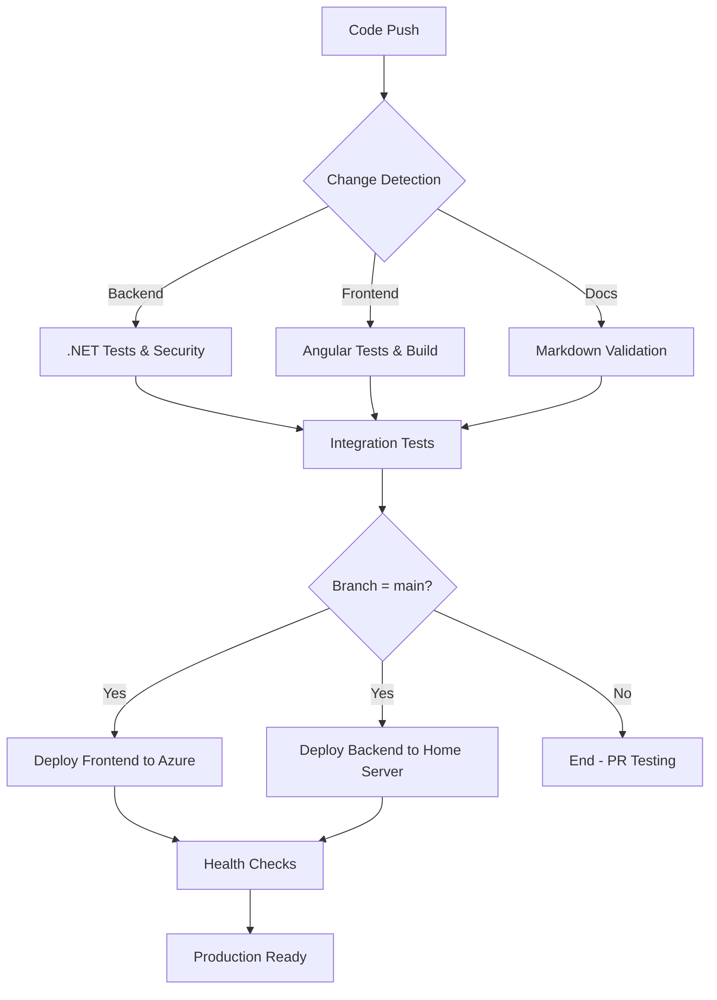

# GitHub Actions CI/CD Implementation Summary

## 🎯 Overview

I've implemented a comprehensive GitHub Actions CI/CD pipeline for the Menlo Home Management application that aligns perfectly with your hybrid cloud-local architecture defined in [ADR-001](docs/decisions/adr-001-hosting-strategy.md).

## 📁 Files Created

### Core Workflows
- **`.github/workflows/ci.yml`** - Comprehensive CI pipeline with change detection
- **`.github/workflows/cd-frontend.yml`** - Frontend deployment to Azure Static Web Apps
- **`.github/workflows/cd-backend.yml`** - Backend deployment to home server
- **`.github/workflows/release.yml`** - Automated release management
- **`.github/workflows/dependency-updates.yml`** - Automated dependency maintenance

### Docker Configuration
- **`Dockerfile`** - Multi-stage .NET 9 container build
- **`.dockerignore`** - Optimized container build context

### Deployment Scripts
- **`deployment/setup-home-server.sh`** - Automated home server setup
- **`deployment/README.md`** - Comprehensive deployment guide

### Supporting Files
- **`.github/workflows/README.md`** - Workflow documentation
- **`.github/markdown-link-check-config.json`** - Documentation link validation

## 🔄 CI/CD Architecture



## 🏗️ Architecture Alignment

The workflows implement your **Hybrid Cloud-Local Strategy**:

### Frontend (Cloud)
- **Azure Static Web Apps** (Free tier)
- **Global CDN** distribution
- **Automatic SSL** certificates
- **Custom domain** support

### Backend (Home Server)
- **Docker containers** on home server
- **Cloudflare Tunnel** for secure access
- **PostgreSQL** and **Ollama** local hosting
- **Zero-downtime** deployments

### Cost Optimization
- **Free tiers** maximized (Azure, GitHub, Cloudflare)
- **Minimal cloud costs** (~R165-365/month as planned)
- **Local AI processing** (no external AI service costs)

## 🔧 Required Configuration

### GitHub Secrets (Backend)
```bash
HOME_SERVER_HOST         # Your home server IP/hostname
HOME_SERVER_USER         # SSH username (suggested: menlo)
HOME_SERVER_SSH_KEY      # Private SSH key for deployment
DATABASE_CONNECTION_STRING # PostgreSQL connection
POSTGRES_USER           # Database username
POSTGRES_PASSWORD       # Database password
```

### GitHub Secrets (Frontend)
```bash
AZURE_STATIC_WEB_APPS_API_TOKEN # From Azure Static Web Apps
```

### GitHub Variables
```bash
API_BASE_URL            # https://api.menlo.yourdomain.com
FRONTEND_URL           # https://menlo.yourdomain.com
POSTGRES_DB            # menlo (default)
OLLAMA_BASE_URL        # http://ollama:11434 (default)
DEPLOY_STORYBOOK       # true/false
STORYBOOK_URL          # Storybook documentation URL
CLOUDFLARE_TUNNEL_ENABLED # true/false
```

## 🚀 Deployment Process

### Automated Deployment Flow

1. **Code Push to `main`** → Triggers deployment workflows
2. **Frontend Deployment**:
   - Build Angular PWA with production optimizations
   - Deploy to Azure Static Web Apps
   - Configure API routing to home server
   - Deploy Storybook documentation (optional)

3. **Backend Deployment**:
   - Build Docker container with .NET 9 API
   - Push to GitHub Container Registry
   - SSH deployment to home server
   - Zero-downtime container update
   - Health verification and rollback on failure

### Release Management

Create releases with semantic versioning:
```bash
git tag v1.0.0
git push origin v1.0.0
```

This triggers:
- Multi-platform Docker builds
- Release artifacts creation
- GitHub release with changelog
- Automatic production deployment (stable releases only)

## 🛡️ Security Features

### Container Security
- **Trivy scanning** for vulnerabilities
- **CodeQL analysis** for code security
- **Non-root containers** with dedicated app user
- **Minimal attack surface** with distroless runtime

### Infrastructure Security
- **No exposed ports** (Cloudflare Tunnel)
- **SSH key-based** authentication
- **Fail2ban** protection
- **UFW firewall** configuration
- **Secret management** via GitHub

### Dependency Security
- **Weekly vulnerability scans**
- **Automated security updates**
- **Dependency auditing** (.NET and npm)
- **Issue creation** for vulnerabilities

## 📊 Monitoring & Observability

### Health Checks
- **Application health** endpoints
- **Database connectivity** verification
- **Ollama service** availability
- **Container health** monitoring

### Logging & Backup
- **Centralized logging** via Docker
- **Automated daily backups** (database + config)
- **Log rotation** and cleanup
- **Backup retention** (30 days default)

## 🧪 Testing Strategy

### Comprehensive Test Suite
- **Unit Tests**: 100% domain coverage target
- **Integration Tests**: API + database interactions
- **Frontend Tests**: Angular components and services
- **End-to-End Tests**: Full workflow validation
- **Security Tests**: Vulnerability scanning

### Quality Gates
- All tests must pass before merge
- Security scans must be clean
- Code coverage thresholds enforced
- Documentation links validated

## 📋 Next Steps

### 1. Home Server Setup
```bash
# Download and run the setup script
wget https://raw.githubusercontent.com/YOUR_REPO/main/deployment/setup-home-server.sh
chmod +x setup-home-server.sh
./setup-home-server.sh
```

### 2. Configure Cloudflare Tunnel
```bash
cloudflared tunnel login
cloudflared tunnel create menlo-api
# Configure DNS and routing in Cloudflare dashboard
```

### 3. Azure Static Web Apps Setup
- Create Azure Static Web Apps resource (free tier)
- Configure deployment token in GitHub secrets
- Set up custom domain (optional)

### 4. GitHub Repository Configuration
- Add all required secrets and variables
- Enable GitHub Actions
- Configure branch protection rules
- Set up environments for production

### 5. First Deployment Test
- Push to `main` branch to trigger deployment
- Monitor workflow execution
- Verify health checks pass
- Test application functionality

## 💡 Key Benefits

### Development Efficiency
- **Automated testing** on every commit
- **Zero-downtime deployments**
- **Automatic dependency updates**
- **Comprehensive monitoring**

### Cost Effectiveness
- **Free tier maximization** (~80% cost reduction vs full cloud)
- **Local AI processing** (no external service costs)
- **Minimal operational overhead**

### Security & Privacy
- **Data remains local** (PostgreSQL + Ollama)
- **No exposed network ports**
- **Automated security scanning**
- **Fail2ban intrusion protection**

### Operational Excellence
- **Infrastructure as Code**
- **Automated backups and recovery**
- **Health monitoring and alerting**
- **Comprehensive documentation**

## 🔍 Architecture Validation

This implementation perfectly aligns with your original vision:

✅ **Hybrid Cloud-Local**: Frontend on Azure, backend on home server  
✅ **Cost Conscious**: ~R165-365/month total hosting cost  
✅ **Privacy First**: All AI and data processing local  
✅ **Zero Learning Curve**: Preserves natural family workflows  
✅ **Experimental Ready**: Low cost for validation phase  
✅ **South African Optimized**: Cloudflare edge in Johannesburg  

The solution provides enterprise-grade CI/CD capabilities while maintaining the cost-conscious, privacy-first approach essential to the Menlo project philosophy.

---

*Ready for deployment! The infrastructure is now in place to support your "Blueberry Muffin" AI integration approach with a robust, scalable, and cost-effective foundation.*
