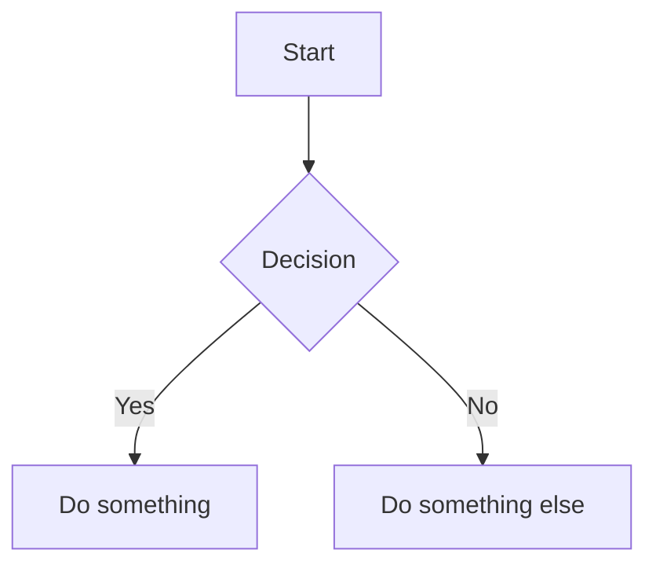

# Menlo Home Management - Documentation Index

## 📝 Documentation Strategy

Menlo uses a customized version of the [Divio documentation system](https://docs.divio.com/documentation-system/) to ensure clarity, consistency, and rapid context gathering for both humans and LLM agents. All documentation is written in Markdown and organized for future deployment as a GitHub Page.

### Documentation Types & Locations

| Type                      | Purpose/Why                                                              | Location/Where                                             | Format            |
| ------------------------- | ------------------------------------------------------------------------ | ---------------------------------------------------------- | ----------------- |
| **Tutorials**             | Step-by-step guides for onboarding, new features, and workflows.         | `/docs/tutorials/`                                         | Markdown          |
| **How-to Guides**         | Task-focused instructions for specific use cases and integrations.       | `/docs/guides/`                                            | Markdown          |
| **Technical Reference**   | API, architecture, domain models, configuration, and code-level details. | `/docs/reference/`                                         | Markdown          |
| **Explanations**          | Rationale, design decisions, philosophy, and context for choices.        | `/docs/explanations/`                                      | Markdown          |
| **Business Requirements** | Feature specs, acceptance criteria, and business context.                | `/docs/requirements/<requirement>/`                        | Markdown          |
| **Diagrams**              | C4, process, sequence, and flowcharts for architecture and workflows.    | `/docs/diagrams/` and `/docs/requirements/<req>/diagrams/` | Mermaid/Markdown |
| **Implementation Plans**  | Stepwise breakdowns for features, LLM/agent context, and snapshots.      | `/docs/requirements/<requirement>/implementation.md`       | Markdown          |
| **Test Cases**            | Linked to requirements, specifying what must be tested and how.          | `/docs/requirements/<requirement>/test-cases.md`           | Markdown          |
| **Decisions**             | Architectural decisions, rationale, and TODOs for traceability.          | `/docs/decisions/`                                         | Markdown          |
| **Snapshots**             | Context captures for LLM/agent fast reference and debugging.             | `/docs/snapshots/`                                         | Markdown          |

### Diagramming Standard

- **All diagrams must use [Mermaid](https://mermaid-js.github.io/mermaid/#/) syntax embedded in markdown files.**
- Mermaid is preferred for its native markdown compatibility and seamless rendering on GitHub Pages.
- Store diagrams in `/docs/diagrams/` or `/docs/requirements/<requirement>/diagrams/` as `.md` files containing Mermaid code blocks.

Example:

### LLM/Agent Enablement

- Documentation is structured for rapid context extraction by LLMs and agents.
- Each requirement folder contains:
  - `specifications.md` (detailed spec)
  - `test-cases.md` (testable criteria)
  - `implementation.md` (stepwise plan)
  - `diagrams/` (visuals)
- Snapshots folder provides point-in-time context for debugging and agent state.
- All documentation sections are referenced in GitHub issues for traceability.

### GitHub Issue Integration

- Issues must link to relevant documentation sections (requirements, diagrams, decisions).
- Use checklists and references to ensure definition of done is met.
- Documentation updates are part of the issue workflow.

### Consistency Guidelines

- Always use Markdown for documentation.
- Use Mermaid for all diagrams
- Follow [Divio](https://docs.divio.com/documentation-system/) tier model, extended for LLM/agent and snapshot needs.
- Use clear, concise, and testable language.
- Reference existing docs—never duplicate sections.
- Store diagrams in the correct folder and link them in requirements/issues.
- Use quote blocks for gotchas and edge cases.
- Update documentation as features evolve and decisions are made.

### Why This Structure?

- Enables fast onboarding and context gathering for humans and agents.
- Supports traceability from requirements to code, tests, and decisions.
- Ensures documentation is always up-to-date, deployable, and actionable.
- Facilitates future automation, debugging, and LLM/agent workflows.

---

## 📋 Essential Documentation

### 🎯 Core Documents

- **[Concepts & Terminology Guide](explanations/concepts-and-terminology.md)** - Start here! Core philosophy, design patterns, and terminology
- **[Business Requirements](requirements/business-requirements.md)** - Complete feature specifications with AI integration
- **[Architecture Decision Record](adr-001-hosting-strategy.md)** - Hosting strategy analysis and decision rationale

### 🏗️ Architecture & Design

- **[C4 Context Diagram](diagrams/c4-context-diagram.md)** - System overview and user interactions
- **[C4 Component Diagram](diagrams/c4-component-diagram.md)** - Internal system architecture
- **[C4 Code Diagram](diagrams/c4-code-diagram.md)** - Detailed domain model and entity relationships
- **[Diagrams Verification](c4-diagrams-verification.md)** - Architecture alignment verification

### 📊 Project Status

- **[Implementation Roadmap](requirements/implementation-roadmap.md)** - Comprehensive development plan with phases

## 🧠 Key Concepts Quick Reference

| Concept                            | Description                                             | Document                                                                                      |
| ---------------------------------- | ------------------------------------------------------- | --------------------------------------------------------------------------------------------- |
| **Blueberry Muffin AI**            | AI embedded throughout workflows, not separate features | [Concepts Guide](concepts-and-terminology.md#the-blueberry-muffin-approach-to-ai-integration) |
| **CFO-COO Dynamic**                | Strategic vs operational family roles                   | [Concepts Guide](concepts-and-terminology.md#the-cfo-coo-family-dynamic)                      |
| **Natural Workflow Preservation**  | Enhance existing habits, don't replace them             | [Concepts Guide](concepts-and-terminology.md#natural-workflow-preservation)                   |
| **Privacy-First Local AI**         | All AI processing on home server                        | [Concepts Guide](concepts-and-terminology.md#privacy-first-local-ai)                          |
| **Hybrid Cloud-Local**             | Frontend in cloud, backend/data local                   | [ADR-001](adr-001-hosting-strategy.md)                                                        |
| **Cost-Conscious Experimentation** | Low-cost validation approach                            | [Concepts Guide](concepts-and-terminology.md#cost-conscious-experimentation)                  |

## 🛤️ Reading Paths

### For Developers

1. [Concepts & Terminology Guide](explanations/concepts-and-terminology.md) - Understand the philosophy
2. [Implementation Roadmap](requirements/implementation-roadmap.md) - Start here for implementation details
3. [Business Requirements](requirements/business-requirements.md) - Learn the features
4. [C4 Component Diagram](diagrams/c4-component-diagram.md) - Understand the architecture
5. [C4 Code Diagram](diagrams/c4-code-diagram.md) - Understand the domain model
6. [ADR-001](decisions/adr-001-hosting-strategy.md) - Know the infrastructure decisions

### For New Team Members

1. [Concepts & Terminology Guide](explanations/concepts-and-terminology.md) - Essential philosophy
2. [C4 Context Diagram](diagrams/c4-context-diagram.md) - System overview
3. [Business Requirements](requirements/business-requirements.md) - What we're building

## 🎨 Design Philosophy Highlights

### The "Blueberry Muffin" Approach
>
> "AI agents embedded seamlessly into existing workflows, like blueberries distributed throughout a muffin, rather than existing as separate, distinct features."

**Key Benefits:**

- ✅ Zero learning curve for primary workflows
- ✅ Non-intrusive background enhancement
- ✅ Contextual cross-domain intelligence
- ✅ Natural family workflow preservation

### Family-Centric Design

- **Wife's Role**: Operational planning with handwritten lists preserved
- **Husband's Role**: Strategic financial analysis and planning
- **Shared Goals**: Budget coordination and family scheduling

### Technical Excellence

- **Local AI**: Privacy-first with Ollama and Microsoft Phi models
- **Cost Control**: ~80% savings vs full cloud hosting
- **South African Context**: Load shedding resilience and local infrastructure considerations

## 📈 Architecture Evolution

| Phase                 | Status     | Focus                                          |
| --------------------- | ---------- | ---------------------------------------------- |
| **Documentation**     | ✅ Complete | Requirements, architecture, and philosophy     |
| **Infrastructure**    | 🔄 Next     | Cloudflare Tunnel, PostgreSQL, Ollama setup    |
| **MVP Development**   | ⏳ Planned  | Handwritten list capture and AI interpretation |
| **Family Validation** | ⏳ Future   | Real family usage testing and feedback         |

## 🔗 External References

- **Microsoft Semantic Kernel**: AI orchestration framework
- **Ollama**: Local AI model hosting
- **Cloudflare Tunnel**: Secure home server connectivity
- **Azure Static Web Apps**: Frontend hosting (free tier)

---

This documentation represents a comprehensive foundation for building an AI-enhanced family home management application that respects natural workflows while providing intelligent automation.
