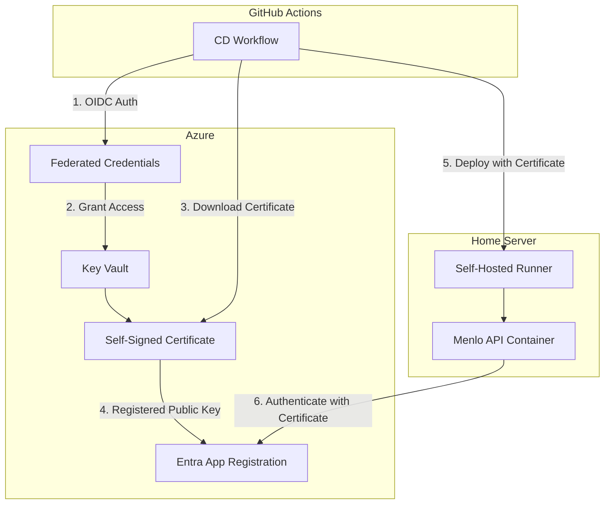

# ADR-003: CD Pipeline Authentication Strategy

## Status

**Accepted** - 2025-12-31

## Context

The Menlo backend application deploys to a Windows 10 home server via a self-hosted GitHub Actions runner. The CD pipeline requires authentication to Azure resources (specifically Microsoft Entra ID) to:

1. Access Azure Container Registry (if used)
2. Configure the application's authentication settings
3. Potentially access other Azure services in the future

### Current CI Approach

The CI pipeline uses an ephemeral client secret approach:

- GitHub Actions authenticates to Azure using OIDC (federated credentials)
- Creates a short-lived (1 hour) client secret for the CI run
- Deletes the secret after the CI run completes

This approach works well for CI where secrets are immediately discarded, but the CD pipeline needs a more persistent authentication mechanism for the deployed application.

### Requirements

- **Security**: Credentials should be rotatable and not stored in plain text
- **Cost**: Minimal to zero ongoing costs (home server deployment)
- **Maintenance**: Low maintenance overhead
- **Reliability**: Consistent authentication without manual intervention
- **Zero Trust**: Align with Azure security best practices

## Options Considered

### 1. Azure Arc-Enabled Server with Managed Identity

- **Pros**: Gold standard for on-premises, no credential management, automatic token rotation
- **Cons**: Requires Azure Arc agent installation, small monthly cost (~$5/server), additional infrastructure complexity
- **Assessment**: Best security, but overkill for a home server hobby project

### 2. Certificate Authentication via Azure Key Vault (Recommended)

- **Pros**: More secure than secrets, long-lived (1-2 years), stored securely in Key Vault, automatic rotation possible, Key Vault Standard tier is effectively free for low usage
- **Cons**: Initial setup complexity, certificate renewal needed periodically
- **Assessment**: Best balance of security and simplicity for this use case

### 3. Ephemeral Secrets (CI Approach Extended)

- **Pros**: Consistent with CI, automatic rotation on each deploy
- **Cons**: Secret exists between deployments, less secure than certificates, requires Azure CLI during deployment
- **Assessment**: Acceptable but not recommended for production-like deployments

### 4. Static GitHub Secret

- **Pros**: Simplest to implement
- **Cons**: Never rotates, long exposure window if leaked, against Microsoft best practices
- **Assessment**: Not recommended

## Decision

**Selected**: Certificate Authentication via Azure Key Vault (Option 2)

We will implement certificate-based authentication using Azure Key Vault to store a self-signed certificate for the Menlo production Entra app registration.

### Rationale

1. **Security**: Certificates are more secure than client secrets - they can't be easily copied or leaked in logs
2. **Cost Effective**: Azure Key Vault Standard tier is free for the first 10,000 operations/month
3. **Maintainability**: Certificate can be auto-rotated via Key Vault policies
4. **Infrastructure as Code**: Key Vault and certificate can be provisioned via Bicep
5. **GitHub Actions Integration**: OIDC authentication allows GitHub Actions to securely retrieve the certificate without storing secrets

### Architecture

### Implementation Details

1. **Infrastructure (Bicep)**:
   - Create Azure Key Vault with RBAC enabled
   - Create user-assigned managed identity for deployment scripts
   - Use `deploymentScripts` resource to generate self-signed certificate
   - Configure RBAC for GitHub Actions service principal to read certificates

2. **Certificate Configuration**:
   - Subject: `CN=menlo-cd.menlo.local`
   - Key Type: RSA 2048-bit
   - Content Type: PKCS #12 (PFX)
   - Validity: 12 months
   - Exportable: Yes (required for deployment)

3. **Entra App Registration**:
   - Upload certificate public key to production Entra app (one-time manual step)
   - Application uses `ClientCertificateCredential` for authentication

4. **CD Workflow**:
   - Authenticate to Azure via OIDC
   - Download certificate from Key Vault
   - Deploy application with certificate to home server
   - Application container uses certificate for Entra authentication

### Cost Analysis

| Resource                                 | Cost                          |
| ---------------------------------------- | ----------------------------- |
| Key Vault Standard                       | Free (first 10,000 ops/month) |
| User-Assigned Managed Identity           | Free                          |
| Deployment Scripts (Container Instance)  | ~$0.01 per deployment         |
| Storage Account (for deployment scripts) | Negligible                    |

**Total Monthly Cost**: ~$0.10 (assuming weekly deployments)

## Consequences

### Positive

- More secure than client secrets
- Credentials stored securely in Azure Key Vault
- Infrastructure defined as code (auditable, repeatable)
- Aligns with Microsoft security best practices
- No secrets stored in GitHub

### Negative

- Initial setup is more complex than static secrets
- Certificate must be renewed before expiry (mitigated by Key Vault auto-rotation)
- Requires one-time manual upload of public key to Entra app registration

### Neutral

- Requires Azure subscription (already available)
- Adds dependency on Azure Key Vault (acceptable for this project)

## Implementation Checklist

- [ ] Create `infra/` folder structure with Bicep templates
- [ ] Create Key Vault module with certificate deployment script
- [ ] Update GitHub Actions workflows to deploy infrastructure
- [ ] Configure federated credentials for infrastructure deployment
- [ ] Manually upload certificate public key to Entra app registration
- [ ] Update CD workflow to download and use certificate
- [ ] Document certificate renewal process

## References

- [Azure Key Vault Certificates](https://learn.microsoft.com/en-us/azure/key-vault/certificates/about-certificates)
- [Use deployment scripts to create a self-signed certificate](https://learn.microsoft.com/en-us/azure/azure-resource-manager/templates/template-tutorial-deployment-script)
- [Certificate authentication in Microsoft Entra](https://learn.microsoft.com/en-us/entra/identity-platform/howto-create-service-principal-portal#set-up-authentication)
- [GitHub Actions OIDC with Azure](https://learn.microsoft.com/en-us/azure/developer/github/connect-from-azure-openid-connect)
