# Home Management Application - Component Diagram

This diagram shows the internal architecture of the Menlo Home Management Application, illustrating how the system is organized into components within a hybrid cloud-local architecture.

```mermaid
graph TB
    %% Azure Cloud
    subgraph Azure["☁️ Azure Cloud"]
        SWA[📱 Azure Static Web Apps<br/>Angular PWA<br/>Globally distributed frontend<br/>hosting with CDN]
    end
    
    %% Cloudflare Edge
    subgraph CloudflareEdge["🌐 Cloudflare Edge"]
        CFTunnel[🔒 Cloudflare Tunnel<br/>Cloudflared<br/>Secure tunnel to home server<br/>without static IP]
    end
    
    %% Home Server
    subgraph HomeServer["🏠 Home Server"]
        %% API Host
        APIHost[🌐 API Host<br/>ASP.NET Core Minimal APIs<br/>Hosts feature endpoints with<br/>authentication middleware]
        
        %% Budget Feature
        subgraph BudgetFeature["💰 Budget Management Feature"]
            BudgetEndpoints[🔗 Budget Endpoints<br/>Minimal API<br/>Budget CRUD, analysis,<br/>and reporting endpoints]
            BudgetHandlers[⚙️ Budget Handlers<br/>Command/Query handlers<br/>for budget operations]
            BudgetModels[📋 Budget Models<br/>C# Records<br/>Budget entities with unified<br/>income/expense hierarchy]
            BudgetRepository[💾 Budget Repository<br/>EF Core<br/>Budget data access with<br/>attribution-based tracking]
            BudgetAnalyser[🤖 Budget Analyser<br/>AI-enhanced spending<br/>analysis and variance detection]
            TransactionCategorizer[🏷️ Transaction Categorizer<br/>AI-powered mapping to<br/>hierarchical budget categories]
            RentalCostAnalyser[🏠 Rental Cost Analyser<br/>Extracts rental-attributable<br/>costs for tax reporting]
        end
        
        %% Planning Feature  
        subgraph PlanningFeature["📝 Planning & Inventory Management"]
            PlanningEndpoints[🔗 Planning Endpoints<br/>List creation, AI planning,<br/>pantry management, handwriting<br/>recognition endpoints]
            PlanningHandlers[⚙️ Planning Handlers<br/>Command/Query handlers for<br/>planning and inventory operations]
            PlanningModels[📋 Planning Models<br/>C# Records with inheritance<br/>hierarchy Basic, Pantry, Maintenance<br/>planning items, recipes, meal plans]
            PlanningRepository[💾 Planning Repository<br/>EF Core<br/>Planning and inventory<br/>data access and persistence]
            ListInterpreter[📷 List Interpreter<br/>AI-powered handwriting<br/>recognition creating appropriate<br/>planning item types]
            BudgetImpactAnalyser[💵 Budget Impact Analyser<br/>AI analysis of planning list<br/>impact on budget for all<br/>planning item types]
            PantryOptimizer[🥫 Pantry Optimizer<br/>Suggests meals and generates<br/>PantryPlanningItem based on<br/>inventory and expiration dates]
            ShoppingListGenerator[🛒 Shopping List Generator<br/>Creates shopping lists with<br/>PantryPlanningItem from meal<br/>plans and pantry gaps]
        end
        
        %% Financial Feature
        subgraph FinancialFeature["💳 Financial Management"]
            FinancialEndpoints[🔗 Financial Endpoints<br/>Transaction import, income<br/>tracking, reconciliation,<br/>and reporting endpoints]
            FinancialHandlers[⚙️ Financial Handlers<br/>Command/Query handlers<br/>for financial operations]
            FinancialModels[📋 Financial Models<br/>C# Records<br/>Financial entities, transactions,<br/>accounts, and income sources]
            FinancialRepository[💾 Financial Repository<br/>EF Core<br/>Financial data access<br/>and persistence]
            ImportProcessor[📥 Import Processor<br/>Processes CSV bank statements<br/>with intelligent parsing<br/>and validation]
            DuplicateDetector[🔍 Duplicate Detector<br/>Identifies potential duplicate<br/>transactions across imports<br/>and manual entries]
            AttributionSuggester[🎯 Attribution Suggester<br/>Smart personal vs rental and<br/>family member attribution<br/>suggestions]
            ReconciliationMatcher[🔗 Reconciliation Matcher<br/>Matches transactions against<br/>budget realizations and<br/>planning items]
        end
        
        %% Household Feature
        subgraph HouseholdFeature["🏡 Household Management"]
            HouseholdEndpoints[🔗 Household Endpoints<br/>Family management, appliance<br/>registry, SA utility tracking,<br/>and rental attribution endpoints]
            HouseholdHandlers[⚙️ Household Handlers<br/>Command/Query handlers for<br/>household and utility operations]
            HouseholdModels[📋 Household Models<br/>C# Records<br/>Household entities: family,<br/>appliances, utilities]
            HouseholdRepository[💾 Household Repository<br/>EF Core<br/>Household and utility<br/>data access and persistence]
            UtilityOptimizer[⚡ Utility Optimizer<br/>SA utility efficiency tracking<br/>and optimization recommendations]
            RentalAttributionAnalyser[🏠 Rental Attribution Analyser<br/>Analyses utility bill changes<br/>for rental vs house attribution]
        end
        
        %% Event Feature
        subgraph EventFeature["📅 Event Management"]
            EventEndpoints[🔗 Event Endpoints<br/>Calendar events and<br/>smart scheduling endpoints]
            EventHandlers[⚙️ Event Handlers<br/>Command/Query handlers<br/>for event operations]
            EventModels[📋 Event Models<br/>C# Records<br/>Event entities and<br/>scheduling logic]
            EventRepository[💾 Event Repository<br/>EF Core<br/>Event data access<br/>and persistence]
            SmartScheduler[🤖 Smart Scheduler<br/>AI-powered conflict detection<br/>and budget-aware scheduling]
        end
        
        %% AI Orchestration
        subgraph AIOrchestration["🧠 AI Orchestration Layer"]
            SemanticKernel[🔧 Semantic Kernel<br/>Microsoft SK<br/>AI agent orchestration<br/>and prompt management]
            AICoordinator[🎭 AI Coordinator<br/>Coordinates AI tasks<br/>across features]
            LearningEngine[📚 Learning Engine<br/>Learns from user corrections<br/>and improves suggestions]
        end
        
        %% Shared Services
        subgraph SharedServices["🔧 Shared Services"]
            NotificationService[📡 Notification Service<br/>SignalR Hub<br/>Real-time notifications<br/>across features]
            AuthenticationService[🔐 Authentication Service<br/>ASP.NET Identity<br/>JWT token validation<br/>and user management]
        end
        
        %% Database
        Database[(🗃️ PostgreSQL Database<br/>Stores all application data<br/>with EF Core mapping)]
        
        %% Ollama Service
        OllamaService[🤖 Ollama AI Service<br/>Local AI inference server<br/>hosting Phi models]
    end
    
    %% External Systems
    FamilyDevices[📱 Family Devices<br/>Phones/Tablets/Laptops<br/>Family members access<br/>the application]
    BankSystem[🏦 Banking System<br/>External<br/>Source of transaction data]
    
    %% Main Flow
    FamilyDevices -->|Accesses PWA<br/>HTTPS| SWA
    SWA -->|API calls via tunnel<br/>HTTPS| CFTunnel
    CFTunnel -->|Forwards to home server<br/>Encrypted tunnel| APIHost
    
    %% API Host to Features
    APIHost --> BudgetEndpoints
    APIHost --> PlanningEndpoints
    APIHost --> FinancialEndpoints
    APIHost --> HouseholdEndpoints
    APIHost --> EventEndpoints
    
    %% Feature Internal Flows (Budget)
    BudgetEndpoints --> BudgetHandlers
    BudgetHandlers --> BudgetModels
    BudgetHandlers --> BudgetRepository
    BudgetHandlers --> BudgetAnalyser
    BudgetHandlers --> TransactionCategorizer
    BudgetHandlers --> RentalCostAnalyser
    
    %% Feature Internal Flows (Planning)
    PlanningEndpoints --> PlanningHandlers
    PlanningHandlers --> PlanningModels
    PlanningHandlers --> PlanningRepository
    PlanningHandlers --> ListInterpreter
    PlanningHandlers --> BudgetImpactAnalyser
    PlanningHandlers --> PantryOptimizer
    PlanningHandlers --> ShoppingListGenerator
    
    %% Feature Internal Flows (Financial)
    FinancialEndpoints --> FinancialHandlers
    FinancialHandlers --> FinancialModels
    FinancialHandlers --> FinancialRepository
    FinancialHandlers --> ImportProcessor
    FinancialHandlers --> DuplicateDetector
    FinancialHandlers --> AttributionSuggester
    FinancialHandlers --> ReconciliationMatcher
    
    %% Feature Internal Flows (Household)
    HouseholdEndpoints --> HouseholdHandlers
    HouseholdHandlers --> HouseholdModels
    HouseholdHandlers --> HouseholdRepository
    HouseholdHandlers --> UtilityOptimizer
    HouseholdHandlers --> RentalAttributionAnalyser
    
    %% Feature Internal Flows (Event)
    EventEndpoints --> EventHandlers
    EventHandlers --> EventModels
    EventHandlers --> EventRepository
    EventHandlers --> SmartScheduler
    
    %% AI Orchestration
    BudgetAnalyser --> SemanticKernel
    TransactionCategorizer --> SemanticKernel
    ListInterpreter --> SemanticKernel
    BudgetImpactAnalyser --> SemanticKernel
    PantryOptimizer --> SemanticKernel
    SmartScheduler --> SemanticKernel
    UtilityOptimizer --> SemanticKernel
    SemanticKernel --> AICoordinator
    AICoordinator --> OllamaService
    AICoordinator --> LearningEngine
    
    %% Repository to Database
    BudgetRepository --> Database
    PlanningRepository --> Database
    FinancialRepository --> Database
    HouseholdRepository --> Database
    EventRepository --> Database
    
    %% Shared Services
    BudgetHandlers --> NotificationService
    PlanningHandlers --> NotificationService
    FinancialHandlers --> NotificationService
    HouseholdHandlers --> NotificationService
    EventHandlers --> NotificationService
    APIHost --> AuthenticationService
    
    %% External Integrations
    ImportProcessor --> BankSystem
    NotificationService --> SWA
    
    %% Cross-feature Dependencies
    BudgetImpactAnalyser --> BudgetRepository
    SmartScheduler --> BudgetRepository
    TransactionCategorizer --> PlanningRepository
    PantryOptimizer --> PlanningRepository
    ShoppingListGenerator --> PlanningRepository
    
    %% Styling
    classDef azureClass fill:#e3f2fd,stroke:#1976d2,stroke-width:2px,color:#000
    classDef cloudflareClass fill:#fff3e0,stroke:#f57c00,stroke-width:2px,color:#000
    classDef apiClass fill:#f3e5f5,stroke:#7b1fa2,stroke-width:2px,color:#000
    classDef budgetClass fill:#e8f5e8,stroke:#388e3c,stroke-width:2px,color:#000
    classDef planningClass fill:#fff8e1,stroke:#f9a825,stroke-width:2px,color:#000
    classDef financialClass fill:#fce4ec,stroke:#c2185b,stroke-width:2px,color:#000
    classDef householdClass fill:#e0f2f1,stroke:#00695c,stroke-width:2px,color:#000
    classDef eventClass fill:#e1f5fe,stroke:#0277bd,stroke-width:2px,color:#000
    classDef aiClass fill:#f1f8e9,stroke:#558b2f,stroke-width:2px,color:#000
    classDef sharedClass fill:#fafafa,stroke:#424242,stroke-width:2px,color:#000
    classDef dbClass fill:#ffebee,stroke:#c62828,stroke-width:3px,color:#000
    classDef externalClass fill:#f5f5f5,stroke:#616161,stroke-width:2px,color:#000
    
    class SWA azureClass
    class CFTunnel cloudflareClass
    class APIHost apiClass
    class BudgetEndpoints,BudgetHandlers,BudgetModels,BudgetRepository,BudgetAnalyser,TransactionCategorizer,RentalCostAnalyser budgetClass
    class PlanningEndpoints,PlanningHandlers,PlanningModels,PlanningRepository,ListInterpreter,BudgetImpactAnalyser,PantryOptimizer,ShoppingListGenerator planningClass
    class FinancialEndpoints,FinancialHandlers,FinancialModels,FinancialRepository,ImportProcessor,DuplicateDetector,AttributionSuggester,ReconciliationMatcher financialClass
    class HouseholdEndpoints,HouseholdHandlers,HouseholdModels,HouseholdRepository,UtilityOptimizer,RentalAttributionAnalyser householdClass
    class EventEndpoints,EventHandlers,EventModels,EventRepository,SmartScheduler eventClass
    class SemanticKernel,AICoordinator,LearningEngine,OllamaService aiClass
    class NotificationService,AuthenticationService sharedClass
    class Database dbClass
    class FamilyDevices,BankSystem externalClass
```

## Architecture Highlights

### Hybrid Cloud-Local Architecture

- **Frontend**: Azure Static Web Apps (global CDN)
- **Backend**: Home server via Cloudflare Tunnel (no static IP needed)
- **Database**: PostgreSQL with EF Core
- **AI**: Local Ollama with Phi models

### Vertical Slice Architecture

Each feature (Budget, Planning, Financial, Household, Event) is organized as a vertical slice containing:

- **Endpoints**: Minimal API controllers
- **Handlers**: Command/Query handlers for business logic
- **Models**: Domain entities as C# records
- **Repository**: EF Core data access
- **AI Services**: Feature-specific AI capabilities

### AI Integration

- **Semantic Kernel**: Microsoft's AI orchestration framework
- **Local Processing**: All AI inference via local Ollama service
- **Learning Engine**: Improves from user corrections
- **Cross-Feature AI**: Shared AI coordinator for complex scenarios

### Key Features

#### Planning & Inventory Management

- **Handwritten List Recognition**: AI interprets photos into typed planning items
- **Planning Item Types**: Basic, Pantry, and Maintenance items via inheritance
- **Pantry Management**: Inventory tracking with expiration dates
- **Meal Planning**: Recipe-based meal plans with automatic shopping lists
- **Budget Impact Analysis**: AI predicts budget impact of planning lists

#### Budget Management

- **Unified Hierarchy**: Income and expenses in single hierarchical structure
- **Attribution-Based**: Personal vs rental expense separation
- **States**: Planned → Realized → Spent progression
- **AI Analysis**: Variance detection and spending insights
- **Rental Cost Extraction**: Automatic tax-deductible expense identification

#### Financial Management

- **CSV Import**: South African bank statement processing
- **AI Categorization**: Smart transaction categorization with learning
- **Attribution**: Personal vs rental and family member splits
- **Reconciliation**: Matches transactions to budget and planning items
- **Duplicate Detection**: Across imports and manual entries

#### Household Management

- **Family Configuration**: Family member and appliance registry
- **SA Utilities**: Prepaid electricity, water readings, municipal billing
- **Rental Attribution**: House vs rental percentage analysis
- **Utility Optimization**: Efficiency tracking and recommendations

#### Event Management

- **Smart Scheduling**: AI conflict detection and optimization
- **Budget Awareness**: Considers budget impact when scheduling
- **Integration**: Events created from planning lists and maintenance needs

### Security & Performance

- **Authentication**: ASP.NET Identity with JWT tokens
- **Real-time**: SignalR for live notifications
- **Privacy**: All AI processing local, no cloud AI costs
- **Resilience**: Home server with Cloudflare Tunnel reliability
