# Home Management Application - System Context Diagram

This diagram shows the high-level system context for the Menlo Home Management Application, illustrating the main users, the system itself, and external systems it integrates with.

```mermaid
graph TB
    %% Users
    Husband[👤 Husband<br/>CFO - Budget management,<br/>financial analysis,<br/>rental decision modelling]
    Wife[👤 Wife<br/>COO - Planning lists handwritten,<br/>event coordination,<br/>family scheduling]
    
    %% Main System
    HomeApp[🏠 Home Management Application<br/>AI-enhanced home and budget management<br/>system with handwritten list interpretation<br/>and intelligent coordination]
    
    %% External Systems
    BankSystem[🏦 Banking System<br/>Provides bank statements and<br/>transaction data via CSV export]
    MunicipalSystem[🏢 Municipal Services Tshwane<br/>Electricity prepaid, water readings,<br/>municipal rates, levies, refuse,<br/>sanitization billing]
    Calendar[📅 External Calendar<br/>Google Calendar, Outlook,<br/>or other calendar systems]
    TaxSystem[🏛️ SARS Tax Authority<br/>South African Revenue Service<br/>for tax compliance]
    LocalAI[🤖 Local AI Ollama<br/>Local Phi models for<br/>privacy-preserving AI assistance]
    
    %% Primary user interactions
    Husband -->|Manages budgets, analyses spending,<br/>models rental scenarios<br/>HTTPS| HomeApp
    Wife -->|Takes photos of handwritten lists,<br/>coordinates events,<br/>tracks family activities<br/>HTTPS| HomeApp
    
    %% External system integrations
    HomeApp -->|Imports transaction data<br/>CSV Import| BankSystem
    HomeApp -->|Manual entry of utility readings<br/>and bills<br/>Manual Input| MunicipalSystem
    HomeApp -->|Potential future integration<br/>for event synchronization<br/>API Future| Calendar
    HomeApp -->|Uses for list interpretation,<br/>categorization, and budget analysis<br/>Local API| LocalAI
    HomeApp -->|Generates rental income reports<br/>and deductible expense tracking<br/>Manual Reporting| TaxSystem
    
    %% Data flows back
    BankSystem -->|Provides bank statements<br/>CSV Files| HomeApp
    MunicipalSystem -->|Utility bills, meter readings,<br/>and municipal invoices<br/>Manual Entry| HomeApp

    %% Styling
    classDef userClass fill:#e1f5fe,stroke:#01579b,stroke-width:2px,color:#000
    classDef systemClass fill:#f3e5f5,stroke:#4a148c,stroke-width:3px,color:#000
    classDef externalClass fill:#e8f5e8,stroke:#1b5e20,stroke-width:2px,color:#000
    
    class Husband,Wife userClass
    class HomeApp systemClass
    class BankSystem,MunicipalSystem,Calendar,TaxSystem,LocalAI externalClass
```

## Architecture Notes

### Hybrid Architecture

- **Frontend**: Azure Static Web Apps
- **Backend**: Home server via Cloudflare Tunnel  
- **Database**: PostgreSQL
- **AI**: Local Ollama with Phi models
- **Cost**: ~R165-365/month

### User Roles

#### Husband (CFO Focus)

- Budget analysis with AI insights
- Rental income modelling  
- Financial reporting
- Expense attribution
- Bank reconciliation
- Transaction categorization

#### Wife (COO Focus)

- Handwritten list capture & AI interpretation
- Budget impact awareness
- Event coordination
- Family scheduling

### Privacy-First AI

- All processing local
- No external AI costs
- User correction learning
- Phi-4-mini & Phi-4-vision models

### Financial Integration

- CSV import with duplicate detection
- AI-powered categorization
- Smart attribution suggestions  
- Automatic reconciliation matching
- Support for major SA banks

### SA Municipal Services

- Prepaid electricity top-ups
- Monthly water meter readings
- Municipal rates & levies (separate invoices)
- Gas refills (6-8 month intervals)
- Fibre internet billing
- Rental vs house attribution focus
