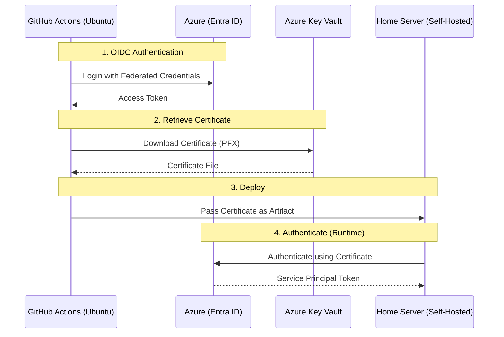

# Deployment CD Guide

This guide explains the Continuous Deployment (CD) pipeline for the Menlo Home Server, focusing on the secure authentication flow between GitHub Actions, Azure Key Vault, and the Home Server.

## Overview

The deployment pipeline uses a hybrid authentication approach:

1. **GitHub Actions** uses **OIDC (OpenID Connect)** to authenticate to Azure without long-lived secrets.
2. **GitHub Actions** retrieves a **self-signed certificate** from Azure Key Vault.
3. The **Home Server** receives this certificate to authenticate as a Service Principal for Azure operations.

### Authentication Flow

## Prerequisites

### GitHub Repository Secrets

The following secrets must be configured in the GitHub repository settings:

| Secret                  | Description                                               |
| ----------------------- | --------------------------------------------------------- |
| `AZURE_CLIENT_ID`       | The Application (client) ID of the Entra App Registration |
| `AZURE_TENANT_ID`       | The Directory (tenant) ID of your Azure Entra ID          |
| `AZURE_SUBSCRIPTION_ID` | The Subscription ID where resources are deployed          |

### Infrastructure

The infrastructure is defined in:

- [infra/main.bicep](infra/main.bicep): Main entry point
- [infra/modules/secrets/main.bicep](infra/modules/secrets/main.bicep): Key Vault and Certificate resources

## One-Time Setup

After deploying the infrastructure for the first time, you must associate the generated certificate with your Entra App Registration.

1. **Deploy Infrastructure**:
   Run the infrastructure deployment workflow or manually deploy `infra/main.bicep`.

2. **Download Public Key**:
   Go to the Azure Portal > Key Vault > `kv-menlo-prod` > Certificates > `menlo-cd-cert`.
   Download the certificate in **CER** format (public key only).

3. **Upload to Entra ID**:
   - Go to **Microsoft Entra ID** > **App registrations**.
   - Select the app registration corresponding to your `AZURE_CLIENT_ID`.
   - Go to **Certificates & secrets** > **Certificates**.
   - Click **Upload certificate** and select the `.cer` file you downloaded.
   - **Description**: `Key Vault CD Cert` (or similar).

   > **Note**: This allows the holder of the private key (the Home Server) to authenticate as this App Registration.

## Pipeline Details

### 1. Infrastructure Deployment

The `deploy-infra.yml` workflow ensures the Key Vault and Certificate exist.

### 2. Certificate Retrieval

The `cd-backend.yml` workflow:

- Logs in to Azure using OIDC.
- Downloads the certificate from Key Vault as a PFX file.
- Passes the PFX file as a build artifact to the deployment job.

### 3. Home Server Deployment

The deployment job runs on the self-hosted runner:

- Downloads the certificate artifact.
- Sets the `CERTIFICATE_PATH` environment variable.
- Executes the deployment logic (pulling images, restarting containers).

## Verification

To verify the setup:

1. Trigger the **CD - Deploy Backend** workflow manually.
2. Check the **Download Certificate** job logs:
   - Ensure "Azure Login (OIDC)" succeeds.
   - Ensure "Download Certificate from Key Vault" succeeds.
3. Check the **Deploy to Home Server** job logs:
   - Ensure the certificate artifact is downloaded.
   - Ensure the deployment script runs without authentication errors.
