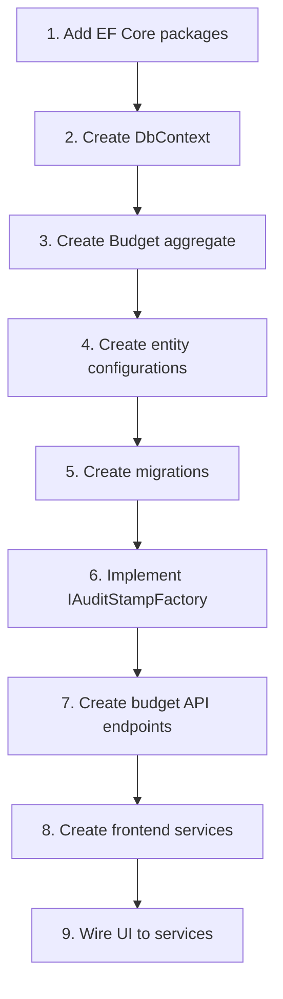

# Fix Plan

> This file is maintained by Ralph. Run `ralph.sh plan` to regenerate from scratch.

## How This File Works

- **Priority Items**: Work to be done, sorted by importance
- **In Progress**: Currently being worked on (should be 0-1 items)
- **Completed**: Recently finished items (clean up periodically)

## Maintenance Rules

1. When this file exceeds 100 items, trigger cleanup:
   - Remove all completed items
   - Consolidate duplicate/related items
   - Re-prioritize remaining work

2. When encountering bugs during implementation:
   - Add to Priority Items FIRST
   - Then spawn subagent to fix

3. Format for items:
   - `- [ ]` Pending
   - `- [x]` Completed

---

## Priority Items

### P0 - Critical (Blocking Validation)

_Build succeeds. All 214 tests pass (119 API, 92 Lib, 2 AI, 1 skipped). Lint passes with 3 warnings._

### P1 - High (Core Missing Features per Specs)

#### Backend - Persistence Layer (Spec: persistence)

> **Status**: ✅ Core persistence infrastructure complete. Budget entity configurations and initial migration created. Next: Add unit tests for persistence features.

- [ ] **Unit tests** - Add unit tests for all persistence features, including converters and interceptors

#### Backend - Budget Domain (Spec: budget-aggregate-minimum)

> **Status**: ✅ Budget aggregate is fully implemented in `src/lib/Menlo.Lib/Budget/`. Next: Add entity configurations for persistence and create API endpoints.

- [x] **Create BudgetId strongly-typed ID** - `readonly record struct BudgetId(Guid Value)` in `Budget/ValueObjects/BudgetId.cs`.
- [x] **Create BudgetCategoryId strongly-typed ID** - `readonly record struct BudgetCategoryId(Guid Value)` in `Budget/ValueObjects/BudgetCategoryId.cs`.
- [x] **Create BudgetPeriod value object** - `readonly record struct BudgetPeriod(int Year, int Month)` in `Budget/ValueObjects/BudgetPeriod.cs`.
- [x] **Create BudgetStatus enum** - `Draft`, `Active` values in `Budget/Enums/BudgetStatus.cs`.
- [x] **Create Budget aggregate root** - Implements `IAggregateRoot<BudgetId>`, `IHasDomainEvents`, `IAuditable` in `Budget/Entities/Budget.cs` with: Name, Period, Currency, Status, Categories collection.
- [x] **Create BudgetCategory entity** - Child of Budget aggregate in `Budget/Entities/BudgetCategory.cs`. Includes: Name, Description, PlannedAmount (Money), ParentId (nullable for hierarchy), DisplayOrder.
- [x] **Implement budget creation validation** - Name required, Period valid (Year 1900-2100, Month 1-12), Currency ISO 4217 (3-letter code), max depth 2 for categories.
- [x] **Implement category uniqueness rule** - Sibling categories must have unique names (case-insensitive using OrdinalIgnoreCase).
- [x] **Implement total computation** - `CalculateTotal()` on BudgetCategory sums own + children amounts; `GetTotal()` on Budget sums all root category totals.
- [x] **Create BudgetError hierarchy** - Domain errors in `Budget/Errors/BudgetError.cs`: `DuplicateBudgetError`, `DuplicateCategoryNameError`, `CategoryHasChildrenError`, `CategoryHasPlannedAmountError`, `MaxDepthExceededError`, `InvalidAmountError`, `ActivationValidationError`, `InvalidStatusTransitionError`.
- [x] **Create budget domain events** - Events in `Budget/Events/BudgetEvents.cs`: `BudgetCreatedEvent`, `BudgetActivatedEvent`, `CategoryAddedEvent`, `CategoryRenamedEvent`, `CategoryRemovedEvent`, `PlannedAmountSetEvent`, `PlannedAmountClearedEvent`.
- [ ] **Unit Tests** - Add tests for all the above items that were added

#### Backend - Auditing (Spec: domain-auditing)

- [x] **Implement IAuditStampFactory** - Created `AuditStampFactory` in `Persistence/` that resolves current user from `HttpContext.User` claims (oid claim) and uses `TimeProvider.System.GetUtcNow()`.
- [x] **Register IAuditStampFactory in DI** - Registered as scoped in `AddMenloPersistence()` extension method.
- [ ] **Unit Tests** - Add tests for all the above items that were added

#### Backend - Budget API Endpoints (Specs: budget-create-vertical, budget-categories-vertical)

> **Status**: ✅ Core CRUD endpoints created (POST, GET list, GET detail, PUT). All endpoints registered with proper auth policies. Next: Activate endpoint and category CRUD.

- [x] **Create POST /api/budgets endpoint** - Created endpoint at `src/api/Menlo.Api/Budgets/Endpoints/CreateBudgetEndpoint.cs`. Returns 201 Created with Location header, 400 for validation errors, 409 for duplicate (user+period+name). Includes budget period validation, duplicate checking, and proper error responses with ProblemDetails.
- [x] **Create GET /api/budgets endpoint** - Created list endpoint at `src/api/Menlo.Api/Budgets/Endpoints/ListBudgetsEndpoint.cs`. Returns list of budget summaries with optional filtering by year and status. Orders by period descending (most recent first).
- [x] **Create GET /api/budgets/{id} endpoint** - Created detail endpoint at `src/api/Menlo.Api/Budgets/Endpoints/GetBudgetEndpoint.cs`. Returns budget DTO with categories tree and totals snapshot. Returns 404 if budget not found or user doesn't have permission.
- [x] **Create PUT /api/budgets/{id} endpoint** - Created endpoint at `src/api/Menlo.Api/Budgets/Endpoints/UpdateBudgetEndpoint.cs`. Returns 200 OK with updated budget, 400 for validation errors (e.g., empty name), 404 if not found or no permission. Uses `Budget.UpdateName()` domain method. Added `UpdateBudgetRequest` DTO.
- [ ] **Create POST /api/budgets/{id}/activate endpoint** - Transition Draft to Active with validation per spec (FR-2).
- [ ] **Create category CRUD endpoints** - POST/PUT/DELETE for `/api/budgets/{id}/categories` per budget-categories-vertical spec.
- [x] **Register budget endpoints** - Created `BudgetEndpoints.MapBudgetEndpoints()` extension method in `src/api/Menlo.Api/Budgets/BudgetEndpoints.cs` and registered in Program.cs. All endpoints require authentication and apply appropriate authorization policies (CanEditBudget for POST, CanViewBudget for GET).
- [x] **Create Budget DTOs** - Created request/response models at `src/lib/Menlo.Lib/Budget/Models/`: `CreateBudgetRequest`, `BudgetResponse`, `BudgetSummaryResponse`, `BudgetCategoryResponse`, `MoneyResponse`.
- [ ] **Unit Tests** - Add tests for all the above items that were added

#### Frontend - Budget UI (Specs: budget-create-vertical, budget-categories-vertical)

> **Current state**: UI components exist but use HARDCODED MOCK DATA. No real API integration.

- [ ] **Implement BudgetService** - Create service in `data-access-menlo-api` with: `getBudgets()`, `getBudget(id)`, `createBudget()`, `updateBudget()`, `deleteBudget()` using `HttpClient` and `toResult()` operator.
- [ ] **Implement CategoryService** - CRUD methods for categories using Result pattern.
- [ ] **Wire BudgetListComponent to BudgetService** - Replace hardcoded `budgets = signal([...])` with actual API calls via service.
- [ ] **Implement budget creation form** - Modal/dialog with reactive form: Name (required), Year (select), Month (select), Currency (select). Wire to `BudgetService.createBudget()`.
- [ ] **Implement budget details view** - Route `/budgets/:id` with category tree visualization and totals.
- [ ] **Wire BudgetAnalyticsComponent to real data** - Replace mock `totalBudget`, `spentThisMonth`, `categories` signals with API data.
- [ ] **Implement category management UI** - Add/edit/soft-delete categories with hierarchy visualization.
- [ ] **Implement form validation error mapping** - Use existing `mapValidationErrorsToForm()` helper with actual forms. Helper at `shared-util/src/lib/types/problem-details.ts:53`.
- [ ] **Unit Tests** - Add tests for all the above items that were added

#### Frontend - Error Handling & UX (Spec: angular-result-pattern)

- [ ] **Implement toast/notification service** - Display non-validation errors from API calls. Result pattern infrastructure exists but no toast integration.
- [ ] **Create UnauthorizedComponent** - `roleGuard` redirects to `/unauthorized` but route/component doesn't exist.
- [ ] **Apply auth guards to budget routes** - Add `authGuard` and `roleGuard` to `/budgets` and `/analytics` routes in `app.routes.ts`. Guards exist but are not applied.
- [ ] **Unit Tests** - Add tests for all the above items that were added

### P2 - Medium (Secondary Features)

#### AI Services (Spec: ai-infrastructure)

- [ ] **Complete VisionService implementation** - Currently throws `NotImplementedException("Vision service will be implemented in future phases")` at `src/lib/Menlo.AI/Services/VisionService.cs:10,15`. Wire to Phi-4-vision model.

#### Budget Allocation (Spec: budget-item)

- [ ] **Implement budget allocation endpoints** - POST to add planned amounts to leaf categories with attribution (Family/Rental/Shared percentages summing to 100%) per spec.
- [ ] **Implement allocation UI** - Form to set planned amounts on leaf categories with attribution validation.

#### Proactive Features (Spec: proactive-budget-adjustment)

- [ ] **Implement budget adjustment suggestions** - AI-driven reallocation suggestions with triggers, option sets, and approval workflow. Depends on: Budget aggregate, AI infrastructure.

#### Charts & Visualization

- [ ] **Integrate Chart.js** - `budget-analytics.component.html` has placeholder: "Chart visualization coming soon with Chart.js integration". Add chart library and implement category breakdown visualization.

### P3 - Low (Improvements & Tech Debt)

#### Lint Warnings (3 total)

- [ ] **Fix `@typescript-eslint/no-explicit-any` warnings**:
  - `src/ui/web/projects/menlo-lib/.storybook/main.ts:21:42`
  - `src/ui/web/projects/menlo-app/.storybook/main.ts:21:42`
  - `src/ui/web/projects/menlo-lib/src/lib/menlo-lib.spec.ts:11:6`

#### Test Configuration

- [ ] **Fix Angular test warnings** - `app.spec.ts` has warnings for missing `RouterOutlet` and `RouterLinkActive` imports in test setup.

#### Result Pattern Enhancement

- [ ] **Implement or remove curried form** - `result.spec.ts` has comment "Curried form not implemented - using standard two-argument form". Either implement or update spec to remove requirement.

---

## Specification-to-Implementation Gap Summary

| Specification               | Backend Status                                                                     | Frontend Status           | Priority |
| --------------------------- | ---------------------------------------------------------------------------------- | ------------------------- | -------- |
| domain-abstractions         | ✅ Complete                                                                         | N/A                       | Done     |
| domain-auditing             | ✅ Complete (AuditStampFactory)                                                     | N/A                       | Done     |
| money-domain                | ✅ Complete                                                                         | ✅ MoneyPipe exists        | Done     |
| user-id-resolution          | ✅ Complete                                                                         | N/A                       | Done     |
| authentication              | ✅ Complete (BFF pattern)                                                           | ✅ Complete (auth service) | Done     |
| persistence                 | ⚠️ 95% - DbContext, interceptors, User/Budget configs, migration done. Needs unit tests | N/A                       | P1       |
| budget-aggregate-minimum    | ✅ Complete - Budget, BudgetCategory, Events, Errors in `src/lib/Menlo.Lib/Budget/` | N/A                       | Done     |
| budget-create-vertical      | ❌ No endpoint                                                                      | ❌ Mock UI only            | P1       |
| budget-categories-vertical  | ❌ No endpoint                                                                      | ⚠️ Display only, mock data | P1       |
| budget-item                 | ❌ Not started                                                                      | ❌ Not started             | P2       |
| angular-result-pattern      | N/A                                                                                | ⚠️ No toast integration    | P1       |
| ui-layout                   | N/A                                                                                | ✅ Shell implemented       | Done     |
| ai-infrastructure           | ⚠️ VisionService placeholder                                                        | N/A                       | P2       |
| proactive-budget-adjustment | ❌ Not started                                                                      | ❌ Not started             | P2       |

---

## Implementation Order (Dependency-Aware)

---

## Validation Status

| Check          | Status | Details                                              |
| -------------- | ------ | ---------------------------------------------------- |
| Build          | ✅ PASS | 0 errors, 8 warnings                                 |
| Backend Tests  | ✅ PASS | 213 tests: 2 AI, 92 Lib, 119 API (1 skipped)         |
| Frontend Tests | ✅ PASS | All projects pass                                    |
| Frontend Lint  | ✅ PASS | 3 warnings - pre-existing in Storybook config        |

---

## In Progress

<!-- Move item here when starting work -->

## Completed

- [x] **Implement Budget aggregate root** - Created complete Budget domain in `src/lib/Menlo.Lib/Budget/` with: `Budget` (aggregate root), `BudgetCategory` (entity), `BudgetId`, `BudgetCategoryId`, `BudgetPeriod` (value objects), `BudgetStatus` (enum), `BudgetError` hierarchy, and domain events (`BudgetCreatedEvent`, `BudgetActivatedEvent`, `CategoryAddedEvent`, etc.). Implements category hierarchy (max depth 2), duplicate name prevention, activation validation, and total computation.
- [x] **Implement persistence layer foundation** - Created MenloDbContext, AuditingInterceptor, SoftDeleteInterceptor, UserConfiguration, ValueConverters (UserId, ExternalUserId), ISoftDeletable interface, and AuditStampFactory. Registered via `AddMenloPersistence()` extension method.
- [x] **Fix 18 failing API tests** - Fixed `TestWebApplicationFactory` to provide valid AzureAd configuration values and mock OpenIdConnect metadata. Tests now pass.
- [x] **Comprehensive codebase analysis** - Analyzed all specs vs implementation. Updated fix_plan.md with detailed gaps.
- [x] **Add EF Core NuGet packages** - Added to `Directory.Packages.props` and `Menlo.Api.csproj`: `Microsoft.EntityFrameworkCore` (10.0.2), `Microsoft.EntityFrameworkCore.Design` (10.0.2), `Npgsql.EntityFrameworkCore.PostgreSQL` (10.0.0), `Aspire.Npgsql.EntityFrameworkCore.PostgreSQL` (13.1.0).
- [x] **Create Menlo.Persistence folder structure** - Created `src/api/Menlo.Api/Persistence/` with subfolders: `Data/`, `Configurations/`, `Interceptors/`, `Converters/`.
- [x] **Implement MenloDbContext** - Created `MenloDbContext : DbContext` with DbSet for User. Schema separation configured via entity configurations.
- [x] **Implement ISoftDeletable interface** - Created in domain at `Common/Abstractions/ISoftDeletable.cs` with: `IsDeleted`, `DeletedAt`, `DeletedBy`, `SoftDelete()`, `Restore()`.
- [x] **Implement ValueConverter for UserId** - Created `UserIdConverter` and `NullableUserIdConverter` in `Persistence/Converters/`.
- [x] **Implement ValueConverter for ExternalUserId** - Created `ExternalUserIdConverter` in `Persistence/Converters/`.
- [x] **Implement ValueConverter for Money** - Money mapping is handled via shadow properties in BudgetCategoryConfiguration per spec.
- [x] **Implement AuditingInterceptor** - Created `SaveChangesInterceptor` that calls `entity.Audit()` before SaveChanges.
- [x] **Implement SoftDeleteInterceptor** - Created with cascade soft delete to children via navigation properties.
- [x] **Create UserConfiguration** - Created `IEntityTypeConfiguration<User>` for `auth.users` table with audit columns and ID converters.
- [x] **Create initial migration** - Migration created at `src/api/Menlo.Api/Migrations/20260121044242_InitialCreate.cs`.
- [x] **Register DbContext in Program.cs** - Added `AddMenloPersistence()` extension method using hybrid approach (AddDbContext + EnrichNpgsqlDbContext).
