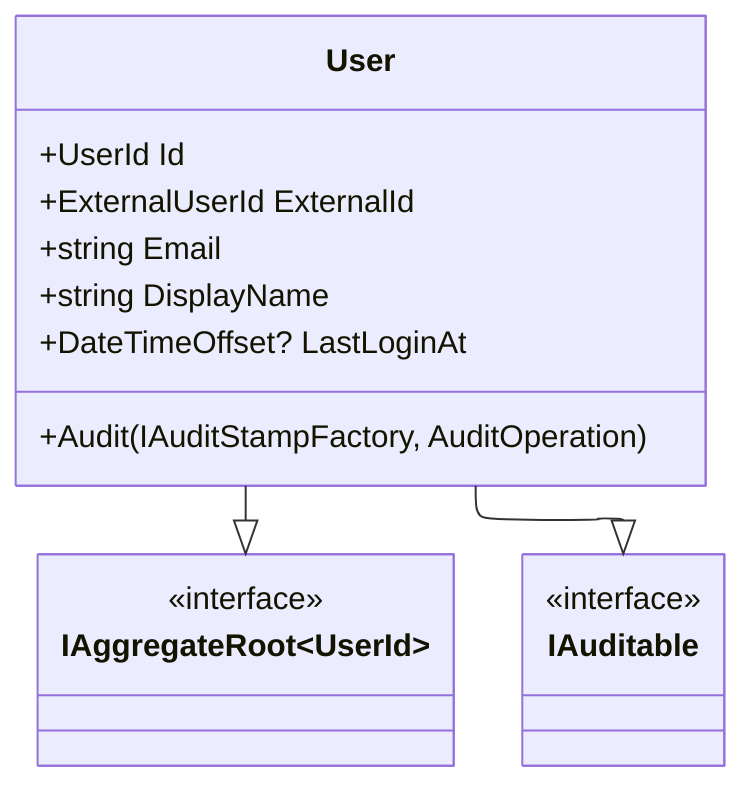
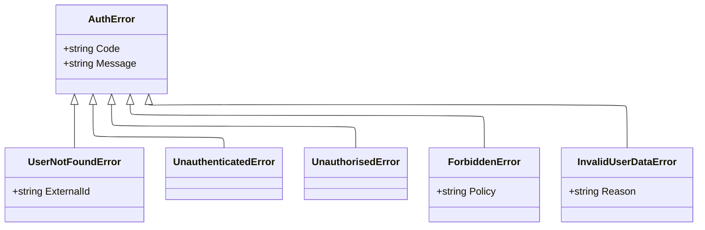

# Authentication API Reference

This document provides reference documentation for the authentication and authorization APIs in the Menlo application.

## Domain Models

### User

The `User` entity represents a system user linked to an external identity provider (Entra ID). It serves as the Aggregate Root for user-related operations.

**Key Properties:**

- `Id`: Internal unique identifier.
- `ExternalId`: The ID from the external provider (e.g., Entra ID Object ID).
- `Email`: User's email address.
- `DisplayName`: User's full name.

### AuthError

The `AuthError` class hierarchy defines domain-specific errors related to authentication and authorization. These errors should be used with the Result pattern.

**Error Types:**

- `UserNotFoundError`: Thrown when a user cannot be resolved from their external ID.
- `UnauthenticatedError`: Indicates the user is not logged in.
- `UnauthorisedError`: Indicates the user lacks permission for an action.
- `ForbiddenError`: Indicates the user does not satisfy a specific policy.
- `InvalidUserDataError`: Indicates validation failures for user data.

## Authorization Policies

Authorization is managed via ASP.NET Core Policies defined in `MenloPolicies`.

### Roles

Roles are defined in `MenloPolicies.Roles` and must match the App Roles defined in Entra ID.

| Role Constant                | Value          | Description                 |
| :--------------------------- | :------------- | :-------------------------- |
| `MenloPolicies.Roles.Admin`  | `Menlo.Admin`  | Full system access.         |
| `MenloPolicies.Roles.User`   | `Menlo.User`   | Standard read/write access. |
| `MenloPolicies.Roles.Reader` | `Menlo.Reader` | Read-only access.           |

### Policies

Policies group roles and requirements.

| Policy Name            | Constant                             | Requirement                                                    |
| :--------------------- | :----------------------------------- | :------------------------------------------------------------- |
| `RequireAuthenticated` | `MenloPolicies.RequireAuthenticated` | User must be logged in.                                        |
| `RequireAdmin`         | `MenloPolicies.RequireAdmin`         | Must have `Menlo.Admin` role.                                  |
| `CanEditBudget`        | `MenloPolicies.CanEditBudget`        | Must have `Menlo.Admin` OR `Menlo.User` role.                  |
| `CanViewBudget`        | `MenloPolicies.CanViewBudget`        | Must have `Menlo.Admin`, `Menlo.User`, OR `Menlo.Reader` role. |

## Configuration

Authentication is configured in `AuthServiceCollectionExtensions.AddMenloAuthentication`. It sets up:

1. **Cookie Authentication** (`.Menlo.Session`) as the default scheme.
2. **OpenIdConnect** (Entra ID) as the challenge scheme.
3. **Authorization Policies** via `AddMenloPolicies`.

API endpoints return `401 Unauthorized` instead of redirecting to login, while browser navigation redirects to Entra ID.
