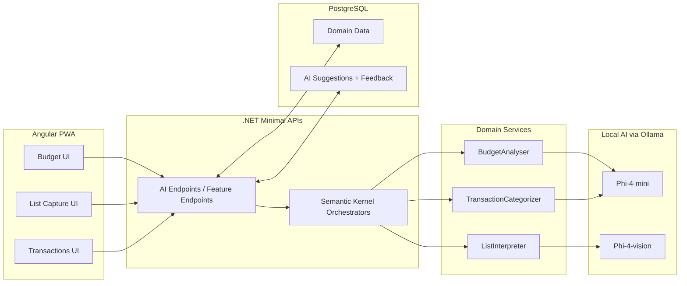

# AI Infrastructure — Component & Data Flow

```mermaid
flowchart LR
  subgraph Frontend[Angular PWA]
    UIBudget[Budget UI]
    UILists[List Capture UI]
    UITrans[Transactions UI]
  end

  subgraph API[.NET Minimal APIs]
    Endpoints[AI Endpoints / Feature Endpoints]
    SK[Semantic Kernel Orchestrators]
  end

  subgraph Domain[Domain Services]
    BudgetAnalyser
    TransactionCategorizer
    ListInterpreter
  end

  subgraph AI[Local AI via Ollama]
    PhiMini[Phi-4-mini]
    PhiVision[Phi-4-vision]
  end

  subgraph Database[PostgreSQL]
    Data[Domain Data]
    AISuggest[AI Suggestions + Feedback]
  end

  UIBudget --> Endpoints
  UILists --> Endpoints
  UITrans --> Endpoints

  Endpoints --> SK
  SK --> BudgetAnalyser
  SK --> TransactionCategorizer
  SK --> ListInterpreter

  BudgetAnalyser --> PhiMini
  TransactionCategorizer --> PhiMini
  ListInterpreter --> PhiVision

  Endpoints <--> Data
  Endpoints <--> AISuggest

  classDef db fill:#eef,stroke:#88a;
  class AISuggest,Data db;
```
