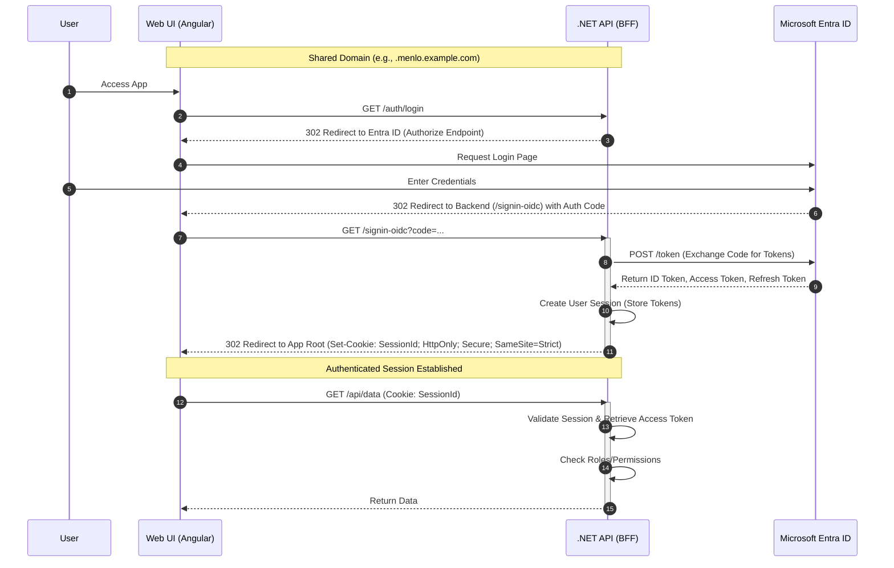

# Authentication Flow Diagram

This sequence diagram illustrates the Backend for Frontend (BFF) authentication flow used by the Web UI.

```mermaid
---
config:
  layout: elk
---
sequenceDiagram
    autonumber
    participant User
    participant Browser as Web UI (Angular)
    participant Backend as .NET API (BFF)
    participant Entra as Microsoft Entra ID

    Note over Browser, Backend: Shared Domain (e.g., .menlo.example.com)

    User->>Browser: Access App
    Browser->>Backend: GET /auth/login
    Backend-->>Browser: 302 Redirect to Entra ID (Authorize Endpoint)
    Browser->>Entra: Request Login Page
    User->>Entra: Enter Credentials
    Entra-->>Browser: 302 Redirect to Backend (/signin-oidc) with Auth Code
    Browser->>Backend: GET /signin-oidc?code=...
    activate Backend
    Backend->>Entra: POST /token (Exchange Code for Tokens)
    Entra-->>Backend: Return ID Token, Access Token, Refresh Token
    Backend->>Backend: Create User Session (Store Tokens)
    Backend-->>Browser: 302 Redirect to App Root (Set-Cookie: SessionId#59; HttpOnly#59; Secure#59; SameSite=Strict)
    deactivate Backend

    Note over Browser, Backend: Authenticated Session Established

    Browser->>Backend: GET /api/data (Cookie: SessionId)
    activate Backend
    Backend->>Backend: Validate Session & Retrieve Access Token
    Backend->>Backend: Check Roles/Permissions
    Backend-->>Browser: Return Data
    deactivate Backend
```
