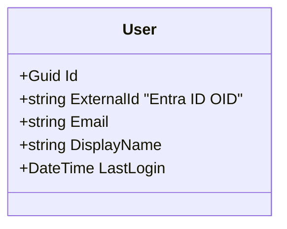

# Authentication & Identity - Requirements Specification

## 1. Overview

This document outlines the requirements for the Authentication and Identity module of the Menlo Home Management system. The system will leverage **Microsoft Entra ID (Free Tier)** as the Identity Provider (IdP) to secure access to the application.

The architecture follows a **Backend for Frontend (BFF)** pattern for the Web UI to ensure high security by keeping tokens out of the browser, while supporting **Bearer Token** authentication for future mobile application integration.

## 2. Business Requirements (BR)

| ID         | Requirement                      | Description                                                                                                                                                | Priority |
| :--------- | :------------------------------- | :--------------------------------------------------------------------------------------------------------------------------------------------------------- | :------- |
| **BR-001** | **Secure Identity Management**   | The system must use a centralized, industry-standard Identity Provider (Microsoft Entra ID) to manage user identities, avoiding custom credential storage. | High     |
| **BR-002** | **Zero-Trust Secret Management** | No application secrets (client secrets, certificates) shall be exposed to the client-side (browser) or committed to source control.                        | High     |
| **BR-003** | **Cost-Effective Authorization** | The solution must utilize the Free Tier of Microsoft Entra ID, working within its constraints (e.g., using App Roles instead of Groups for authorization). | High     |
| **BR-004** | **Seamless Web Experience**      | Web users should experience a seamless Single Sign-On (SSO) flow with persistent sessions managed via secure cookies.                                      | Medium   |
| **BR-005** | **Future Mobile Readiness**      | The authentication architecture must support future native mobile applications which typically rely on token-based authentication (OAuth2/OIDC).           | Medium   |
| **BR-006** | **Family Role Support**          | The system must distinguish between different family roles (e.g., Admin, User, Reader) to control access to sensitive financial data.                      | High     |

## 3. Functional Requirements (FR)

### 3.1. Authentication Flow

| ID         | Requirement            | Acceptance Criteria                                                                                                                                                                                                                                                                                                                               |
| :--------- | :--------------------- | :------------------------------------------------------------------------------------------------------------------------------------------------------------------------------------------------------------------------------------------------------------------------------------------------------------------------------------------------ |
| **FR-001** | **BFF Web Login**      | 1. Web UI initiates login via a backend endpoint (e.g., `/auth/login`). 2. Backend handles the OIDC Authorization Code flow with PKCE. 3. Tokens (Access, ID, Refresh) are stored securely on the server (e.g., encrypted session cache). 4. A `HttpOnly`, `Secure`, `SameSite` cookie is issued to the browser to maintain the session. |
| **FR-002** | **Mobile API Login**   | 1. API accepts standard `Authorization: Bearer <token>` headers. 2. API validates the token signature, issuer, and audience against Entra ID.                                                                                                                                                                                                  |
| **FR-003** | **Logout**             | 1. User can initiate logout from the UI. 2. Backend revokes the local session cookie. 3. Backend initiates a remote logout with Entra ID to clear the SSO session.                                                                                                                                                                          |
| **FR-004** | **Session Management** | 1. Web sessions utilize Sliding Expiration to keep active users logged in. 2. Backend automatically refreshes Access Tokens using Refresh Tokens without user interaction.                                                                                                                                                                     |

### 3.2. Authorization (RBAC)

| ID         | Requirement             | Acceptance Criteria                                                                                                                                                                                  |
| :--------- | :---------------------- | :--------------------------------------------------------------------------------------------------------------------------------------------------------------------------------------------------- |
| **FR-005** | **App Role Definition** | 1. Roles are defined in the Entra ID App Registration manifest (App Roles). 2. Roles include: `Menlo.Admin`, `Menlo.User`, `Menlo.Reader`.                                                        |
| **FR-006** | **Role Assignment**     | 1. Users are assigned to App Roles via the Entra ID Enterprise Application blade. 2. The system does not rely on Entra ID Groups for permission checking (due to Free tier constraints).          |
| **FR-007** | **Role Enforcement**    | 1. API endpoints enforce role requirements (e.g., `.RequiresAuth("CanEditBudget")`). 2. UI adapts to show/hide elements based on the user's assigned roles (fetched via a `/auth/user` endpoint). |

### 3.3. Security & Configuration

| ID         | Requirement         | Acceptance Criteria                                                                                                                                                                                                                                                                           |
| :--------- | :------------------ | :-------------------------------------------------------------------------------------------------------------------------------------------------------------------------------------------------------------------------------------------------------------------------------------------- |
| **FR-008** | **Cookie Security** | 1. Auth cookies must be `HttpOnly`. 2. Auth cookies must be `Secure` (HTTPS only). 3. Auth cookies must use `SameSite=Strict`. 4. Domain configuration must support the split topology (Frontend on Pages, Backend on Tunnel) via a shared root domain (e.g., `.menlo.example.com`). |
| **FR-009** | **Secret Handling** | 1. Backend uses `Azure.Identity` (`DefaultAzureCredential`) to load credentials. 2. In Production: Uses Environment Variables injected into the container/host. 3. In Development: Uses User Secrets or local Environment Variables.                                                    |

## 4. Non-Functional Requirements (NFR)

- **NFR-001 Security:** All authentication traffic must occur over HTTPS (TLS 1.2+).
- **NFR-002 Performance:** Authentication overhead on API calls should be < 20ms (using cached validation keys).
- **NFR-003 Usability:** Login redirects should be handled automatically; users should not see raw JSON errors for auth failures.

## 5. Technical Constraints

- **Identity Provider:** Microsoft Entra ID (Free Tier).
- **Frontend:** Angular (Cloudflare Pages).
- **Backend:** .NET 10 Web API (Cloudflare Tunnel).
- **Library:** `Azure.Identity` for credential management; `Microsoft.Identity.Web` or standard ASP.NET Core OIDC for protocol handling.
- **Topology:** Frontend and Backend must share a root domain (e.g., `app.menlo.example.com` and `api.menlo.example.com`) to support secure cookies.

## 6. Data Model Impact

No internal user passwords will be stored. A local `User` entity may be required to link domain-specific data (like preferences) to the Entra ID `oid` (Object ID).

