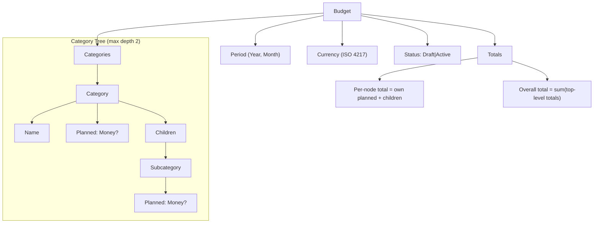

# Budget Structure

```mermaid
graph TD
  B[Budget] --> P["Period (Year, Month)"]
  B --> Ccy["Currency (ISO 4217)"]
  B --> S["Status: Draft|Active"]
  B --> CAT[Categories]

  subgraph "Category Tree (max depth 2)"
    CAT --> C1[Category]
    C1 --> C1N[Name]
    C1 --> C1P[Planned: Money?]
    C1 --> C1CH[Children]
    C1CH --> C1_1[Subcategory]
    C1_1 --> C1_1P[Planned: Money?]
  end

  B --> T[Totals]
  T --> NT[Per-node total = own planned + children]
  T --> OT["Overall total = sum(top-level totals)"]
```
