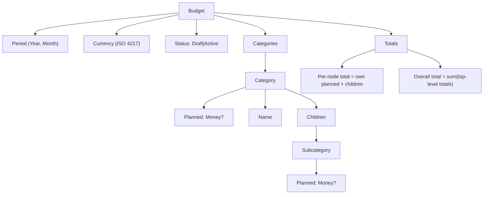

# Implementation Plan: Minimum Budget Aggregate Surface

## Overview

Implement the minimal Budget aggregate that’s “meaningful” for a family: a named budget for a month/year and currency, with a category hierarchy (max depth 2) that holds planned amounts and exposes correct computed totals. Activation transitions Draft → Active only when invariants pass.

References: see `specifications.md`, `../../reference/entity-design.md`, and `../domain-abstractions/specifications.md`.

## Architecture Alignment

- Vertical slice: Domain-first aggregate in a domain project; no persistence or API details here.
- Dependencies: Uses Domain Abstractions (strongly-typed IDs, IAggregateRoot, IAuditable, domain events).
- Decoupling: No ASP.NET or ClaimsPrincipal; auditing via `IAuditStampFactory`.

## Domain Surface (Contracts)

Entities and value objects:

- Ids: `BudgetId`, `BudgetCategoryId` (readonly record structs)
- Value Objects: `BudgetPeriod` (Year:int, Month:1-12), `Money` (decimal amount, Currency: ISO 4217), `Currency` (code:string), `CategoryName` (non-empty, trimmed)
- Aggregate: `Budget` implements `IAggregateRoot<BudgetId>`, `IAuditable`
- Entity: `CategoryNode` with fields: `Id`, `Name`, optional `Description`, `ParentId?`, `Planned: Money?`, `Order:int`, `Children: IReadOnlyList<CategoryNode>` (max depth 2)

Invariants:

- Category depth ≤ 2 (root → child only)
- Sibling names unique (case-insensitive, culture-invariant) within same parent
- Planned amount per node ≥ 0 and respects currency precision
- Computed node total = own planned (or 0) + sum(children totals)
- Budget can Activate only if at least one node has a non-zero planned amount and all validations pass

Operations (aggregate methods, returning `Result`/`Result<T>`):

- Create(name, period, currency) → Budget
- AddCategory(name, description?)
- AddSubcategory(parentId, name, description?)
- RenameCategory(categoryId, newName)
- ReorderCategory(categoryId, newOrder) (display only)
- RemoveCategory(categoryId) only when no children and planned=0
- SetPlanned(categoryId, amount: Money)
- ClearPlanned(categoryId)
- GetTotals() → aggregate snapshot with per-node totals and overall total
- Activate() (validates and sets Status=Active)

Audit:

- Budget is `IAuditable`; use `Audit(IAuditStampFactory, AuditOperation)` in mutators.

Events (illustrative):

- `CategoryAdded`, `CategoryRenamed`, `CategoryRemoved`, `PlannedSet`, `PlannedCleared`, `BudgetActivated`

## Data Shapes (Illustrative)

- Budget
  - Id: BudgetId, Name, Period, Currency, Status (Draft|Active), Categories: CategoryNode[]
- CategoryNode
  - Id: BudgetCategoryId, ParentId?, Name, Description?, Planned: Money?, Order:int, Children: CategoryNode[]
- Money
  - Amount: decimal, Currency: string (ISO code)

## Diagrams

- Budget Structure diagram: see `diagrams/budget-structure.md`.

## Implementation Steps

1) Contracts and types
   - Define `BudgetId`, `BudgetCategoryId`, `BudgetPeriod`, `Money`, `Currency`, `CategoryName`.
2) Aggregate and entities
   - Implement `Budget` with internal `CategoryNode` and status.
   - Implement invariants and operations listed above.
3) Totals computation
   - Implement total as derived value (on demand) to avoid stale state; ensure deterministic order.
4) Auditing hooks
   - Call `Audit(factory, op)` within mutators; ensure Created*/Modified* semantics.
5) Domain events
   - Emit events where helpful (non-breaking for MVP).
6) Validation utilities
   - Case-insensitive name comparer; currency precision guards.

## Testing Strategy

- Unit tests (xUnit + Shouldly):
  - Happy path: create budget; add categories; set planned; compute totals.
  - Edge cases: duplicate sibling name; depth >2 blocked; negative amounts rejected; remove non-empty category rejected; activation fails until one non-zero planned.
  - Totals: verify per-node and overall totals with mixed leaf and parent values.
- Error surface:
  - Domain errors: `DuplicateCategoryName`, `MaxDepthExceeded`, `CategoryNotLeaf`, `InvalidAmount`, `CategoryHasChildren`, `ActivationValidationFailed`.
- Determinism:
  - Reordering affects display only; totals unchanged.

## Acceptance Mapping

- BR-1..BR-5, FR-1..FR-8 mapped to operations and invariants above; totals verified via tests. Activation guarded by validation. Optional features (duplicate budget, notes) can be no-ops or deferred.

## Open Questions

- Money precision: enforce per-currency fraction digits or fixed 2dp for MVP?
- Name constraints: max length and allowed characters?
- Category count limits: practical cap to keep UI performant?
- Duplicate Budget scope (FR-7): include notes and order? copy planned amounts only?

## Risks & Mitigations

- Floating/decimal mistakes → always use decimal, validate precision, centralize Money logic.
- Name uniqueness locale issues → use OrdinalIgnoreCase for sibling checks.
- Hidden depth growth → enforce on add operations and during import/duplication.

## Definition of Done

- [ ] Domain types and aggregate implemented with invariants.
- [ ] Unit tests cover happy paths and edge cases; totals verified.
- [ ] No ASP.NET or persistence dependencies.
- [ ] Auditing integrated via `IAuditStampFactory`.
- [ ] Diagrams stored under `diagrams/` and linked from docs.
