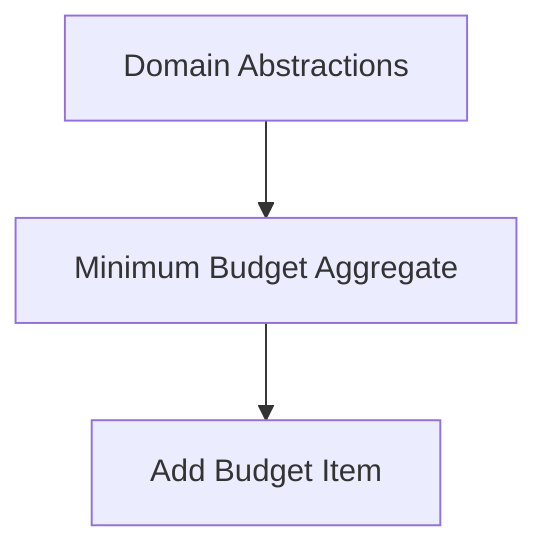

# Requirement: Minimum Budget Aggregate Surface

## Overview

Define the minimum domain surface of the Budget aggregate required to create a budget that is meaningful to a family. “Meaningful” here means: a named budget for a defined period and currency, with a set of planned allocations organised by category (optionally hierarchical), where totals are computed and validated so the family can plan spending.

- Goal: Enable creation and maintenance of a simple, valid monthly budget with clear totals
- Users: Family members managing the home budget (single household context)
- Outputs: A persisted Budget with identity, period, currency, category tree, and planned amounts with computed totals

## Scope

In scope:

- Budget identity, name, description (optional), household association, and status (Draft/Active)
- Planned allocations per category (decimal money in budget currency)
- Automatic computation of per-category and overall totals
- Category hierarchy up to depth 2 (category and optional subcategory)

Out of scope:

- Multi-currency budgets; FX
- Collaboration/roles; sharing outside a single household
- AI assistance and transaction reconciliation

Assumptions:

- Each budget belongs to a single household; cross-household budgets are not needed.
- Auditing is handled separately (see Domain Auditing requirement).

## Business Requirements

- BR-1 Named Monthly Budget
  - A family can create a named budget for a specific month and year in a chosen currency.

- BR-2 Category-Based Planning
  - The budget is structured as categories (with optional subcategories) that hold planned amounts.

- BR-3 Clear Totals
  - The budget shows computed totals at category, parent, and overall levels.

- BR-4 Minimal Cognitive Load
  - The structure should be simple enough to maintain monthly with limited effort (depth limited to 2; sensible defaults).

- BR-5 Household Context
  - Each budget belongs to a single household; cross-household budgets are not needed.

## Functional Requirements

- FR-1 Create Budget
  - Create a budget with: Name (required), Period (Month, Year), Currency (ISO code), Status = Draft (default).

- FR-2 Activate Budget
  - Transition a budget from Draft → Active when it passes validation.

- FR-3 Category Management
  - Add category (unique name within same parent). Optional description.
  - Add subcategory (max depth 2).
  - Rename category/subcategory.
  - Reorder categories within the same parent (affects display only).
  - Remove category only if it has no children and planned amount is zero.

- FR-4 Planned Amounts
  - Set/clear planned amount on any category node.
  - Amounts must be ≥ 0 and respect currency precision.

- FR-5 Computed Totals
  - Compute per-node total as sum of its planned amount plus all descendants.
  - Compute overall budget total as sum of all top-level node totals.

- FR-6 Validation
  - Category names must be unique within a sibling set (case-insensitive compare).
  - Budget must have at least one category with a non-zero planned amount to be considered “meaningful”.
  - Total must be computable without overflow; amounts must be finite and within decimal bounds.

- FR-7 Duplicate Budget (Optional)
  - Duplicate an existing budget (structure and amounts) into a new period with a new identity; set Status = Draft.

- FR-8 Notes/Annotations (Optional)
  - Allow optional free-text notes at budget or category level (non-functional to totals).

## Dependencies

- Upstream dependencies:
  - Domain Abstractions: strongly-typed IDs, aggregates, domain events, and auditing surface
    - See: `../domain-abstractions/specifications.md`

- Downstream dependents:
  - Add Budget Item vertical slice: relies on the Budget aggregate structure and totals
    - See: `../budget-item/specifications.md`

### Dependency Graph

## Acceptance Criteria

- [ ] Can create a Draft budget with Name, Month/Year, and Currency
- [ ] Can add categories/subcategories (max depth 2) and set planned amounts ≥ 0
- [ ] Category names are unique per sibling group; invalid operations are rejected with clear messages
- [ ] Deleting a category with children or non-zero planned amount is blocked with a descriptive reason
- [ ] Totals compute correctly at each node and overall
- [ ] A budget cannot be Activated unless it contains at least one non-zero planned amount and passes validation
- [ ] Duplicate operation (if used) creates a new Draft budget with identical structure/amounts for a target period

## Considerations

- Zero-Based vs Envelope: Future support for “planned income” or zero-based balancing is out of scope; current model plans spending only.
- Depth Constraint: Depth 2 is sufficient for MVP and reduces complexity; can be extended later.
- Currency Precision: Use currency-aware precision (e.g., 2 decimals for ZAR); validate inputs accordingly.
- Performance: Category count for household use is typically small (< 200 nodes); no special optimisations required initially.
- Internationalisation: Category names are free text; localisation is UI-level concern.
- Migration Path: Duplicating prior month is a pragmatic path to monthly maintenance.

---

References: docs/reference/entity-design.md, domain-abstractions, domain-auditing.
