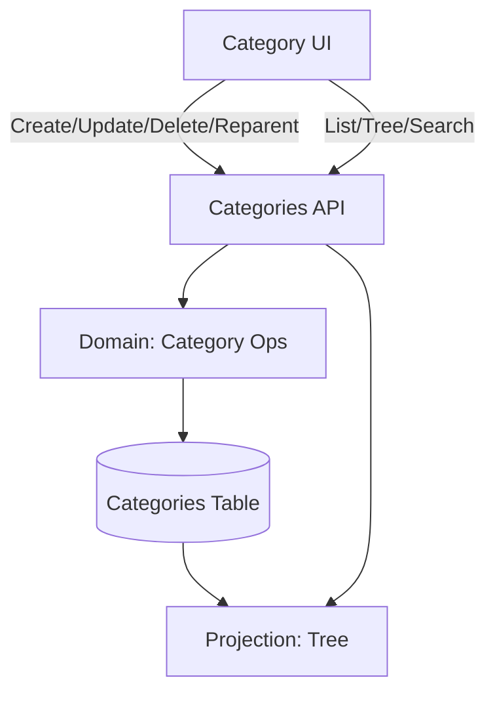

# Budget Categories — Vertical Flow

```mermaid
flowchart TD
    UI[Category UI]
    API[Categories API]
    Domain[Domain: Category Ops]
    DB[(Categories Table)]
    Read[Projection: Tree]

    UI -- Create/Update/Delete/Reparent --> API
    API --> Domain
    Domain --> DB
    DB --> Read
    UI -- List/Tree/Search --> API
    API --> Read
```
