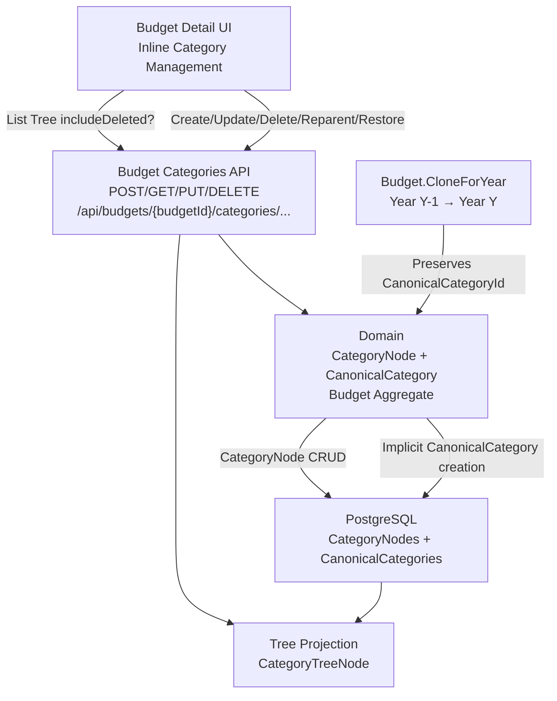

# Budget Categories — Vertical Flow

```mermaid
flowchart TD
    UI["Budget Detail UI<br/>Inline Category Management"]
    API["Budget Categories API<br/>POST/GET/PUT/DELETE<br/>/api/budgets/{budgetId}/categories/..."]
    Domain["Domain<br/>CategoryNode + CanonicalCategory<br/>Budget Aggregate"]
    DB["PostgreSQL<br/>CategoryNodes + CanonicalCategories"]
    Read["Tree Projection<br/>CategoryTreeNode"]
    Clone["Budget.CloneForYear<br/>Year Y-1 → Year Y"]

    UI -- Create/Update/Delete/Reparent/Restore --> API
    API --> Domain
    Domain -- Implicit CanonicalCategory creation --> DB
    Domain -- CategoryNode CRUD --> DB
    DB --> Read
    UI -- List Tree includeDeleted? --> API
    API --> Read
    Clone -- Preserves CanonicalCategoryId --> Domain
```
