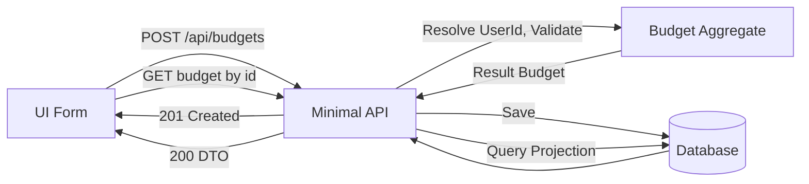

# Create Budget Vertical — Flow

```mermaid
flowchart LR
  UI[UI Form]
  API[Minimal API]
  DOM[Budget Aggregate]
  DB[(Database)]

  UI -->|POST /api/budgets| API
  API -->|Resolve UserId, Validate| DOM
  DOM -->|Result Budget| API
  API -->|Save| DB
  API -->|201 Created| UI
  UI -->|GET budget by id| API
  API -->|Query Projection| DB
  DB --> API
  API -->|200 DTO| UI
```
