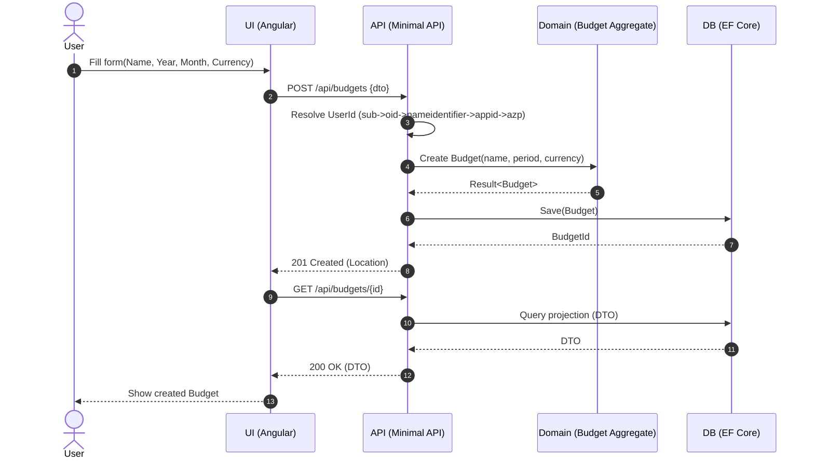

# Implementation Plan: Create Budget (Vertical Slice)

## Overview

End-to-end implementation to create a budget from UI through API to persistence, then render the created budget.

## Components

- UI (Angular, App Shell present): Create Budget page/form, navigation to detail
- API (Minimal APIs): POST /api/budgets, GET /api/budgets/{id}
- Domain: Use Minimum Budget Aggregate to construct a Draft budget
- Persistence: EF Core model and mappings; unique index; projections for GET
- Cross-cutting: User ID Resolution, Domain Auditing, Observability

## Sequence

## Data Contracts

- POST Request: { name:string, year:int, month:int, currency:string }
- POST Responses:
  - 201 Created { id } with Location header
  - 400 ValidationProblemDetails
  - 409 ProblemDetails(code="DuplicateBudget")
- GET Response: BudgetDto { id, name, year, month, currency, status }

## API Surface

- POST /api/budgets
  - Validates inputs; resolves UserId; calls domain; audits; persists
- GET /api/budgets/{id}
  - Returns projection; 404 if not found or not owned by user

## Persistence

- EF Core entity tables: Budgets (initial minimal fields)
- Unique index: (UserId, Year, Month, Name)
- Keep domain model rich; map value objects appropriately (owned types where helpful)

## Observability

- Source-generated logging for key steps
- Trace context propagation; minimal metrics on create operations

## Testing

- UI: Component tests for validation; e2e flow happy path
- API: Integration tests covering 201, 400, 409, 404
- Domain: Already covered by Minimum Budget Aggregate tests
- Persistence: TestContainers + Respawn for uniqueness and CRUD

## Risks

- Validation mismatch UI/API → share rules where feasible or mirror exactly
- Uniqueness race conditions → DB unique index + graceful 409 mapping

## DoD

- [ ] UI form implemented and navigates on success
- [ ] API endpoints implemented with tests
- [ ] Persistence model and constraints in place
- [ ] Observability wired and validated
