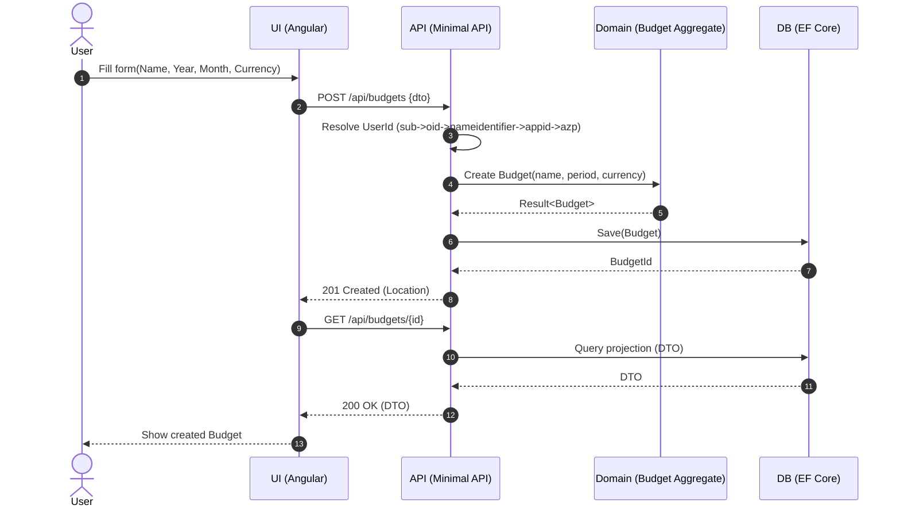

# Implementation Plan: Create Budget (Vertical Slice)

## Overview

End-to-end implementation to create a budget from UI through API to persistence, then render the created budget.

## Components

- UI (Angular, App Shell present): Create Budget page/form, navigation to detail
- API (Minimal APIs): POST /api/budgets, GET /api/budgets/{id}
- Domain: Use Minimum Budget Aggregate to construct a Draft budget
- Persistence: EF Core model and mappings; unique index; projections for GET
- Cross-cutting: User ID Resolution, Domain Auditing, Observability

## Sequence

## Contract summary (inputs/outputs)

- Input (UI → API): CreateBudgetRequest
  - name: string (required, trimmed)
  - year: int (1900..2100)
  - month: int (1..12)
  - currency: string (ISO 4217, uppercase 3 letters)
- Output (API → UI):
  - 201 Created with Location: /api/budgets/{id}
  - Body: { id: string }
  - 400 ValidationProblemDetails (field errors)
  - 409 ProblemDetails(code="DuplicateBudget")
  - 401/403 for auth failures

- Read (GET): BudgetDto { id, name, year, month, currency, status }

Edge cases to handle explicitly:

- Missing/invalid fields; month/year out of range; currency wrong case/length
- Duplicate existing budget for same user + period + name
- Unauthenticated/unauthorised

## Data Contracts

- POST Request: { name:string, year:int, month:int, currency:string }
- POST Responses:
  - 201 Created { id } with Location header
  - 400 ValidationProblemDetails
  - 409 ProblemDetails(code="DuplicateBudget")
- GET Response: BudgetDto { id, name, year, month, currency, status }

## API Surface

- POST /api/budgets
  - Validates inputs; resolves UserId; calls domain; audits; persists
- GET /api/budgets/{id}
  - Returns projection; 404 if not found or not owned by user

### Minimal API endpoints (shape)

- Route group: /api/budgets
  - POST / → CreateBudget
  - Signature: `static Task<IResult> CreateBudget(CreateBudgetRequest request, HttpContext http, IServiceProvider services)`
    - Validates request; resolves UserId using the configured provider; calls Budget.Create; audits; persists; returns 201 with Location
  - GET /{id} → GetBudgetById
  - Signature: `static Task<Results<Ok<BudgetDto>, NotFound>> GetBudgetById(Guid id, HttpContext http, IServiceProvider services)`
    - Ensures ownership (UserId check); projects to BudgetDto; returns 200 or 404

Handlers live as static classes within a Budget vertical folder; do not introduce MediatR per guidelines.

## Persistence

- EF Core entity tables: Budgets (initial minimal fields)
- Unique index: (UserId, Year, Month, Name)
- Keep domain model rich; map value objects appropriately (owned types where helpful)

### EF Core mapping details

- Table: Budgets
  - Columns: BudgetId (pk, Guid), UserId (Guid), Name (varchar 200), Year (int), Month (int), Currency (char(3)), Status (smallint)
  - Unique index: IX_Budgets_User_Period_Name(UserId, Year, Month, Name)
- Value conversions
  - Strongly-typed IDs (BudgetId) via ValueConverter
  - Currency as string(3) uppercased at write, read as VO if applicable
  - Period as separate Year/Month scalar columns
- Migrations: add initial CreateBudget tables and unique index

### Read projection

- LINQ select to `BudgetDto` directly from Budgets (no domain re-hydration for GET by id)
- Ownership filter: WHERE UserId == resolved user

## Observability

- Source-generated logging for key steps
- Trace context propagation; minimal metrics on create operations

### Logging source generators

- Define LoggerMessage methods for: CreatingBudgetStart, CreatingBudgetDuplicate, CreatingBudgetSuccess, GetBudgetNotFound, GetBudgetSuccess
- Include correlating BudgetId and UserId; avoid PII

## Testing

- UI: Component tests for validation; e2e flow happy path
- API: Integration tests covering 201, 400, 409, 404
- Domain: Already covered by Minimum Budget Aggregate tests
- Persistence: TestContainers + Respawn for uniqueness and CRUD

### Test inventory (examples)

- API integration (xUnit 3):
  - GivenValidRequest_WhenCreateBudget
  - GivenDuplicateBudget_WhenCreateBudget
  - GivenOtherUserBudget_WhenGetById
  - GivenOwnedBudget_WhenGetById
- Persistence:
  - GivenUniqueIndex_WhenInsertDuplicate
- UI (Angular):
  - GivenInvalidForm_WhenTyping
  - Given409FromApi_WhenSubmitting

## Risks

- Validation mismatch UI/API → share rules where feasible or mirror exactly
- Uniqueness race conditions → DB unique index + graceful 409 mapping

## Security & Authorisation

- Authentication: Microsoft Entra ID (JWT bearer)
- Policies: budget.read, budget.write (PBAC). POST requires budget.write; GET requires budget.read and ownership check
- Ownership enforcement: UserId from IoC provider compared to row UserId

## Feature toggle

- Toggle key: feature.create-budget (bool)
- API: conditionally map POST/GET group based on toggle
- UI: guard route and button visibility with the same toggle

## Angular UI implementation details

- Standalone component: CreateBudgetPageComponent
  - Reactive typed form with controls: name, year, month, currency
  - Synchronous validators: required, ranges, regex for currency [A-Z]{3}
  - Disabled submit until valid; normalise currency to uppercase on submit
- Service: BudgetApi
  - `createBudget(req: CreateBudgetRequest): Observable<{ id: string }>`
  - `getBudget(id: string): Observable<BudgetDto>`
- Navigation: on 201, navigate to /budgets/:id and fetch to render header summary
- Error UX: map 409 to inline message near name/month/year; map 400 field errors to form
- Telemetry: emit page view + create attempt/success/failure events (no PII)

## Step-by-step tasks (Do the smallest thing first)

1. Domain wiring — Ensure `Budget.Create(name, period, currency)` exists per Minimum Budget Aggregate (Result pattern).
2. Endpoint scaffolding — Add /api/budgets route group with POST and GET handlers (static classes). Wire UserId resolution provider and IAuditStampFactory in handlers.
3. Persistence — Add EF entity/map for Budget with unique index; create migration; update DbContext. Implement repository or direct DbContext usage in handlers (keep vertical slice simple).
4. Observability & security — Add LoggerMessage partials; add policies and apply to endpoints; add ownership checks.
5. UI — Create standalone form component + service; add route; handle success navigation and error mapping.
6. Tests — API integration (happy/409/400/404); persistence unique index test; UI component tests for form validation.
7. Toggle & docs — Gate endpoints and UI; verify docs and diagrams match implementation.

## DoD

- [ ] UI form implemented and navigates on success
- [ ] API endpoints implemented with tests
- [ ] Persistence model and constraints in place
- [ ] Observability wired and validated
- [ ] Feature toggle guards API and UI
- [ ] Security policies enforced and covered by tests
