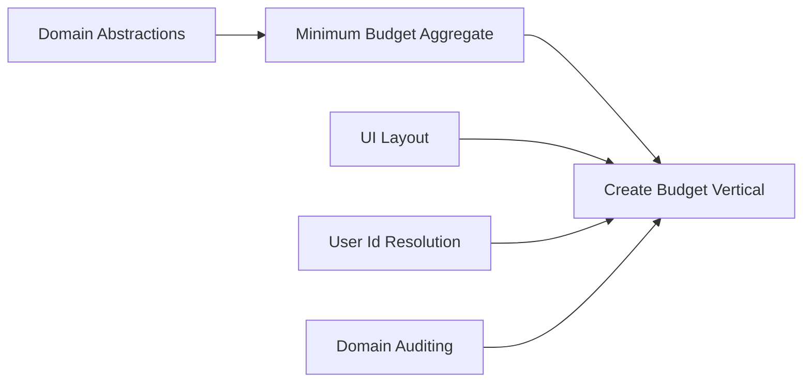

# Requirement: Create Budget (Vertical Slice)

## Purpose

Deliver a full vertical path for creating a new Budget from the UI to persistence and rendering it back on the UI.

- Scope spans: UI (form), API (command), Domain (aggregate), Persistence (write & read), and UI read (confirmation/display).
- Reuse existing requirements: Domain Abstractions, Domain Auditing, User ID Resolution, UI Layout, Minimum Budget Aggregate.

## Dependencies

- ../domain-abstractions/specifications.md
- ../domain-auditing/specifications.md
- ../user-id-resolution/specifications.md
- ../ui-layout/specifications.md
- ../budget-aggregate-minimum/specifications.md

## Business Requirements

- BR-1: A user can create a new budget for a specific month, year, and currency.
- BR-2: The system must prevent duplicate budgets for the same user, month, and year (currency considered configurable; default allow multiple currencies per period, but do not duplicate name+period).
- BR-3: The budget is initially Draft; activation is a separate action (covered by Minimum Budget Aggregate).
- BR-4: After creation, the user is shown the newly created budget with its summary details.
- BR-5: If creation fails, the user receives a clear error with actionable guidance.

## Functional Requirements

- FR-1: UI Form
  - Inputs: Name (required), Year (numeric), Month (1-12), Currency (ISO 4217 code)
  - Validation: client-side immediate feedback; disable submit until valid
  - Submit: POST to API
- FR-2: API Endpoint (Minimal API)
  - Route: POST /api/budgets (kebab-case)
  - Auth: Entra ID; resolve UserId via IoC provider (claim precedence)
  - Body: { name, year, month, currency }
  - Responses:
    - 201 Created with Location: /api/budgets/{id}
    - 400 for validation errors; 409 for duplicate budget; 401/403 as appropriate
- FR-3: Command Handling
  - Validate input; construct Budget aggregate per Minimum Budget Aggregate
  - Apply auditing via IAuditStampFactory
  - Persist (EF Core) and emit domain events
- FR-4: Persistence (Write)
  - Store new Budget and initial empty categories set; status=Draft
  - Enforce uniqueness: (UserId, Year, Month, Name) unique index
- FR-5: Persistence (Read)
  - GET /api/budgets/{id} returns budget DTO
  - Use projection that’s independent of domain models; include totals snapshot
- FR-6: UI Confirmation & Display
  - After 201, navigate to Budget page and render budget header and empty categories
  - Show currency, period, and status

## Non-Functional Requirements

- NFR-1: AuthN/AuthZ via Microsoft Entra ID; PBAC policy checks
- NFR-2: Observability: structured logs, trace IDs, and metrics for the command path
- NFR-3: Performance: P95 create path under 300ms (local network)
- NFR-4: Internationalisation: ISO currency; month names locale-aware on UI
- NFR-5: Privacy: no PII leakage in telemetry

## Considerations

- Currency precision per ISO fraction digits; client inputs normalised to uppercase
- Duplicate rules might evolve to include currency; keep index flexible
- Vertical slice should isolate concerns and not introduce MediatR (per guidelines)

## Acceptance Criteria

- AC-1: Given valid inputs, when submitting the form, then a 201 is returned with Location and the UI navigates to the new budget page.
- AC-2: Given an existing budget with same user+period+name, when submitting, then a 409 is returned with an explanatory message and the UI shows an inline error.
- AC-3: Given invalid inputs, when submitting, then a 400 is returned with detailed validation errors mapped to fields.
- AC-4: The persisted budget can be retrieved via GET and matches the submitted values with Status=Draft.
- AC-5: Observability confirms a trace spans UI → API → Domain → DB and back.

## Out of Scope

- Activation, categories authoring, planned amounts (covered elsewhere)
- Duplication/cloning of budgets (future requirement)
- Import/Export features

## Diagrams

- Vertical flow: `diagrams/vertical-flow.md`

