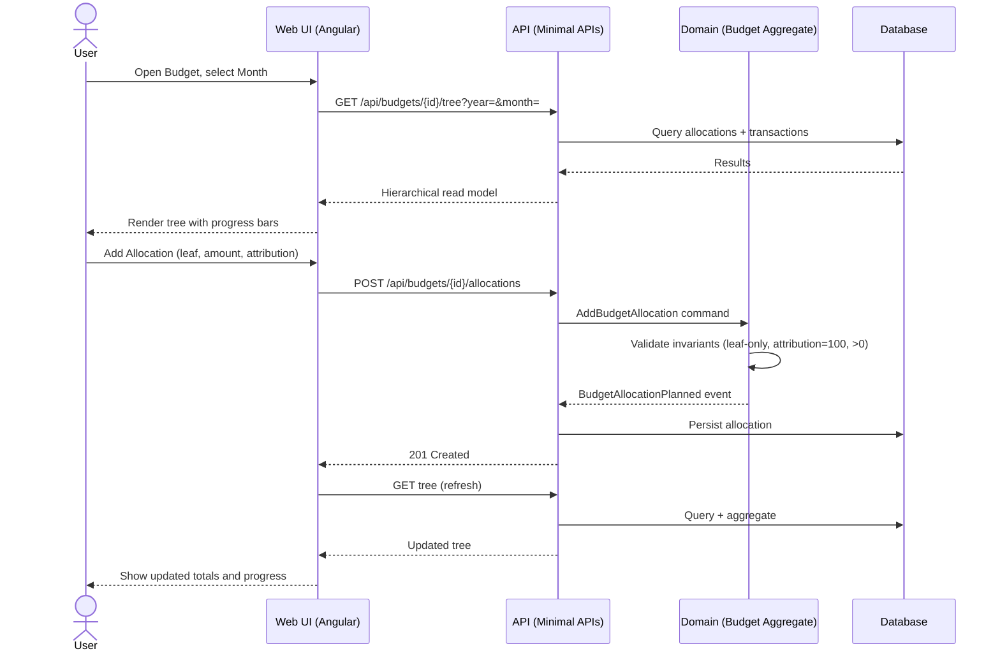
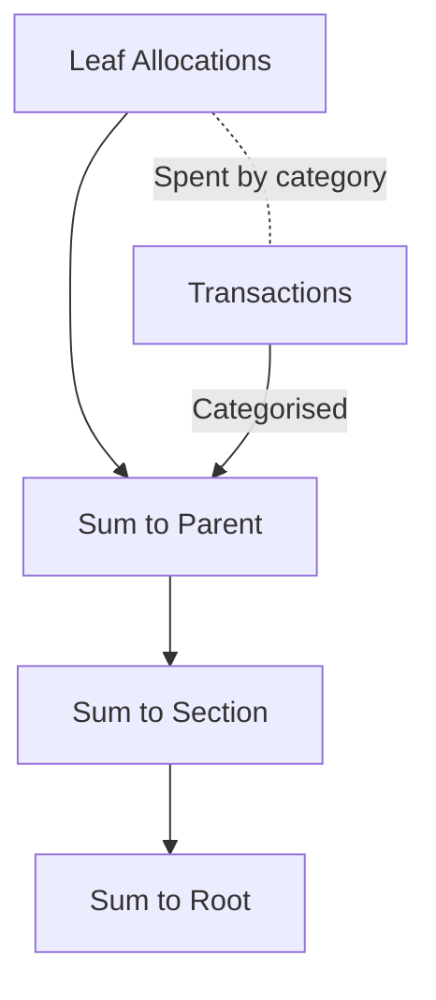

# Diagram: Add Budget Item Flow and Visualisation

```mermaid
sequenceDiagram
    actor U as User
    participant UI as Web UI (Angular)
    participant API as API (Minimal APIs)
    participant D as Domain (Budget Aggregate)
    participant DB as Database

    U->>UI: Open Budget, select Month
    UI->>API: GET /api/budgets/{id}/tree?year=&month=
    API->>DB: Query allocations + transactions
    DB-->>API: Results
    API-->>UI: Hierarchical read model
    UI-->>U: Render tree with progress bars

    U->>UI: Add Allocation (leaf, amount, attribution)
    UI->>API: POST /api/budgets/{id}/allocations
    API->>D: AddBudgetAllocation command
    D->>D: Validate invariants (leaf-only, attribution=100, >0)
    D-->>API: BudgetAllocationPlanned event
    API->>DB: Persist allocation
    API-->>UI: 201 Created
    UI->>API: GET tree (refresh)
    API->>DB: Query + aggregate
    API-->>UI: Updated tree
    UI-->>U: Show updated totals and progress
```

```mermaid
flowchart TD
    A[Leaf Allocations] --> B[Sum to Parent]
    B --> C[Sum to Section]
    C --> D[Sum to Root]
    A -.Spent by category.- E[Transactions]
    E -->|Categorised| B
```
