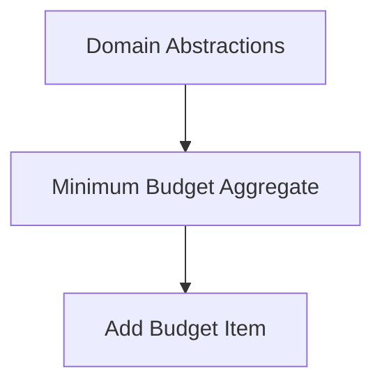

# Requirement: Add Budget Item from UI (Budget Domain)

## Overview

Enable a user to add a new leaf-level budget allocation ("budget item") within the Budget aggregate, persist it, and visualise the budget hierarchy with Planned vs Realized vs Spent states for a selected month. The design must align with the Domain Model in `docs/reference/entity-design.md` and the documentation strategy in `docs/README.md`.

- Primary user: Household budget owner or collaborator
- Context: South African family budgeting with attribution for personal vs rental costs
- Value: Faster planning at leaf categories, immediate feedback with clear visualisation

## Scope

In scope:

- Add a new leaf-level Planned allocation to an existing yearly Budget for a selected month (BudgetPeriod)
- Persist the new allocation and read existing allocations for display
- Visualise the budget hierarchy (categories and leaf nodes) for a selected month, including:
  - Planned vs Realized vs Spent indicators (at least Planned + Spent; Realized optional but provisioned)
  - Aggregation from children to parent categories
  - Per-category progress indicators and totals
- Basic attribution capture on the item (Family/Rental/Shared with percentages summing to 100%)
- Validation of invariants from the Budget domain

Out of scope (for this requirement):

- Category CRUD (creation, rename, move, delete)
- Annual budget cloning/carry-over
- AI assistance (BudgetAnalyser, TransactionCategorizer)
- Bank import and reconciliation flows
- Editing or deleting budget items (covered by a future requirement)
- Authentication/authorisation specifics (assume user is authenticated)
- Multi-currency and advanced tax reporting
- Complex feature toggles beyond a single on/off toggle for the feature

Assumptions:

- A Budget (year) and its category hierarchy already exist with canonical IDs
- Leaf categories are identifiable; allocations can only be created for leaf categories
- Currency is ZAR and shown with R prefix; locale en-ZA

## Domain Alignment

- Aggregate: Budget
- Entities: BudgetCategory, BudgetAllocation, BudgetTransaction (read-only for Spent aggregation)
- Value Objects: Money, AttributionRule, BudgetPeriod, CategoryPath
- States: Planned → Realized → Spent
- Invariants enforced:
  - Allocations only on leaf categories
  - Parent totals derive from children
  - Attribution percentages sum to 100%
  - Over-budget spending is allowed (no blocking), warnings later

## Functional Requirements

FR-1: Create Budget Allocation

- From the UI, user selects: Month, Leaf Category, Amount (Money), Optional Notes, Attribution split
- System invokes domain to add a Planned allocation for the selected month and category

FR-2: Persist Allocation

- Allocation is saved to the data store tied to the owning yearly Budget and category

FR-3: Read and Aggregate for Display

- System reads allocations, realizations, and transactions for the selected month
- Aggregates amounts up the category hierarchy to parents

FR-4: Visualise Budget

- UI presents a hierarchical view with per-node totals and progress bars:
  - Planned (sum of allocations)
  - Spent (sum of linked transactions)
  - Realized layer is shown only when realized items exist; otherwise hidden
- Provide quick filters: All / Over budget / With allocations / No allocations

FR-5: Validation and Errors

- Validate leaf-only rule, attribution sum=100, amount > 0, month in the selected budget year
- On invalid input, show clear messages; do not persist invalid data

FR-6: Accessibility and Responsiveness

- Visualisation usable on mobile and desktop, keyboard accessible, with colour + text indicators

FR-7: Telemetry and Audit (minimal)

- Record allocation-created event (domain) and basic usage telemetry (app), without PII

## Non-Functional Requirements

- Performance: Render a budget of up to 2,000 categories with <200ms aggregation time client-visible (server pre-aggregation allowed)
- Reliability: Atomic creation per item with clear error outcomes
- Security: No PII in telemetry, follow least privilege data access
- Usability: Visual clarity with progress bars and summarised totals at each level
- Internationalisation: en-ZA formatting; supportive of future i18n

## Acceptance Criteria

- [ ] User can add a Planned allocation on a leaf category for a month in the active budget year
- [ ] Invalid attempts (non-leaf, attribution ≠ 100%, amount ≤ 0, month outside year) are blocked with friendly errors
- [ ] New item is persisted and appears after refresh in the hierarchical view
- [ ] Hierarchical visual shows Planned and Spent totals rolled up to parents
- [ ] Progress bars show Spent vs Planned; over-budget visually indicated
- [ ] Basic filters work (All/Over budget/With allocations/No allocations)
- [ ] Telemetry and a domain event trace the creation without PII
- [ ] Realized layer is hidden when there are no realized items for the month
- [ ] Attribution captured via numeric inputs with a live total validator; submit disabled until total = 100
- [ ] No inline edits in the tree; allocation creation happens via a dedicated dialog/form

## Data Shapes (Illustrative)

- Command/Input (UI → API):
  - budgetId (Guid), year (int), month (1-12), categoryId (Guid), amount (decimal, 2dp), currency="ZAR", notes?, attribution: [{type: Family|Rental|Shared, percent:int}]

- Read Model (API → UI, per month):
  - tree: [{ categoryId, name, isLeaf, planned: Money, realized?: Money, spent: Money, children: [...] }]

## Risks & Constraints

- Large hierarchies require efficient aggregation (server-side recommended)
- Leaf-only rule must be strictly enforced to avoid inconsistent totals
- Spent linkage depends on reconciliation availability; for now, sum of transactions tagged to category

## Dependencies

- Existing Budget and Category hierarchy
- Data access layer or repository for Budget and Allocations
- UI framework (Angular per repo standards) for tree visualisation

### Dependencies Map

- Upstream:
  - Domain Abstractions: strongly-typed IDs, domain events, auditing contract
    - See: `../domain-abstractions/specifications.md`
  - Minimum Budget Aggregate: provides the category tree and totals semantics
    - See: `../budget-aggregate-minimum/specifications.md`

## Decisions (Resolved)

- Realized visibility: Hide when none exist; show only when realized items are present
- Inline edits: Not required (explicitly out of scope); use dialog/form for creation
- Attribution UI: Numeric inputs with a live total validator (must equal 100%)

---

Reference: See `docs/reference/entity-design.md` (Budget Aggregate) and `docs/README.md` (documentation strategy).
