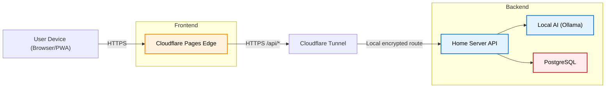

# Cloudflare Pages Hosting Flow Diagram

```mermaid
flowchart LR
    A["User Device (Browser/PWA)"] -->|HTTPS| B[Cloudflare Pages Edge]
    B -->|HTTPS /api/*| C[Cloudflare Tunnel]
    C -->|Local encrypted route| D[Home Server API]
    D --> E["Local AI (Ollama)"]
    D --> F[PostgreSQL]

    subgraph Frontend
        B
    end
    subgraph Backend
        D
        E
        F
    end

    classDef edge fill:#fff3e0,stroke:#fb8c00,stroke-width:2px,color:#000
    classDef backend fill:#e3f2fd,stroke:#1976d2,stroke-width:2px,color:#000
    classDef data fill:#ffebee,stroke:#c62828,stroke-width:2px,color:#000
    class B edge
    class D backend
    class E backend
    class F data
```

---

See also: [Specifications](../specifications.md), [Implementation Plan](../implementation.md), [Test Cases](../test-cases.md).
