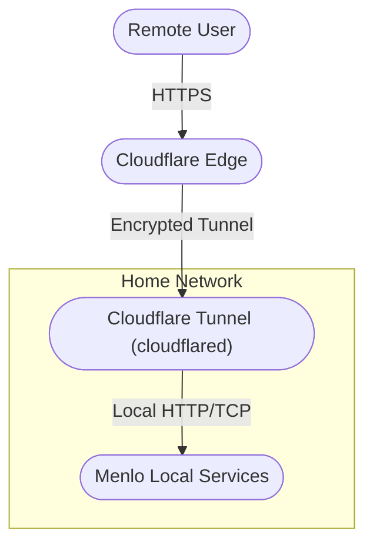

# Cloudflare Tunnel - Network Flow Diagram

This diagram shows how remote users securely access Menlo's local services via Cloudflare Tunnel, with all traffic encrypted and no inbound ports required.
