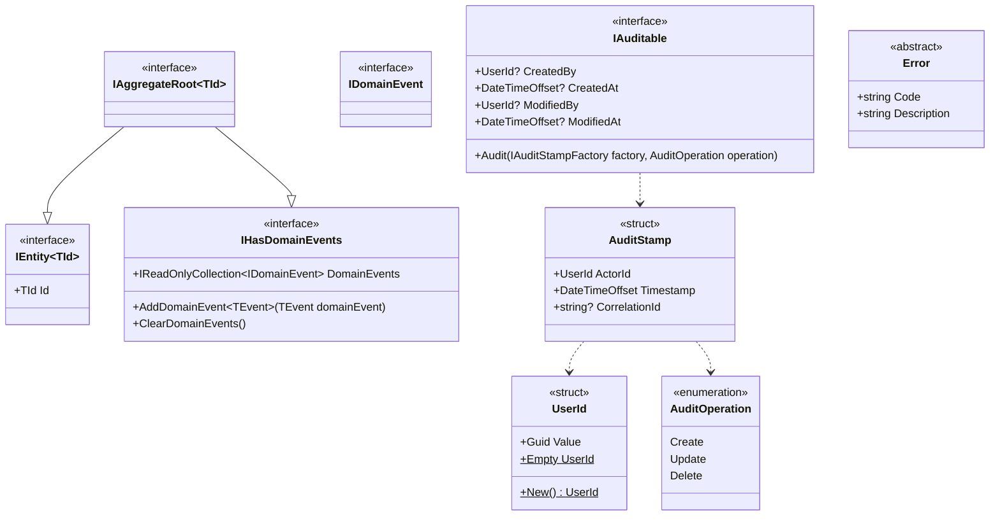

```mermaid
classDiagram
    class IEntity~TId~ {
        <<interface>>
        +TId Id
    }

    class IAggregateRoot~TId~ {
        <<interface>>
    }

    class IHasDomainEvents {
        <<interface>>
        +IReadOnlyCollection~IDomainEvent~ DomainEvents
        +AddDomainEvent~TEvent~(TEvent domainEvent)
        +ClearDomainEvents()
    }

    class IDomainEvent {
        <<interface>>
    }

    class IAuditable {
        <<interface>>
        +UserId? CreatedBy
        +DateTimeOffset? CreatedAt
        +UserId? ModifiedBy
        +DateTimeOffset? ModifiedAt
        +Audit(IAuditStampFactory factory, AuditOperation operation)
    }

    class Error {
        <<abstract>>
        +string Code
        +string Description
    }

    class UserId {
        <<struct>>
        +Guid Value
        +New() UserId$
        +Empty UserId$
    }

    class AuditStamp {
        <<struct>>
        +UserId ActorId
        +DateTimeOffset Timestamp
        +string? CorrelationId
    }

    class AuditOperation {
        <<enumeration>>
        Create
        Update
        Delete
    }

    IAggregateRoot --|> IEntity
    IAggregateRoot --|> IHasDomainEvents
    
    IAuditable ..> AuditStamp
    AuditStamp ..> UserId
    AuditStamp ..> AuditOperation
```
