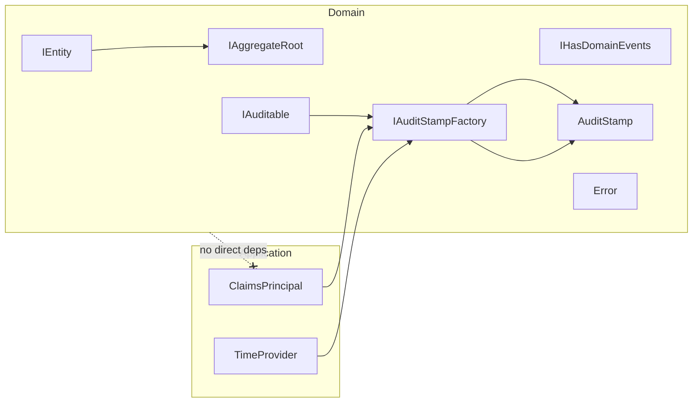

# Implementation Plan: Domain Model Abstractions

## Summary

Define abstractions only; no concrete implementations or persistence. Provide interfaces, value object contracts, and examples that guide future slices.

## Steps

1. Id Types & Contracts

- Define readonly record struct pattern for Ids (e.g., BudgetId, UserId examples in docs)
- Provide generic interfaces: IEntity\<TId\>, IAggregateRoot\<TId\>

1. Domain Events

- Provide IHasDomainEvents with add/clear semantics
- Document guidance for event publication by application layer

1. Auditing

- Define AuditStamp (Actor, Timestamp)
- Define IAuditable with read-only audit fields and Audit(factory, op); factory returns an AuditStamp
- Define AuditOperation enum (Create, Update)
- Note: IAuditStampFactory interface and its concrete adapters are defined in a separate “Audit” requirement. The domain only consumes the interface.

1. Error & Result

- Provide Error base class (code, message) for domain errors
- Specify Result/Result\<T\> usage in domain method signatures

1. Documentation & Samples

- Include non-binding code snippets in specs
- Mermaid diagram to show dependency boundaries

## Diagram

## Risks

- EF Core mapping for readonly record struct Ids requires value converters (future work)
- Over-abstracting too early; keep minimal and iterate

## Definition of Done

- Specs, test cases, and diagrams present
- Interfaces and examples agreed in docs; ready for concrete slices to implement
