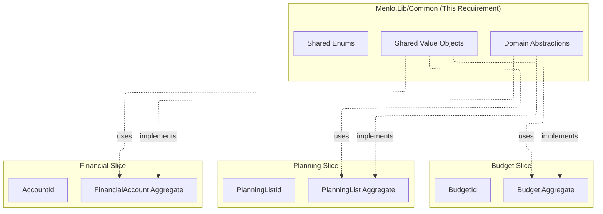

# Implementation Plan: Domain Model Abstractions

## Technical Summary

This requirement establishes the foundational domain abstractions that enable all vertical slices to implement rich domain models with strong typing, proper encapsulation, and testability.
These are **contracts only** - no concrete implementations or persistence logic. The abstractions enforce Domain-Driven Design principles while maintaining independence from infrastructure concerns
(ASP.NET, EF Core, ClaimsPrincipal).

**Key Principles:**

- Strongly-typed identities using readonly record structs prevent accidental ID misuse
- Generic interfaces enable compile-time guarantees across aggregates and entities
- Auditing abstraction decouples domain from authentication infrastructure
- Result pattern replaces exceptions for predictable error handling
- Domain events enable eventual consistency without tight coupling

## Architecture Impact

### How This Fits Into Menlo Architecture

This requirement is **foundational** to the entire Menlo architecture:

1. **Enables Vertical Slices**: Each domain slice (Budget, Planning, Financial, Events, Household) will implement these interfaces in their own aggregates and entities
2. **Maintains Domain Purity**: No dependencies on ASP.NET, Entity Framework, or authentication infrastructure
3. **Supports Testing**: Interfaces are easily mocked; abstractions enable unit testing without infrastructure
4. **Enforces Consistency**: All slices follow the same patterns for identity, auditing, events, and errors
5. **Future-Proofs EF Core**: Strongly-typed IDs are compatible with value converters (future requirement)

### Bounded Context Integration



## Implementation Steps

### Phase 1: Project Setup and Dependencies

**Objective**: Establish project structure and add required dependencies

#### 1.1 Update Directory.Packages.props

Add CSharpFunctionalExtensions to centralized package management:

```xml
<ItemGroup>
  <PackageVersion Include="CSharpFunctionalExtensions" Version="2.42.5" />
</ItemGroup>
```

#### 1.2 Update Menlo.Lib.csproj

Add package reference:

```xml
<ItemGroup>
  <PackageReference Include="CSharpFunctionalExtensions" />
</ItemGroup>
```

#### 1.3 Create Directory Structure

Create the following structure in `src/lib/Menlo.Lib`:

```sh
Menlo.Lib/
├── Common/
│   ├── Abstractions/
│   │   ├── IDomainEvent.cs
│   │   ├── IEntity.cs
│   │   ├── IAggregateRoot.cs
│   │   ├── IHasDomainEvents.cs
│   │   ├── IAuditable.cs
│   │   ├── IAuditStampFactory.cs
│   │   └── Error.cs
│   ├── ValueObjects/
│   │   ├── UserId.cs
│   │   └── AuditStamp.cs
│   └── Enums/
│       └── AuditOperation.cs
└── Class1.cs (delete this placeholder)
```

**Commands:**

```powershell
# From src/lib/Menlo.Lib directory
New-Item -ItemType Directory -Path "Common/Abstractions" -Force
New-Item -ItemType Directory -Path "Common/ValueObjects" -Force
New-Item -ItemType Directory -Path "Common/Enums" -Force
Remove-Item Class1.cs
```

### Phase 2: Core Entity and Aggregate Abstractions

**Objective**: Define base contracts for entities and aggregates

#### 2.1 Create IEntity<TId> Interface

**File**: `src/lib/Menlo.Lib/Common/Abstractions/IEntity.cs`

```csharp
namespace Menlo.Lib.Common.Abstractions;

/// <summary>
/// Represents a domain entity with a strongly-typed identity.
/// Entities have a unique identifier that distinguishes them from other entities.
/// </summary>
/// <typeparam name="TId">The type of the entity's identifier. Must be a strongly-typed ID (e.g., readonly record struct).</typeparam>
public interface IEntity<out TId>
{
    /// <summary>
    /// Gets the unique identifier for this entity.
    /// </summary>
    TId Id { get; }
}
```

**Testing**: Compile-time verification that entities expose typed IDs

#### 2.2 Create IAggregateRoot<TId> Interface

**File**: `src/lib/Menlo.Lib/Common/Abstractions/IAggregateRoot.cs`

```csharp
namespace Menlo.Lib.Common.Abstractions;

/// <summary>
/// Marker interface for aggregate roots in domain-driven design.
/// Aggregate roots are the entry points for all operations on an aggregate.
/// Only aggregate roots should be accessed directly from repositories.
/// </summary>
/// <typeparam name="TId">The type of the aggregate root's identifier.</typeparam>
public interface IAggregateRoot<out TId> : IEntity<TId>
{
    // Marker interface - no additional members
    // Aggregates should implement IHasDomainEvents and IAuditable as needed
}
```

**Testing**: Verify marker interface compiles and extends IEntity

### Phase 3: Domain Events Abstraction

**Objective**: Enable aggregates to raise domain events

#### 3.1 Create IDomainEvent Marker Interface

**File**: `src/lib/Menlo.Lib/Common/Abstractions/IDomainEvent.cs`

```csharp
namespace Menlo.Lib.Common.Abstractions;

/// <summary>
/// Marker interface for all domain events.
/// All domain events must implement this interface to ensure type safety
/// and avoid boxing/unboxing overhead.
/// </summary>
public interface IDomainEvent
{
    // Marker interface - no members required
    // Domain events can be implemented as records, classes, or readonly record structs
}
```

**Note**: Domain events can be implemented as:

- `record class` for reference-type events (most common)
- `readonly record struct` for small, value-type events (performance optimization)
- Regular classes for complex events

#### 3.2 Create IHasDomainEvents Interface

**File**: `src/lib/Menlo.Lib/Common/Abstractions/IHasDomainEvents.cs`

```csharp
namespace Menlo.Lib.Common.Abstractions;

/// <summary>
/// Interface for entities that can raise domain events.
/// Domain events represent significant business occurrences within the domain.
/// </summary>
public interface IHasDomainEvents
{
    /// <summary>
    /// Gets the collection of domain events raised by this entity.
    /// Events should be dispatched by the application layer after persistence.
    /// </summary>
    IReadOnlyCollection<IDomainEvent> DomainEvents { get; }

    /// <summary>
    /// Adds a domain event to be published after the current operation completes.
    /// The generic constraint ensures compile-time type safety.
    /// </summary>
    /// <typeparam name="TEvent">The type of domain event. Must implement <see cref="IDomainEvent"/>.</typeparam>
    /// <param name="domainEvent">The domain event to add. Must not be null.</param>
    void AddDomainEvent<TEvent>(TEvent domainEvent) where TEvent : IDomainEvent;

    /// <summary>
    /// Clears all pending domain events.
    /// Typically called by the application layer after events have been dispatched.
    /// </summary>
    void ClearDomainEvents();
}
```

**Implementation Pattern** (for future concrete implementations):

```csharp
// Example in a concrete aggregate:
private readonly List<IDomainEvent> _domainEvents = new();
public IReadOnlyCollection<IDomainEvent> DomainEvents => _domainEvents.AsReadOnly();

public void AddDomainEvent<TEvent>(TEvent domainEvent) where TEvent : IDomainEvent
{
    ArgumentNullException.ThrowIfNull(domainEvent);
    _domainEvents.Add(domainEvent);
}

public void ClearDomainEvents() => _domainEvents.Clear();

// Example domain events:
public record BudgetCreatedEvent(BudgetId BudgetId, UserId CreatedBy, DateTimeOffset CreatedAt) : IDomainEvent;
public readonly record struct BudgetItemAddedEvent(BudgetId BudgetId, string ItemName) : IDomainEvent;
```

### Phase 4: Error and Result Pattern

**Objective**: Define base error type for domain-specific errors

#### 4.1 Create Error Base Class

**File**: `src/lib/Menlo.Lib/Common/Abstractions/Error.cs`

```csharp
namespace Menlo.Lib.Common.Abstractions;

/// <summary>
/// Base class for all domain errors.
/// Errors represent business rule violations or domain-specific failure conditions.
/// Use Result&lt;T&gt; from CSharpFunctionalExtensions with Error for predictable error handling.
/// </summary>
public abstract class Error
{
    /// <summary>
    /// Initializes a new instance of the <see cref="Error"/> class.
    /// </summary>
    /// <param name="code">Machine-readable error code (e.g., "BUDGET_001"). Must not be null or whitespace.</param>
    /// <param name="message">Human-readable error message. Must not be null or whitespace.</param>
    protected Error(string code, string message)
    {
        if (string.IsNullOrWhiteSpace(code))
            throw new ArgumentException("Error code cannot be null or whitespace.", nameof(code));
        
        if (string.IsNullOrWhiteSpace(message))
            throw new ArgumentException("Error message cannot be null or whitespace.", nameof(message));

        Code = code;
        Message = message;
    }

    /// <summary>
    /// Gets the machine-readable error code.
    /// Format: {DOMAIN}_{NUMBER} (e.g., BUDGET_001, PLANNING_005).
    /// </summary>
    public string Code { get; }

    /// <summary>
    /// Gets the human-readable error message suitable for display to users.
    /// </summary>
    public string Message { get; }

    /// <summary>
    /// Returns a string representation of this error.
    /// </summary>
    public override string ToString() => $"[{Code}] {Message}";
}
```

**Usage Pattern** (for future domain-specific errors):

```csharp
// Example in Budget domain:
public sealed class BudgetNotFoundError : Error
{
    public BudgetNotFoundError(BudgetId budgetId) 
        : base("BUDGET_001", $"Budget with ID {budgetId.Value} was not found.")
    {
        BudgetId = budgetId;
    }

    public BudgetId BudgetId { get; }
}

// Usage in domain method:
public Result<Budget, Error> GetBudget(BudgetId id)
{
    var budget = /* ... */;
    return budget ?? Result.Failure<Budget, Error>(new BudgetNotFoundError(id));
}
```

### Phase 5: Strongly-Typed Identity Pattern

**Objective**: Define shared identity types and establish the pattern

#### 5.1 Create UserId Value Object

**File**: `src/lib/Menlo.Lib/Common/ValueObjects/UserId.cs`

```csharp
namespace Menlo.Lib.Common.ValueObjects;

/// <summary>
/// Represents a strongly-typed identifier for a user (person) in the system.
/// Used for auditing, ownership, and authorization purposes across all domains.
/// </summary>
/// <param name="Value">The underlying unique identifier.</param>
public readonly record struct UserId(Guid Value)
{
    /// <summary>
    /// Creates a new UserId with a new unique value.
    /// </summary>
    public static UserId NewId() => new(Guid.NewGuid());

    /// <summary>
    /// Returns the string representation of the user ID.
    /// </summary>
    public override string ToString() => Value.ToString();
}
```

**Pattern Documentation**: Each domain creates its own strongly-typed IDs following this pattern:

```csharp
// Example: BudgetId in Budget domain
public readonly record struct BudgetId(Guid Value)
{
    public static BudgetId NewId() => new(Guid.NewGuid());
    public override string ToString() => Value.ToString();
}

// Example: PlanningListId in Planning domain
public readonly record struct PlanningListId(Guid Value)
{
    public static PlanningListId NewId() => new(Guid.NewGuid());
    public override string ToString() => Value.ToString();
}
```

**Key Benefits:**

- Compile-time type safety: `BudgetId` cannot be assigned to `PlanningListId`
- Value semantics: automatic equality and hashing
- Performance: struct avoids heap allocation
- EF Core compatible: future value converters will map to Guid columns

### Phase 6: Auditing Abstractions

**Objective**: Define auditing contracts without coupling to infrastructure

#### 6.1 Create AuditOperation Enum

**File**: `src/lib/Menlo.Lib/Common/Enums/AuditOperation.cs`

```csharp
namespace Menlo.Lib.Common.Enums;

/// <summary>
/// Specifies the type of audit operation being performed.
/// </summary>
public enum AuditOperation
{
    /// <summary>
    /// The entity is being created for the first time.
    /// Sets both Created and Modified audit fields.
    /// </summary>
    Create = 0,

    /// <summary>
    /// The entity is being updated after initial creation.
    /// Updates only Modified audit fields.
    /// </summary>
    Update = 1
}
```

#### 6.2 Create AuditStamp Value Object

**File**: `src/lib/Menlo.Lib/Common/ValueObjects/AuditStamp.cs`

```csharp
namespace Menlo.Lib.Common.ValueObjects;

using Menlo.Lib.Common.ValueObjects;

/// <summary>
/// Represents a point-in-time snapshot of who performed an action and when.
/// Used by IAuditable entities to track creation and modification.
/// </summary>
/// <param name="ActorId">The user who performed the action.</param>
/// <param name="Timestamp">When the action was performed (UTC).</param>
/// <param name="CorrelationId">Optional correlation ID for distributed tracing.</param>
public readonly record struct AuditStamp(
    UserId ActorId,
    DateTimeOffset Timestamp,
    string? CorrelationId = null)
{
    /// <summary>
    /// Returns a string representation of this audit stamp.
    /// </summary>
    public override string ToString() => 
        $"By {ActorId} at {Timestamp:yyyy-MM-dd HH:mm:ss}Z" +
        (CorrelationId != null ? $" [{CorrelationId}]" : string.Empty);
}
```

#### 6.3 Create IAuditStampFactory Interface

**File**: `src/lib/Menlo.Lib/Common/Abstractions/IAuditStampFactory.cs`

```csharp
namespace Menlo.Lib.Common.Abstractions;

using Menlo.Lib.Common.ValueObjects;

/// <summary>
/// Factory for creating AuditStamp instances from infrastructure concerns.
/// The domain depends only on this interface. Concrete implementations
/// (adapting ClaimsPrincipal, TimeProvider, etc.) are provided by the
/// infrastructure/application layer in a separate requirement.
/// </summary>
public interface IAuditStampFactory
{
    /// <summary>
    /// Creates an AuditStamp for the current user and time.
    /// </summary>
    /// <returns>An AuditStamp containing the current actor, timestamp, and optional correlation ID.</returns>
    AuditStamp CreateStamp();
}
```

**Note**: Concrete implementations will be in the separate "Audit" requirement. The domain only consumes this interface.

#### 6.4 Create IAuditable Interface

**File**: `src/lib/Menlo.Lib/Common/Abstractions/IAuditable.cs`

```csharp
namespace Menlo.Lib.Common.Abstractions;

using Menlo.Lib.Common.Enums;
using Menlo.Lib.Common.ValueObjects;

/// <summary>
/// Interface for entities that track audit information (who created/modified and when).
/// Audit fields are read-only from outside the entity. The Audit method is the
/// only way to mutate audit fields, ensuring consistency.
/// </summary>
public interface IAuditable
{
    /// <summary>
    /// Gets the user who created this entity.
    /// Null until the entity has been audited with AuditOperation.Create.
    /// </summary>
    UserId? CreatedBy { get; }

    /// <summary>
    /// Gets when this entity was created (UTC).
    /// Null until the entity has been audited with AuditOperation.Create.
    /// </summary>
    DateTimeOffset? CreatedAt { get; }

    /// <summary>
    /// Gets the user who last modified this entity.
    /// Updated on both Create and Update operations.
    /// </summary>
    UserId? ModifiedBy { get; }

    /// <summary>
    /// Gets when this entity was last modified (UTC).
    /// Updated on both Create and Update operations.
    /// </summary>
    DateTimeOffset? ModifiedAt { get; }

    /// <summary>
    /// Performs an audit operation, updating the appropriate audit fields.
    /// For Create operations, sets both Created and Modified fields.
    /// For Update operations, sets only Modified fields.
    /// </summary>
    /// <param name="factory">Factory to create the current audit stamp. Must not be null.</param>
    /// <param name="operation">The type of audit operation being performed.</param>
    void Audit(IAuditStampFactory factory, AuditOperation operation);
}
```

**Implementation Pattern** (for future concrete implementations):

```csharp
// Example in a concrete aggregate:
private UserId? _createdBy;
private DateTimeOffset? _createdAt;
private UserId? _modifiedBy;
private DateTimeOffset? _modifiedAt;

public UserId? CreatedBy => _createdBy;
public DateTimeOffset? CreatedAt => _createdAt;
public UserId? ModifiedBy => _modifiedBy;
public DateTimeOffset? ModifiedAt => _modifiedAt;

public void Audit(IAuditStampFactory factory, AuditOperation operation)
{
    ArgumentNullException.ThrowIfNull(factory);
    
    var stamp = factory.CreateStamp();
    
    switch (operation)
    {
        case AuditOperation.Create:
            _createdBy = stamp.ActorId;
            _createdAt = stamp.Timestamp;
            _modifiedBy = stamp.ActorId;
            _modifiedAt = stamp.Timestamp;
            break;
            
        case AuditOperation.Update:
            _modifiedBy = stamp.ActorId;
            _modifiedAt = stamp.Timestamp;
            break;
            
        default:
            throw new ArgumentOutOfRangeException(nameof(operation), operation, "Unknown audit operation.");
    }
}
```

## Testing Strategy

### Overview

Since this requirement provides abstractions only (no concrete implementations), testing focuses on:

1. **Compile-time guarantees** - interfaces are correctly defined
2. **Pattern validation** - strongly-typed IDs work as expected
3. **Constraint verification** - no prohibited dependencies exist
4. **Documentation accuracy** - example code compiles

### Test Organization

Create test files in `src/lib/Menlo.Lib.Tests`:

```sh
Menlo.Lib.Tests/
├── Common/
│   ├── Abstractions/
│   │   ├── EntityContractsTests.cs
│   │   ├── DomainEventsTests.cs
│   │   ├── AuditingContractsTests.cs
│   │   └── ErrorResultTests.cs
│   ├── ValueObjects/
│   │   └── StronglyTypedIdTests.cs
│   └── ConstraintVerificationTests.cs
└── UnitTest1.cs (delete this placeholder)
```

### Test Execution

```powershell
# Run all tests
dotnet test src/lib/Menlo.Lib.Tests/Menlo.Lib.Tests.csproj

# Run with coverage
dotnet test src/lib/Menlo.Lib.Tests/Menlo.Lib.Tests.csproj --collect:"XPlat Code Coverage"

# Run specific test class
dotnet test --filter "FullyQualifiedName~AuditingContractsTests"
```

## Documentation Requirements

### 1. Diagrams (Mermaid)

Create the following diagrams in `docs/requirements/domain-abstractions/diagrams/`:

#### 1.1 Class Diagram (class-diagram.mmd)

Shows relationships between all interfaces and value objects

#### 1.2 Audit Flow Diagram (audit-flow-diagram.md)

Sequence diagram showing how auditing flows from API through domain

#### 1.3 Value Object Pattern (value-object-pattern.md)

Illustrates the benefits of strongly-typed IDs vs primitives

### 2. How-To Guide

**File**: `docs/guides/domain-abstractions-howto.md`

Create a comprehensive guide covering:

- Creating strongly-typed IDs for your domain
- Implementing IEntity and IAggregateRoot
- Using IHasDomainEvents in your aggregates
- Implementing IAuditable
- Creating domain-specific Error types
- Using Result pattern in domain methods
- EF Core integration (future: value converters)

### 3. Update Entity Design Reference

**File**: `docs/reference/entity-design.md`

Add a new section "Domain Abstractions Reference" linking to:

- Interface contracts (IEntity, IAggregateRoot, etc.)
- Strongly-typed ID pattern
- Auditing pattern
- Error and Result usage

## Configuration Requirements

### Directory.Packages.props Update

Add CSharpFunctionalExtensions version:

```xml
<ItemGroup>
  <!-- Existing packages -->
  <PackageVersion Include="CSharpFunctionalExtensions" Version="2.42.5" />
</ItemGroup>
```

### No Additional Configuration

- No app settings required (abstractions only)
- No feature flags needed
- No environment variables
- No database configuration (persistence is future requirement)

## Risk Assessment

### Risk 1: Over-Abstraction

**Impact**: Medium - Could slow down development and make code harder to understand

**Mitigation**:

- Keep interfaces minimal - only what's truly needed
- Follow YAGNI (You Aren't Gonna Need It)
- Iterate based on actual domain slice needs

**Status**: Mitigated - Specs clearly define only essential contracts

### Risk 2: IAuditStampFactory Ownership Ambiguity

**Impact**: Low - Could cause confusion about where implementations belong

**Mitigation**:

- Clearly document that interface is domain contract
- Note that implementations are in separate "Audit" requirement
- Add XML comments explaining this separation

**Status**: Mitigated - Documentation clearly states separation

### Risk 3: UserId Coupling Across Domains

**Impact**: Low - Acceptable for cross-cutting auditing concern

**Mitigation**:

- Document that UserId is for system identity/auditing only
- UserId lives in Common/ValueObjects (shared by design)
- Each domain still has its own domain-specific IDs

**Status**: Accepted - Auditing is inherently cross-cutting

### Risk 4: EF Core Value Converter Complexity

**Impact**: Medium - Could be complex to implement correctly

**Mitigation**:

- Out of scope for this requirement (future work)
- Research indicates pattern is well-supported in EF Core 7+
- Document pattern for future implementers

**Status**: Deferred - Will be addressed in persistence requirement

### Risk 5: Testing Abstract Contracts

**Impact**: Low - Tests can create minimal test implementations

**Mitigation**:

- Create simple test implementations in test project
- Focus on compile-time guarantees
- Real behavior testing happens in domain slices

**Status**: Mitigated - Test strategy addresses this

### Risk 6: Breaking Changes to Contracts

**Impact**: High - Could require changes across multiple slices

**Mitigation**:

- Review specs and test cases thoroughly before implementing
- Get stakeholder approval on contracts
- Version interfaces if breaking changes needed

**Status**: Mitigated - Thorough planning and review required

## Definition of Done

### Code Artifacts

- [X] CSharpFunctionalExtensions added to Directory.Packages.props
- [X] Menlo.Lib.csproj updated with package reference
- [X] Directory structure created: Common/Abstractions, Common/ValueObjects, Common/Enums
- [X] IDomainEvent marker interface implemented with XML docs
- [X] IEntity<TId> interface implemented with XML docs
- [X] IAggregateRoot<TId> interface implemented with XML docs
- [X] IHasDomainEvents interface implemented with XML docs
- [X] IAuditable interface implemented with XML docs
- [X] IAuditStampFactory interface implemented with XML docs
- [X] Error base class implemented with validation
- [X] UserId readonly record struct implemented
- [X] AuditStamp readonly record struct implemented
- [X] AuditOperation enum implemented
- [X] Class1.cs placeholder removed

### Documentation

- [X] implementation.md updated with comprehensive plan (this file)
- [ ] class-diagram.mmd created with Mermaid class diagram
- [ ] audit-flow-diagram.md created with sequence diagram
- [ ] value-object-pattern.md created with pattern diagram
- [ ] domain-abstractions-howto.md created in docs/guides
- [ ] entity-design.md updated with abstractions reference

### Testing

- [X] Directory structure created in Menlo.Lib.Tests/Common
- [X] EntityContractsTests.cs created with TC-02 and TC-03
- [X] DomainEventsTests.cs created with TC-04
- [X] AuditingContractsTests.cs created with TC-05 and TC-06
- [X] ErrorResultTests.cs created with TC-08
- [X] StronglyTypedIdTests.cs created with TC-01
- [X] ConstraintVerificationTests.cs created with TC-07
- [X] All tests map to test-cases.md requirements
- [X] UnitTest1.cs placeholder removed

### Quality Checks

- [X] All files follow C# coding standards from csharp.instructions.md
- [X] XML documentation comments on all public APIs
- [X] No dependencies on ASP.NET Core
- [X] No references to System.Security.Claims
- [X] Proper namespacing: Menlo.Lib.Common.*
- [X] Readonly record structs for value objects
- [X] File-scoped namespaces used
- [X] Strongly-typed variables (no unnecessary var)

### Verification

- [X] Solution builds without errors: `dotnet build`
- [X] All tests pass: `dotnet test`
- [X] No ClaimsPrincipal references: verified by ConstraintVerificationTests
- [X] No ASP.NET dependencies: verified by ConstraintVerificationTests
- [X] Abstractions are usable from domain slices (compile check)
- [X] Example code in documentation compiles

### Stakeholder Approval

- [X] Specifications reviewed and approved
- [X] Test cases reviewed and approved
- [X] Implementation plan reviewed and approved
- [X] Ready for concrete domain slice implementations

## Next Steps

After this requirement is complete, the following dependent requirements can proceed:

1. **Domain Auditing** (`docs/requirements/domain-auditing/`) - Implements IAuditStampFactory concrete classes
2. **Budget Aggregate Minimum** (`docs/requirements/budget-aggregate-minimum/`) - First domain slice implementing these abstractions
3. **Budget Item** (`docs/requirements/budget-item/`) - Extends budget domain using abstractions
4. **Persistence** (future) - Implements EF Core value converters for strongly-typed IDs

## Summary

This implementation plan establishes the foundational domain abstractions that enable:

- ✅ Strong compile-time type safety with strongly-typed IDs
- ✅ Clean domain boundaries with no infrastructure dependencies
- ✅ Consistent error handling with Result pattern
- ✅ Auditable entities with decoupled audit stamp factory
- ✅ Event-driven architecture with domain events (IDomainEvent marker interface avoids boxing)
- ✅ Testable contracts that can be mocked and verified

All abstractions follow DDD principles, support vertical slice architecture, and maintain separation between domain and infrastructure concerns. The implementation is minimal, focused, and ready for concrete domain slices to build upon.
