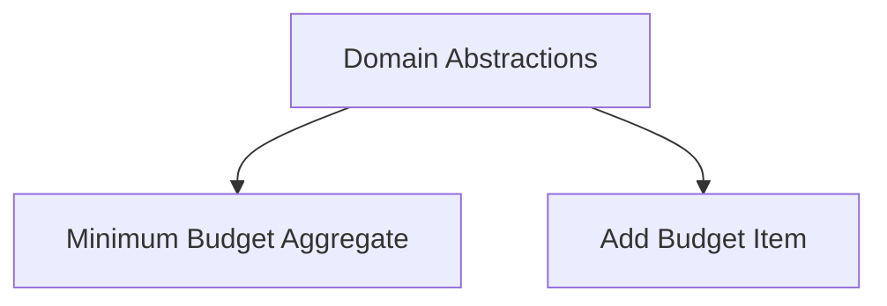

# Requirement: Domain Model Abstractions (Strongly-Typed IDs and Auditing)

## Overview

Define shared domain model abstractions to enable consistent, testable, and decoupled entities and aggregates across the solution. This requirement focuses on abstractions only (no concrete implementations or persistence details).

- Goals: strongly-typed identities, proper encapsulation, auditable entities, domain events, error/Result usage
- Alignment: Follows DDD tenets and `.github/instructions/csharp.instructions.md`
- Decoupling: Domain remains independent of ASP.NET and ClaimsPrincipal; auditing uses a domain-friendly input

## Scope

In scope:

- Strongly-typed identity pattern for entities and aggregates
- Core interfaces: `IEntity<TId>`, `IAggregateRoot<TId>`, `IHasDomainEvents`
- Auditing contract with non-settable fields and an `Audit` operation
- Audit method receives an audit-stamp provider abstraction (`IAuditStampFactory`) and actor identity types (`UserId` or `PersonId`)
- Error and Result pattern conventions for domain methods
- Guidance for value objects (immutability, equality)

Out of scope:

- EF Core mappings, database schemas, and persistence-specific attributes
- Concrete entity/aggregate implementations
- Infrastructure adapters (e.g., ClaimsPrincipal → `UserId` mapping), except as guidance
- Soft-delete and advanced audit trails (can be future requirements)

Assumptions:

- The solution will use CSharpFunctionalExtensions Result for domain method outcomes
- The application layer will create `AuditStamp` by adapting framework concerns (ClaimsPrincipal, TimeProvider)

## Functional Requirements

FR-1: Strongly-Typed Identities

- Each aggregate/entity type must use a dedicated strongly-typed Id (e.g., `public readonly record struct BudgetId(Guid Value)`).
- Id types are non-interchangeable at compile time.

FR-2: Entity and Aggregate Contracts

- Provide `IEntity<TId>` exposing `TId Id { get; }`.
- Provide `IAggregateRoot<TId>` as a marker interface extending `IEntity<TId>`.
- Provide `IHasDomainEvents` to collect and clear domain events.

FR-3: Auditing Contract

- Define audit fields (CreatedBy, CreatedAt, ModifiedBy, ModifiedAt) as read-only (no public setters).
- Provide an `Audit(IAuditStampFactory factory, AuditOperation op)` method. The entity invokes the factory to obtain an `AuditStamp` and sets audit fields accordingly.
- Creation requires an initial audit operation that sets Created and Modified fields consistently.

FR-4: Audit Inputs Decoupling

- Define `AuditStamp` value object carrying `UserId` and `DateTimeOffset` (and optional CorrelationId).
- Do not depend on `ClaimsPrincipal` in domain abstractions.
- The domain depends only on `IAuditStampFactory` (interface to be defined in the separate audit requirement); application/infrastructure adapts `ClaimsPrincipal` + `TimeProvider` to produce `AuditStamp`.

FR-5: Result and Error Conventions

- Domain methods return `Result`/`Result<T>`.
- Provide `Error` base class (code + message) and guidance for domain-specific errors.

FR-6: Value Object Guidelines

- Value objects are immutable and equatable; provide factories/validation.
- Avoid primitive obsession for key concepts (e.g., Money, Attribution).

## Non-Functional Requirements

- Decoupling: No dependencies on ASP.NET Core types in domain.
- Testability: Abstractions easy to mock and verify; deterministic auditing via explicit `AuditStamp`.
- Clarity: Strong typing prevents accidental misuse of identifiers.

## Acceptance Criteria

- [ ] A set of interfaces and value object contracts exist for entities, aggregates, domain events, and auditing.
- [ ] Example Id types are demonstrated in documentation using readonly record structs.
- [ ] No audit fields are publicly settable; `Audit` is the only mutation path for audit data.
- [ ] Domain abstractions contain zero references to `System.Security.Claims`.
- [ ] Guidance provided for an application adapter that constructs `AuditStamp` from `ClaimsPrincipal` and `TimeProvider`.
- [ ] Result/Error usage is specified for domain operations.

## Illustrative Contracts (non-binding examples)

```csharp
// Strongly-typed identity example
public readonly record struct BudgetId(Guid Value);
public readonly record struct UserId(Guid Value);

public interface IEntity<TId>
{
    TId Id { get; }
}

public interface IAggregateRoot<TId> : IEntity<TId> { }

public interface IHasDomainEvents
{
    IReadOnlyCollection<object> DomainEvents { get; }
    void AddDomainEvent(object @event);
    void ClearDomainEvents();
}

public enum AuditOperation { Create, Update }

public readonly record struct AuditStamp(UserId ActorId, DateTimeOffset Timestamp);

public interface IAuditable
{
    UserId? CreatedBy { get; }
    DateTimeOffset? CreatedAt { get; }
    UserId? ModifiedBy { get; }
    DateTimeOffset? ModifiedAt { get; }
    // IAuditStampFactory is defined in the audit requirement; the domain only consumes it
    void Audit(IAuditStampFactory factory, AuditOperation op);
}

public abstract class Error
{
    public string Code { get; }
    public string Message { get; }
    protected Error(string code, string message) { Code = code; Message = message; }
}
```

## Decisions

- Use readonly record structs for Id types to keep value semantics and performance.
- `AuditStamp` is passed from the application layer; domain never reads `ClaimsPrincipal` directly.
- Prefer composition over inheritance; interfaces first, optional base helpers later (separate requirement).

## Risks & Considerations

- EF Core mapping for readonly record struct Ids requires value converters (future requirement).
- Overusing base classes can reduce flexibility; stick to interfaces now.
- Multi-tenant identity representation should stay minimal in domain (Id only), enrich at app layer.

---

References: `docs/reference/entity-design.md`, `.github/instructions/csharp.instructions.md`, `docs/README.md`.

## Dependencies

- Downstream consumers (examples):
        - Minimum Budget Aggregate: uses strongly-typed IDs, aggregate contracts, and auditing surface
            - See: `../budget-aggregate-minimum/specifications.md`
        - Add Budget Item: relies on aggregate contracts and domain event conventions
            - See: `../budget-item/specifications.md`


