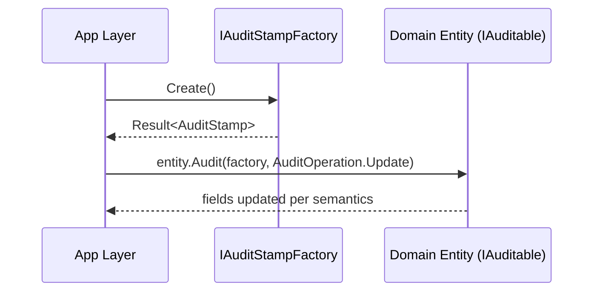

# Implementation Plan: Domain Auditing

## Summary

Implement domain-level auditing via a factory-produced AuditStamp and an operation enum. Keep the domain independent from ASP.NET, claims, and clocks; adapter(s) in the application/infrastructure layer will supply the factory.

## Steps

1. Contracts

- Add/confirm `AuditStamp` (UserId, OccurredAt UTC), `AuditOperation` (Create, Update, SoftDelete, Restore)
- Define `IAuditStampFactory` with `Result<AuditStamp, AuditError> Create()`
- Ensure `IAuditable.Audit(IAuditStampFactory, AuditOperation)` is the uniform entry point

1. Semantics

- Implement auditing rules:
  - Create: set Created*, clear Modified*/Deleted*, IsDeleted=false
  - Update: set Modified*, preserve Created*
  - SoftDelete: set Deleted*, IsDeleted=true
  - Restore: clear Deleted*, set Modified*
- Store times in UTC and treat `AuditStamp` as immutable

1. Infrastructure Factory (outside domain)

- ASP.NET adapter composes `IUserContextProvider` + `TimeProvider` (or equivalent) to produce stamps
- Claim precedence for identity: `sub` → `oid` → `nameidentifier` → `appid` (daemon) → optional `azp`
- Provide fallback to configured system user id for anonymous/daemon gaps if policy allows

1. Error Handling

- If factory cannot resolve identity or time, return a failure with codes like `audit.identity-missing` or `audit.clock-error`
- Domain code should either:
  - fail fast and prevent state changes, or
  - raise a domain error/event suitable for the application layer

1. Tests

- Unit tests for each operation path (create/update/soft-delete/restore)
- Tests for factory failure paths (no changes applied)
- Tests for daemon contexts via `appid`

## Diagram

## Risks

- Overuse of auditing in hot paths could add overhead; keep update logic O(1)
- Inconsistent adoption across entities; enforce via code reviews and tests

## Definition of Done

- Contracts defined and documented
- Domain entities updated to use `IAuditable.Audit(...)` where applicable
- Factory implemented in application layer and wired via DI
- Tests cover all operations and error paths
