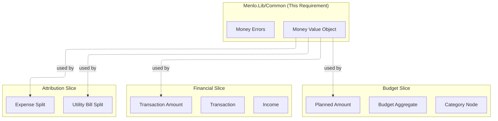

# Implementation Plan: Money Domain Object

## Technical Summary

This requirement establishes the `Money` Value Object as a fundamental building block for all financial calculations in the Menlo application. It replaces raw `decimal` types to prevent precision
errors, ensure currency safety, and provide correct arithmetic operations. The implementation follows the Result pattern for error handling and integrates with EF Core and JSON serialization.

**Key Principles:**

- **Precision**: Uses `decimal` internally with MidpointRounding.ToEven for division operations
- **Currency Safety**: Prevents operations between different currencies via Result pattern
- **Allocation**: Solves the Penny Allocation problem for splitting amounts without losing cents
- **Immutability**: Implemented as a `readonly record struct` for zero-allocation value semantics
- **Error Handling**: Uses `Result<Money, Error>` pattern - no exceptions for domain operations

## Architecture Impact

### How This Fits Into Menlo Architecture

This requirement is **foundational** for financial integrity across all Menlo features:

1. **Budget Management**: Ensures precise budget calculations, allocations, and totals
2. **Transaction Management**: Provides safe arithmetic for transaction processing and reconciliation
3. **Attribution**: Enables accurate splitting of utility bills and shared expenses
4. **Income Tracking**: Maintains precision for salary, bonuses, and investment calculations
5. **Rental Analysis**: Ensures accurate ROI and tax implication calculations

### Bounded Context Integration



## Domain Surface (Contracts)

### Value Object

**`Money` (readonly record struct)**

```csharp
public readonly record struct Money(decimal Amount, string Currency)
{
    public static Money Zero(string currency);
    
    // Arithmetic Operations (Result-returning)
    public Result<Money, Error> Add(Money other);
    public Result<Money, Error> Subtract(Money other);
    public Money Multiply(decimal factor);
    public Result<Money, Error> Divide(decimal divisor);
    
    // Allocation Operations
    public Result<IReadOnlyList<Money>, Error> Allocate(int parts);
    public Result<IReadOnlyList<Money>, Error> Allocate(params int[] ratios);
    
    // Comparison
    public int CompareTo(Money other); // throws if currency mismatch
    // Operators: ==, !=, <, >, <=, >= (delegate to CompareTo)
}
```

### Errors

**`MoneyError` (base class)**

```csharp
public abstract class MoneyError(string code, string message) : Error(code, message);
```

**Specific Errors:**

```csharp
public sealed class CurrencyMismatchError(string expected, string actual) 
    : MoneyError("MONEY_001", $"Currency mismatch: expected '{expected}' but got '{actual}'")
{
    public string ExpectedCurrency { get; } = expected;
    public string ActualCurrency { get; } = actual;
}

public sealed class DivisionByZeroError() 
    : MoneyError("MONEY_002", "Cannot divide money by zero");

public sealed class InvalidAllocationError(string reason) 
    : MoneyError("MONEY_003", $"Invalid allocation: {reason}")
{
    public string Reason { get; } = reason;
}
```

## Implementation Steps

### Phase 1: Value Object Foundation

**Objective**: Implement the core Money value object with basic operations

#### 1.1 Create Money Value Object

**File**: `src/lib/Menlo.Lib/Common/Money/Money.cs`

Ensure construction happens by means of the factory methods but that parameterised constructors exist for Entity Framework to hydrate objects.

```csharp
namespace Menlo.Lib.Common;

/// <summary>
/// Represents a monetary value with currency.
/// Immutable value object that ensures precision and currency safety.
/// </summary>
public readonly record struct Money
{
    public decimal Amount { get; init; }
    public string Currency { get; init; }

    private Money(decimal amount, string currency)
    {
        Amount = amount;
        Currency = currency.ToUpperInvariant();
    }

    public static Result<Money, Error> Create(decimal amount, string currency)
    {
        if (string.IsNullOrWhitespace(currency))
        {
            return new EmptyCurrencyError();
        }

        return new(amount, currency);
    }

    public static Money Zero(string currency) => new(0, currency);
}
```

**Tests** (TC-MON-001 to TC-MON-005):

- Create with valid amount and currency
- Verify equality based on amount and currency
- Verify inequality with different amounts or currencies

#### 1.2 Create Money Errors

**File**: `src/lib/Menlo.Lib/Common/Errors/MoneyError.cs`

```csharp
namespace Menlo.Lib.Common.Errors;

/// <summary>
/// Base class for all Money-related domain errors.
/// </summary>
public abstract class MoneyError(string code, string message) : Error(code, message);
```

**File**: `src/lib/Menlo.Lib/Common/Errors/CurrencyMismatchError.cs`

```csharp
namespace Menlo.Lib.Common.Errors;

/// <summary>
/// Error raised when attempting to perform operations on Money objects with different currencies.
/// </summary>
/// <param name="expected">The expected currency code.</param>
/// <param name="actual">The actual currency code provided.</param>
public sealed class CurrencyMismatchError(string expected, string actual) 
    : MoneyError("MONEY_001", $"Currency mismatch: expected '{expected}' but got '{actual}'")
{
    /// <summary>
    /// Gets the expected currency code.
    /// </summary>
    public string ExpectedCurrency { get; } = expected;

    /// <summary>
    /// Gets the actual currency code that was provided.
    /// </summary>
    public string ActualCurrency { get; } = actual;
}
```

**File**: `src/lib/Menlo.Lib/Common/Errors/DivisionByZeroError.cs`

```csharp
namespace Menlo.Lib.Common.Errors;

/// <summary>
/// Error raised when attempting to divide money by zero.
/// </summary>
public sealed class DivisionByZeroError() 
    : MoneyError("MONEY_002", "Cannot divide money by zero");
```

**File**: `src/lib/Menlo.Lib/Common/Errors/InvalidAllocationError.cs`

```csharp
namespace Menlo.Lib.Common.Errors;

/// <summary>
/// Error raised when allocation parameters are invalid.
/// </summary>
public sealed class InvalidAllocationError(string reason) 
    : MoneyError("MONEY_003", $"Invalid allocation: {reason}")
{
    public string Reason { get; } = reason;
}
```

### Phase 2: Arithmetic Operations

**Objective**: Implement safe arithmetic operations using Result pattern

#### 2.1 Implement Addition

**Method**: `Money.Add`

```csharp
/// <summary>
/// Adds two Money values.
/// </summary>
/// <param name="other">The Money value to add.</param>
/// <returns>Success with the sum if currencies match; Failure with CurrencyMismatchError otherwise.</returns>
public Result<Money, Error> Add(Money other)
{
    if (!Currency.Equals(other.Currency, StringComparison.Ordinal))
    {
        return new CurrencyMismatchError(Currency, other.Currency);
    }
    
    return Money.Create(Amount + other.Amount, Currency);
}
```

**Tests** (TC-MON-006, TC-MON-007):

```csharp
[Fact]
public void GivenMoneyWithSameCurrency_WhenAdding()
{
    // Arrange
    Result<Money, Error> money1Result = Money.Create(10.00m, "ZAR");
    Result<Money, Error> money2Result = Money.Create(20.00m, "ZAR");
    Money money1 = money1Result.Value;
    Money money2 = money2Result.Value;

    // Act
    Result<Money, Error> result = money1.Add(money2);

    // Assert
    ItShouldReturnSuccessWithSum(result);
}

private static void ItShouldReturnSuccessWithSum(Result<Money, Error> result)
{
    result.IsSuccess.ShouldBeTrue();
    result.Value.Amount.ShouldBe(30.00m);
    result.Value.Currency.ShouldBe("ZAR");
}

[Fact]
public void GivenMoneyWithDifferentCurrency_WhenAdding()
{
    // Arrange
    Money money1 = Money.Create(10.00m, "ZAR").Value;
    Money money2 = Money.Create(20.00m, "USD").Value;

    // Act
    Result<Money, Error> result = money1.Add(money2);

    // Assert
    ItShouldReturnCurrencyMismatchError(result);
}

private static void ItShouldReturnCurrencyMismatchError(Result<Money, Error> result)
{
    result.IsFailure.ShouldBeTrue();
    result.Error.ShouldBeOfType<CurrencyMismatchError>();
    result.Error.Code.ShouldBe("MONEY_001");
}
```

#### 2.2 Implement Subtraction

**Method**: `Money.Subtract`

```csharp
/// <summary>
/// Subtracts one Money value from another.
/// </summary>
/// <param name="other">The Money value to subtract.</param>
/// <returns>Success with the difference if currencies match; Failure with CurrencyMismatchError otherwise.</returns>
public Result<Money, Error> Subtract(Money other)
{
    if (!Currency.Equals(other.Currency, StringComparison.Ordinal))
    {
        return new CurrencyMismatchError(Currency, other.Currency);
    }
    
    return Money.Create(Amount - other.Amount, Currency);
}
```

**Tests** (TC-MON-008, TC-MON-009):

- Same currency returns success
- Different currencies returns CurrencyMismatchError

#### 2.3 Implement Multiplication

**Method**: `Money.Multiply`

```csharp
/// <summary>
/// Multiplies money by a scalar factor.
/// </summary>/// <param name="factor">The scalar factor to multiply by.</param>
/// <returns>A new Money instance with the multiplied amount.</returns>public Money Multiply(decimal factor)
{
    return Money.Create(Amount * factor, Currency);
}
```

**Tests** (TC-MON-010, TC-MON-011):

- Integer and decimal multipliers

#### 2.4 Implement Division

**Method**: `Money.Divide`

```csharp
/// <summary>
/// Divides money by a scalar divisor. Returns failure if divisor is zero.
/// Uses MidpointRounding.ToEven (Banker's Rounding).
/// </summary>
public Result<Money, Error> Divide(decimal divisor)
{
    if (divisor == 0)
        return new DivisionByZeroError();

    var result = Math.Round(Amount / divisor, 2, MidpointRounding.ToEven);
    return Money.Create(result, Currency);
}
```

**Tests** (TC-MON-012, TC-MON-013, TC-MON-013b):

- Even division returns success
- Division with rounding
- Division by zero returns DivisionByZeroError

### Phase 3: Allocation Operations

**Objective**: Implement Penny Allocation algorithms

#### 3.1 Implement Even Allocation

**Method**: `Money.Allocate(int parts)`

```csharp
/// <summary>
/// Allocates money into equal parts, distributing remainder to first parts.
/// Ensures sum of parts equals original amount.
/// </summary>
public Result<IReadOnlyList<Money>, Error> Allocate(int parts)
{
    if (parts <= 0)
        return new InvalidAllocationError("Parts must be greater than zero");

    // Convert to smallest unit (cents)
    var totalCents = (long)(Amount * 100);
    var centsPerPart = totalCents / parts;
    var remainder = (int)(totalCents % parts);

    var result = Money.Create[parts];
    for (int i = 0; i < parts; i++)
    {
        var cents = centsPerPart + (i < remainder ? 1 : 0);
        result[i] = Money.Create(cents / 100m, Currency);
    }

    return result;
}
```

**Tests** (TC-MON-014, TC-MON-015):

- R1.00 into 3 parts returns Success with [0.34, 0.33, 0.33], sum = 1.00
- R0.05 into 2 parts returns Success with [0.03, 0.02]
- Allocate with 0 or negative parts returns InvalidAllocationError

#### 3.2 Implement Ratio Allocation

**Method**: `Money.Allocate(params int[] ratios)`

```csharp
/// <summary>
/// Allocates money based on ratios, distributing remainder proportionally.
/// </summary>
public Result<IReadOnlyList<Money>, Error> Allocate(params int[] ratios)
{
    if (ratios == null || ratios.Length == 0)
        return new InvalidAllocationError("Ratios cannot be null or empty");
    
    if (ratios.Any(r => r < 0))
        return new InvalidAllocationError("Ratios must be non-negative");
    
    var totalRatio = ratios.Sum();
    if (totalRatio == 0)
        return new InvalidAllocationError("Sum of ratios must be greater than zero");
    
    var totalCents = (long)(Amount * 100);
    var result = Money.Create[ratios.Length];
    var allocatedCents = 0L;
    
    for (int i = 0; i < ratios.Length - 1; i++)
    {
        var cents = (totalCents * ratios[i]) / totalRatio;
        result[i] = Money.Create(cents / 100m, Currency);
        allocatedCents += cents;
    }
    
    // Last part gets remainder to ensure exact sum
    var lastCents = totalCents - allocatedCents;
    result[^1] = Money.Create(lastCents / 100m, Currency);

    return result;
}
```

**Tests** (TC-MON-016, TC-MON-017):

- R100 by ratio [1, 3] returns Success with [25, 75]
- R0.04 by ratio [30, 70] returns Success with [0.01, 0.03]
- Allocate with null, empty, negative, or all-zero ratios returns InvalidAllocationError

### Phase 4: Comparison Operations

**Objective**: Implement safe comparison

#### 4.1 Implement CompareTo

**Method**: `Money.CompareTo`

```csharp
/// <summary>
/// Compares two Money values.
/// Note: This method throws InvalidOperationException if currencies differ.
/// Consider using explicit currency checks before comparison in domain logic.
/// </summary>
/// <param name="other">The Money value to compare with.</param>
/// <returns>Negative if less, zero if equal, positive if greater.</returns>
/// <exception cref="InvalidOperationException">Thrown when currencies do not match.</exception>
public int CompareTo(Money other)
{
    if (!Currency.Equals(other.Currency, StringComparison.Ordinal))
    {
        throw new InvalidOperationException(
            $"Cannot compare Money with different currencies: {Currency} and {other.Currency}");
    }
    
    return Amount.CompareTo(other.Amount);
}
```

#### 4.2 Implement Comparison Operators

```csharp
public static bool operator >(Money left, Money right) => left.CompareTo(right) > 0;
public static bool operator <(Money left, Money right) => left.CompareTo(right) < 0;
public static bool operator >=(Money left, Money right) => left.CompareTo(right) >= 0;
public static bool operator <=(Money left, Money right) => left.CompareTo(right) <= 0;
```

**Tests** (TC-MON-018 to TC-MON-021):

- Comparison with same currency
- Comparison with different currencies throws

### Phase 5: EF Core Integration

**Objective**: Enable persistence of Money in domain entities

#### 5.1 Configure as Complex Type

**File**: `src/lib/Menlo.Infrastructure/Persistence/Configurations/MoneyConfiguration.cs`

```csharp
using Microsoft.EntityFrameworkCore;
using Microsoft.EntityFrameworkCore.Metadata.Builders;
using Menlo.Lib.Common.ValueObjects;

namespace Menlo.Infrastructure.Persistence.Configurations;

public static class MoneyConfiguration
{
    public static ComplexPropertyBuilder<Money> ConfigureMoney(
        this ComplexPropertyBuilder<Money> builder,
        string amountColumnName = "Amount",
        string currencyColumnName = "Currency")
    {
        builder.Property(m => m.Amount)
            .HasColumnName(amountColumnName)
            .HasColumnType("decimal(18,2)")
            .IsRequired();
        
        builder.Property(m => m.Currency)
            .HasColumnName(currencyColumnName)
            .HasMaxLength(3)
            .IsRequired();
        
        return builder;
    }
}
```

**Usage Example**:

```csharp
public class BudgetCategoryConfiguration : IEntityTypeConfiguration<CategoryNode>
{
    public void Configure(EntityTypeBuilder<CategoryNode> builder)
    {
        builder.ComplexProperty(e => e.Planned, money =>
        {
            money.ConfigureMoney("PlannedAmount", "PlannedCurrency");
        });
    }
}
```

**Tests** (TC-MON-INT-001 to TC-MON-INT-003):

- Save entity with Money property
- Retrieve and verify values
- Query based on Money.Amount

### Phase 6: JSON Serialization

**Objective**: Enable JSON serialization for API responses

#### 6.1 Verify Default Behavior

Default System.Text.Json should handle the record struct correctly:

```json
{
  "amount": 10.00,
  "currency": "ZAR"
}
```

#### 6.2 Create Custom Converter

**File**: `src/api/Menlo.Api/Serialization/MoneyJsonConverter.cs`

```csharp
using System.Text.Json;
using System.Text.Json.Serialization;
using Menlo.Lib.Common.ValueObjects;

namespace Menlo.Api.Serialization;

public class MoneyJsonConverter : JsonConverter<Money>
{
    public override Money Read(ref Utf8JsonReader reader, Type typeToConvert, JsonSerializerOptions options)
    {
        if (reader.TokenType != JsonTokenType.StartObject)
            throw new JsonException("Expected start of object");

        decimal amount = 0;
        string? currency = null;

        while (reader.Read())
        {
            if (reader.TokenType == JsonTokenType.EndObject)
                break;
            
            if (reader.TokenType == JsonTokenType.PropertyName)
            {
                var propertyName = reader.GetString();
                reader.Read();
                
                switch (propertyName?.ToLowerInvariant())
                {
                    case "amount":
                        amount = reader.GetDecimal();
                        break;
                    case "currency":
                        currency = reader.GetString();
                        break;
                }
            }
        }

        if (currency == null)
            throw new JsonException("Currency is required");

        return Money.Create(amount, currency);
    }

    public override void Write(Utf8JsonWriter writer, Money value, JsonSerializerOptions options)
    {
        writer.WriteStartObject();
        writer.WriteNumber("amount", value.Amount);
        writer.WriteString("currency", value.Currency);
        writer.WriteEndObject();
    }
}
```

**Tests** (TC-MON-INT-004, TC-MON-INT-005):

- Serialize Money to JSON
- Deserialize JSON to Money

### Phase 7: Refactor Existing Code

**Objective**: Replace decimal with Money in existing domain models

#### 7.1 Identify Usage of Decimal for Money

Search for decimal properties in domain models that represent monetary values:

```powershell
# Search for decimal properties in domain models
Get-ChildItem -Path "src/lib" -Recurse -Filter "*.cs" | 
    Select-String -Pattern "decimal.*Amount|decimal.*Price|decimal.*Cost|decimal.*Limit"
```

#### 7.2 Update Budget Aggregate

Example refactoring:

**Before**:

```csharp
public class CategoryNode
{
    public decimal? Planned { get; private set; }
}
```

**After**:

```csharp
public class CategoryNode
{
    public Money? Planned { get; private set; }
}
```

#### 7.3 Update Tests

Update test data and assertions to use Money:

**Before**:

```csharp
budget.SetPlanned(categoryId, 100.00m);
category.Planned.ShouldBe(100.00m);
```

**After**:

```csharp
Money expected = Money.Create(100.00m, "ZAR");
budget.SetPlanned(categoryId, expected);
category.Planned.ShouldBe(expected);
```

## Testing Strategy

### Unit Tests

**Location**: `src/lib/Menlo.Lib.Tests/Common/ValueObjects/MoneyTests.cs`

**Test Organization**:

```csharp
using Menlo.Lib.Common.Abstractions;
using Menlo.Lib.Common.ValueObjects;
using Shouldly;

namespace Menlo.Lib.Tests.Common.ValueObjects;

/// <summary>
/// Tests for Money value object.
/// TC-MON: Money Value Object Tests
/// </summary>
public sealed class MoneyTests
{
    [Fact]
    public void GivenValidAmountAndCurrency_WhenCreatingMoney()
    {
        // Arrange & Act
        Result<Money, Error> result = Money.Create(100.50m, "ZAR");

        // Assert
        ItShouldHaveCorrectProperties(result);
    }

    private static void ItShouldHaveCorrectProperties(Result<Money, Error> result)
    {
        result.IsSuccess.ShouldBeTrue();
        result.Value.Amount.ShouldBe(100.50m);
        result.Value.Currency.ShouldBe("ZAR");
    }

    [Fact]
    public void GivenSameAmountAndCurrency_WhenComparingMoney()
    {
        // Arrange
        Money money1 = Money.Create(100.00m, "ZAR").Value;
        Money money2 = Money.Create(100.00m, "ZAR").Value;

        // Act & Assert
        ItShouldBeEqual(money1, money2);
    }

    private static void ItShouldBeEqual(Money money1, Money money2)
    {
        money1.ShouldBe(money2);
        (money1 == money2).ShouldBeTrue();
    }
}
```

**Framework**: xUnit v3 + Shouldly
**Naming Convention**: Given-When with ItShould assertion methods - **NO THEN!!**
**Class Modifier**: sealed

### Integration Tests

**Location**: `src/lib/Menlo.Lib.Tests/Common/ValueObjects/MoneyIntegrationTests.cs`

**Test Coverage**:

- EF Core persistence (TC-MON-INT-001 to TC-MON-INT-003)
- JSON serialization (TC-MON-INT-004, TC-MON-INT-005)

## Configuration Requirements

### No Feature Flags Required

Money is a foundational value object used across all features. No feature flag needed.

### Default Currency

Add to application configuration:

```json
{
  "Financial": {
    "DefaultCurrency": "ZAR"
  }
}
```

## Documentation Updates

### API Reference

Create or update: `docs/reference/money-api.md`

Document all public methods, operators, and errors.

### How-To Guide

Create or update: `docs/guides/money-howto.md`

Show practical examples:

- Creating Money values
- Performing arithmetic
- Handling allocation
- Using with EF Core

### Architecture Document

Update: `docs/explanations/architecture-document.md`

Add Money to the list of core domain abstractions.

## Risk Assessment

### Potential Issues

1. **Floating Point Precision**:
   - **Risk**: Incorrect use of double instead of decimal
   - **Mitigation**: Use decimal throughout; unit tests verify precision

2. **Currency Code Validation**:
   - **Risk**: Invalid currency codes accepted
   - **Mitigation**: Validate against ISO 4217 (future enhancement)

3. **Allocation Edge Cases**:
   - **Risk**: Remainder distribution creates unexpected results
   - **Mitigation**: Comprehensive unit tests with edge cases

4. **Performance**:
   - **Risk**: Allocation algorithms slow with large parts
   - **Mitigation**: Use efficient cent-based arithmetic; benchmark if needed

5. **Migration Complexity**:
   - **Risk**: Refactoring existing decimal usages is error-prone
   - **Mitigation**: Incremental migration; thorough testing at each step

## Acceptance Criteria

- [x] Money value object implemented as readonly record struct
- [x] All arithmetic operations return Result<Money, Error>
- [x] CurrencyMismatchError and DivisionByZeroError defined
- [x] Allocation algorithms distribute remainder correctly
- [x] EF Core Complex Type configuration provided
- [x] JSON serialization works correctly
- [x] All unit tests pass (TC-MON-001 to TC-MON-021)
- [x] All integration tests pass (TC-MON-INT-001 to TC-MON-INT-005)
- [x] Documentation updated in reference and guides folders

## Definition of Done

### Backend (C#/.NET)

- [x] Money value object implemented in Menlo.Lib
- [x] MoneyError hierarchy created
- [x] All arithmetic operations use Result pattern
- [x] Allocation algorithms implemented and tested
- [x] EF Core configuration created
- [x] JSON serialization verified
- [x] All unit tests pass (100% coverage for Money class)
- [x] Integration tests pass for EF Core and JSON
- [ ] Existing decimal usages identified and documented
- [x] API reference documentation created
- [x] How-to guide created with examples
- [ ] Code review completed
- [ ] Solution builds without warnings

### Frontend (Angular/TypeScript)

- [x] Money interface created in shared/util library
- [x] Type guards (isMoney, isMoneyOrNull) implemented
- [x] MoneyUtils utility class implemented
- [x] MoneyPipe for template display created
- [x] All Angular unit tests pass (Vitest)
- [x] Public API exports configured
- [x] Usage examples documented
- [ ] Integration with budget features tested
- [x] No arithmetic operations in frontend (validation)
- [ ] Code review completed
- [x] Build succeeds without warnings

### Phase 8: Angular TypeScript Abstraction

**Objective**: Create a type-safe Angular abstraction that matches JSON serialization format

#### 8.1 Create Money Interface

**File**: `src/ui/web/libs/shared/util/src/lib/models/money.interface.ts`

```typescript
/**
 * Represents a monetary value with currency.
 * This interface matches the JSON serialization from the backend Money value object.
 * 
 * @remarks
 * The backend uses decimal precision. JavaScript uses IEEE 754 floating-point.
 * Always perform calculations server-side for financial operations.
 * This interface is for display and transport only.
 */
export interface Money {
  readonly amount: number;
  readonly currency: string;
}
```

#### 8.2 Create Money Type Guards

**File**: `src/ui/web/libs/shared/util/src/lib/guards/money.guard.ts`

```typescript
import { Money } from '../models/money.interface';

/**
 * Type guard to check if an object is a valid Money instance.
 * 
 * @param value - The value to check
 * @returns True if the value matches the Money interface
 */
export function isMoney(value: unknown): value is Money {
  return (
    typeof value === 'object' &&
    value !== null &&
    'amount' in value &&
    'currency' in value &&
    typeof (value as Money).amount === 'number' &&
    typeof (value as Money).currency === 'string' &&
    (value as Money).currency.length > 0
  );
}

/**
 * Type guard to check if a value might be Money (nullable).
 * 
 * @param value - The value to check
 * @returns True if the value is null or matches the Money interface
 */
export function isMoneyOrNull(value: unknown): value is Money | null {
  return value === null || isMoney(value);
}
```

#### 8.3 Create Money Utilities

**File**: `src/ui/web/libs/shared/util/src/lib/utils/money.utils.ts`

```typescript
import { Money } from '../models/money.interface';

/**
 * Utilities for working with Money values in the UI.
 * 
 * @remarks
 * These utilities are for display purposes only.
 * Never perform financial calculations in the frontend.
 * All arithmetic must be done server-side.
 */
export class MoneyUtils {
  /**
   * Creates a Money instance from primitive values.
   * 
   * @param amount - The numeric amount
   * @param currency - The currency code (e.g., 'ZAR')
   * @returns A Money object
   */
  static create(amount: number, currency: string): Money {
    return { amount, currency };
  }

  /**
   * Creates a zero Money value for a given currency.
   * 
   * @param currency - The currency code
   * @returns A Money object with amount 0
   */
  static zero(currency: string): Money {
    return { amount: 0, currency };
  }

  /**
   * Formats Money for display using Intl.NumberFormat.
   * 
   * @param money - The Money value to format
   * @param locale - Optional locale (defaults to 'en-ZA' for South Africa)
   * @returns Formatted string (e.g., 'R 100.00')
   */
  static format(money: Money, locale: string = 'en-ZA'): string {
    return new Intl.NumberFormat(locale, {
      style: 'currency',
      currency: money.currency,
      minimumFractionDigits: 2,
      maximumFractionDigits: 2,
    }).format(money.amount);
  }

  /**
   * Compares two Money values for equality.
   * 
   * @param a - First Money value
   * @param b - Second Money value
   * @returns True if amounts and currencies match
   */
  static equals(a: Money, b: Money): boolean {
    return a.amount === b.amount && a.currency === b.currency;
  }

  /**
   * Checks if a Money value is zero.
   * 
   * @param money - The Money value to check
   * @returns True if amount is 0
   */
  static isZero(money: Money): boolean {
    return money.amount === 0;
  }

  /**
   * Checks if a Money value is positive.
   * 
   * @param money - The Money value to check
   * @returns True if amount is greater than 0
   */
  static isPositive(money: Money): boolean {
    return money.amount > 0;
  }

  /**
   * Checks if a Money value is negative.
   * 
   * @param money - The Money value to check
   * @returns True if amount is less than 0
   */
  static isNegative(money: Money): boolean {
    return money.amount < 0;
  }

  /**
   * Checks if two Money values have the same currency.
   * 
   * @param a - First Money value
   * @param b - Second Money value
   * @returns True if currencies match
   */
  static sameCurrency(a: Money, b: Money): boolean {
    return a.currency === b.currency;
  }
}
```

#### 8.4 Create Money Pipe for Display

**File**: `src/ui/web/libs/shared/ui/src/lib/pipes/money.pipe.ts`

```typescript
import { Pipe, PipeTransform } from '@angular/core';
import { Money, MoneyUtils } from '@menlo/shared/util';

/**
 * Angular pipe for formatting Money values in templates.
 * 
 * @example
 * ```html
 * <!-- Display Money with default locale -->
 * <span>{{ plannedAmount | money }}</span>
 * 
 * <!-- Display Money with custom locale -->
 * <span>{{ plannedAmount | money:'en-US' }}</span>
 * ```
 */
@Pipe({
  name: 'money',
  standalone: true,
})
export class MoneyPipe implements PipeTransform {
  transform(value: Money | null | undefined, locale?: string): string {
    if (!value) {
      return '';
    }
    return MoneyUtils.format(value, locale);
  }
}
```

#### 8.5 Create Unit Tests

**File**: `src/ui/web/libs/shared/util/src/lib/utils/money.utils.spec.ts`

```typescript
import { describe, it, expect } from 'vitest';
import { MoneyUtils } from './money.utils';
import { Money } from '../models/money.interface';

describe('MoneyUtils', () => {
  describe('create', () => {
    it('should create Money with amount and currency', () => {
      const money = MoneyUtils.create(100.50, 'ZAR');
      
      expect(money.amount).toBe(100.50);
      expect(money.currency).toBe('ZAR');
    });
  });

  describe('zero', () => {
    it('should create Money with zero amount', () => {
      const money = MoneyUtils.zero('ZAR');
      
      expect(money.amount).toBe(0);
      expect(money.currency).toBe('ZAR');
    });
  });

  describe('format', () => {
    it('should format Money for South African locale', () => {
      const money: Money = { amount: 1234.56, currency: 'ZAR' };
      const formatted = MoneyUtils.format(money);
      
      // Format: R 1,234.56 or R1,234.56 depending on browser
      expect(formatted).toContain('1');
      expect(formatted).toContain('234');
      expect(formatted).toContain('56');
    });

    it('should format Money with custom locale', () => {
      const money: Money = { amount: 1234.56, currency: 'USD' };
      const formatted = MoneyUtils.format(money, 'en-US');
      
      expect(formatted).toContain('1,234.56');
    });
  });

  describe('equals', () => {
    it('should return true for equal Money values', () => {
      const a: Money = { amount: 100, currency: 'ZAR' };
      const b: Money = { amount: 100, currency: 'ZAR' };
      
      expect(MoneyUtils.equals(a, b)).toBe(true);
    });

    it('should return false for different amounts', () => {
      const a: Money = { amount: 100, currency: 'ZAR' };
      const b: Money = { amount: 200, currency: 'ZAR' };
      
      expect(MoneyUtils.equals(a, b)).toBe(false);
    });

    it('should return false for different currencies', () => {
      const a: Money = { amount: 100, currency: 'ZAR' };
      const b: Money = { amount: 100, currency: 'USD' };
      
      expect(MoneyUtils.equals(a, b)).toBe(false);
    });
  });

  describe('isZero', () => {
    it('should return true for zero amount', () => {
      const money = MoneyUtils.zero('ZAR');
      
      expect(MoneyUtils.isZero(money)).toBe(true);
    });

    it('should return false for non-zero amount', () => {
      const money = MoneyUtils.create(100, 'ZAR');
      
      expect(MoneyUtils.isZero(money)).toBe(false);
    });
  });

  describe('isPositive', () => {
    it('should return true for positive amount', () => {
      const money = MoneyUtils.create(100, 'ZAR');
      
      expect(MoneyUtils.isPositive(money)).toBe(true);
    });

    it('should return false for zero amount', () => {
      const money = MoneyUtils.zero('ZAR');
      
      expect(MoneyUtils.isPositive(money)).toBe(false);
    });

    it('should return false for negative amount', () => {
      const money = MoneyUtils.create(-100, 'ZAR');
      
      expect(MoneyUtils.isPositive(money)).toBe(false);
    });
  });

  describe('isNegative', () => {
    it('should return true for negative amount', () => {
      const money = MoneyUtils.create(-100, 'ZAR');
      
      expect(MoneyUtils.isNegative(money)).toBe(true);
    });

    it('should return false for positive amount', () => {
      const money = MoneyUtils.create(100, 'ZAR');
      
      expect(MoneyUtils.isNegative(money)).toBe(false);
    });
  });

  describe('sameCurrency', () => {
    it('should return true for same currency', () => {
      const a = MoneyUtils.create(100, 'ZAR');
      const b = MoneyUtils.create(200, 'ZAR');
      
      expect(MoneyUtils.sameCurrency(a, b)).toBe(true);
    });

    it('should return false for different currencies', () => {
      const a = MoneyUtils.create(100, 'ZAR');
      const b = MoneyUtils.create(100, 'USD');
      
      expect(MoneyUtils.sameCurrency(a, b)).toBe(false);
    });
  });
});
```

**File**: `src/ui/web/libs/shared/util/src/lib/guards/money.guard.spec.ts`

```typescript
import { describe, it, expect } from 'vitest';
import { isMoney, isMoneyOrNull } from './money.guard';

describe('Money Type Guards', () => {
  describe('isMoney', () => {
    it('should return true for valid Money object', () => {
      const money = { amount: 100, currency: 'ZAR' };
      
      expect(isMoney(money)).toBe(true);
    });

    it('should return false for null', () => {
      expect(isMoney(null)).toBe(false);
    });

    it('should return false for undefined', () => {
      expect(isMoney(undefined)).toBe(false);
    });

    it('should return false for object missing amount', () => {
      const invalid = { currency: 'ZAR' };
      
      expect(isMoney(invalid)).toBe(false);
    });

    it('should return false for object missing currency', () => {
      const invalid = { amount: 100 };
      
      expect(isMoney(invalid)).toBe(false);
    });

    it('should return false for empty currency', () => {
      const invalid = { amount: 100, currency: '' };
      
      expect(isMoney(invalid)).toBe(false);
    });

    it('should return false for wrong types', () => {
      const invalid = { amount: '100', currency: 'ZAR' };
      
      expect(isMoney(invalid)).toBe(false);
    });
  });

  describe('isMoneyOrNull', () => {
    it('should return true for valid Money object', () => {
      const money = { amount: 100, currency: 'ZAR' };
      
      expect(isMoneyOrNull(money)).toBe(true);
    });

    it('should return true for null', () => {
      expect(isMoneyOrNull(null)).toBe(true);
    });

    it('should return false for undefined', () => {
      expect(isMoneyOrNull(undefined)).toBe(false);
    });

    it('should return false for invalid object', () => {
      const invalid = { amount: 100 };
      
      expect(isMoneyOrNull(invalid)).toBe(false);
    });
  });
});
```

**File**: `src/ui/web/libs/shared/ui/src/lib/pipes/money.pipe.spec.ts`

```typescript
import { TestBed } from '@angular/core/testing';
import { MoneyPipe } from './money.pipe';
import { Money } from '@menlo/shared/util';

describe('MoneyPipe', () => {
  let pipe: MoneyPipe;

  beforeEach(() => {
    TestBed.configureTestingModule({
      providers: [MoneyPipe],
    });
    pipe = TestBed.inject(MoneyPipe);
  });

  it('should create an instance', () => {
    expect(pipe).toBeTruthy();
  });

  it('should format Money value', () => {
    const money: Money = { amount: 100, currency: 'ZAR' };
    const result = pipe.transform(money);
    
    expect(result).toContain('100');
  });

  it('should return empty string for null', () => {
    const result = pipe.transform(null);
    
    expect(result).toBe('');
  });

  it('should return empty string for undefined', () => {
    const result = pipe.transform(undefined);
    
    expect(result).toBe('');
  });

  it('should format with custom locale', () => {
    const money: Money = { amount: 1234.56, currency: 'USD' };
    const result = pipe.transform(money, 'en-US');
    
    expect(result).toContain('1,234.56');
  });
});
```

#### 8.6 Export Public API

**File**: `src/ui/web/libs/shared/util/src/index.ts`

```typescript
// Money types
export * from './lib/models/money.interface';
export * from './lib/guards/money.guard';
export * from './lib/utils/money.utils';
```

**File**: `src/ui/web/libs/shared/ui/src/index.ts`

```typescript
// Money pipes
export * from './lib/pipes/money.pipe';
```

#### 8.7 Usage Examples

**In Component Template**:

```typescript
import { Component, signal } from '@angular/core';
import { Money, MoneyUtils } from '@menlo/shared/util';
import { MoneyPipe } from '@menlo/shared/ui';

@Component({
  selector: 'app-budget-category',
  standalone: true,
  imports: [MoneyPipe],
  template: `
    <div class="category">
      <h3>{{ categoryName() }}</h3>
      <p>Planned: {{ planned() | money }}</p>
      <p>Spent: {{ spent() | money }}</p>
      <p>Remaining: {{ remaining() | money }}</p>
      
      @if (isOverBudget()) {
        <span class="warning">Over budget!</span>
      }
    </div>
  `
})
export class BudgetCategoryComponent {
  categoryName = signal('Groceries');
  planned = signal<Money>(MoneyUtils.create(2000, 'ZAR'));
  spent = signal<Money>(MoneyUtils.create(1850, 'ZAR'));
  
  // Display only - never calculate money in frontend
  remaining = computed(() => {
    // This would come from backend calculation
    return MoneyUtils.create(150, 'ZAR');
  });
  
  isOverBudget = computed(() => {
    return MoneyUtils.isNegative(this.remaining());
  });
}
```

**In Service (API Response Handling)**:

```typescript
import { Injectable, inject } from '@angular/core';
import { HttpClient } from '@angular/common/http';
import { Observable } from 'rxjs';
import { map } from 'rxjs/operators';
import { Money } from '@menlo/shared/util';
import { isMoney } from '@menlo/shared/util';

interface BudgetCategoryDto {
  id: string;
  name: string;
  planned: Money | null;
  spent: Money;
}

@Injectable({ providedIn: 'root' })
export class BudgetService {
  private readonly http = inject(HttpClient);

  getBudgetCategories(): Observable<BudgetCategoryDto[]> {
    return this.http.get<BudgetCategoryDto[]>('/api/budgets/categories').pipe(
      map(categories => categories.map(cat => this.validateCategory(cat)))
    );
  }

  private validateCategory(dto: BudgetCategoryDto): BudgetCategoryDto {
    // Runtime validation of Money properties
    if (dto.planned !== null && !isMoney(dto.planned)) {
      throw new Error('Invalid Money format for planned amount');
    }
    if (!isMoney(dto.spent)) {
      throw new Error('Invalid Money format for spent amount');
    }
    return dto;
  }
}
```

#### 8.8 Documentation

**Important Constraints**:

1. **No Arithmetic in Frontend**: All financial calculations MUST be done server-side. The Angular Money abstraction is for display and transport only.
2. **Floating Point Warning**: JavaScript uses IEEE 754 floating-point. The backend uses `decimal`. Never perform addition, subtraction, multiplication, or division on Money in the frontend.
3. **Formatting Only**: Use `MoneyPipe` and `MoneyUtils.format()` for display purposes only.
4. **Type Safety**: Use type guards (`isMoney`, `isMoneyOrNull`) to validate API responses.
5. **Signal Integration**: Store Money values in Angular signals for reactive updates.

## Dependencies

- `Menlo.Lib` (Domain logic)
- `CSharpFunctionalExtensions` (Result pattern)
- `Menlo.Api` (JSON serialization)
- `Menlo.Infrastructure` (EF Core mapping)
- `@angular/core` (Angular framework)
- `@menlo/shared/util` (Shared utilities library)
- `@menlo/shared/ui` (Shared UI components library)

## Decisions

1. **Currency Validation**: No ISO 4217 validation for MVP; accept any non-empty string
2. **Precision**: Fixed 2 decimal places for all currencies in MVP
3. **Negative Amounts**: Negative amounts are core to budgeting (e.g., overspending, refunds)
4. **Allocation Validation**: Always prefer Result over exceptions for all validation errors

## Future Enhancements

### Backend

1. **Format Providers**: Culture-specific formatting for display
2. **Money Math Extensions**: Percentage calculations, tax calculations
3. **Currency Validation**: ISO 4217 validation for currency codes
4. **Exchange Rate Service**: Multi-currency support with conversion

### Frontend

1. **Money Input Component**: Custom form control for entering Money values with validation
2. **Currency Selector**: Dropdown component for selecting currencies
3. **Money Comparison Utilities**: Visual indicators for comparing Money values (e.g., budget vs actual)
4. **Accessibility**: ARIA labels for screen readers with formatted currency amounts
5. **Localization**: Dynamic locale selection based on user preferences
