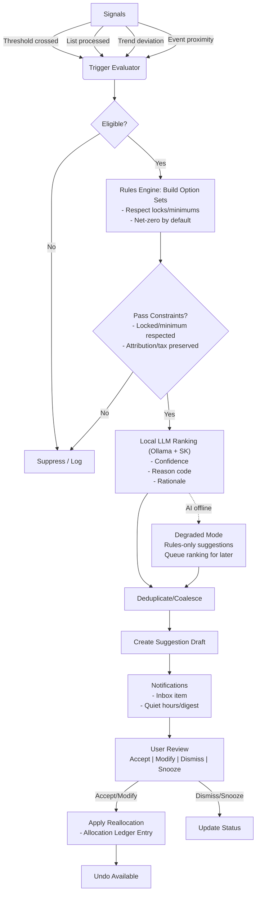

# Proactive Budget Adjustments — Suggestion Flow

```mermaid
flowchart TD
  A[Signals] -->|Threshold crossed| B(Trigger Evaluator)
  A -->|List processed| B
  A -->|Trend deviation| B
  A -->|Event proximity| B

  B --> C{Eligible?}
  C -- No --> Z[Suppress / Log]
  C -- Yes --> D["Rules Engine: Build Option Sets\n- Respect locks/minimums\n- Net-zero by default"]

  D --> P{Pass Constraints?\n- Locked/minimum respected\n- Attribution/tax preserved}
  P -- No --> Z
  P -- Yes --> E["Local LLM Ranking (Ollama + SK)\n- Confidence\n- Reason code\n- Rationale"]

  E --> F[Deduplicate/Coalesce]
  F --> G[Create Suggestion Draft]

  G --> H["Notifications\n- Inbox item\n- Quiet hours/digest"]
  H --> I["User Review\nAccept | Modify | Dismiss | Snooze"]
  I -->|Accept/Modify| J["Apply Reallocation\n- Allocation Ledger Entry"]
  I -->|Dismiss/Snooze| K[Update Status]
  J --> L[Undo Available]

  %% AI offline degraded path
  E -. AI offline .-> Q[Degraded Mode\nRules-only suggestions\nQueue ranking for later]
  Q --> F
```
