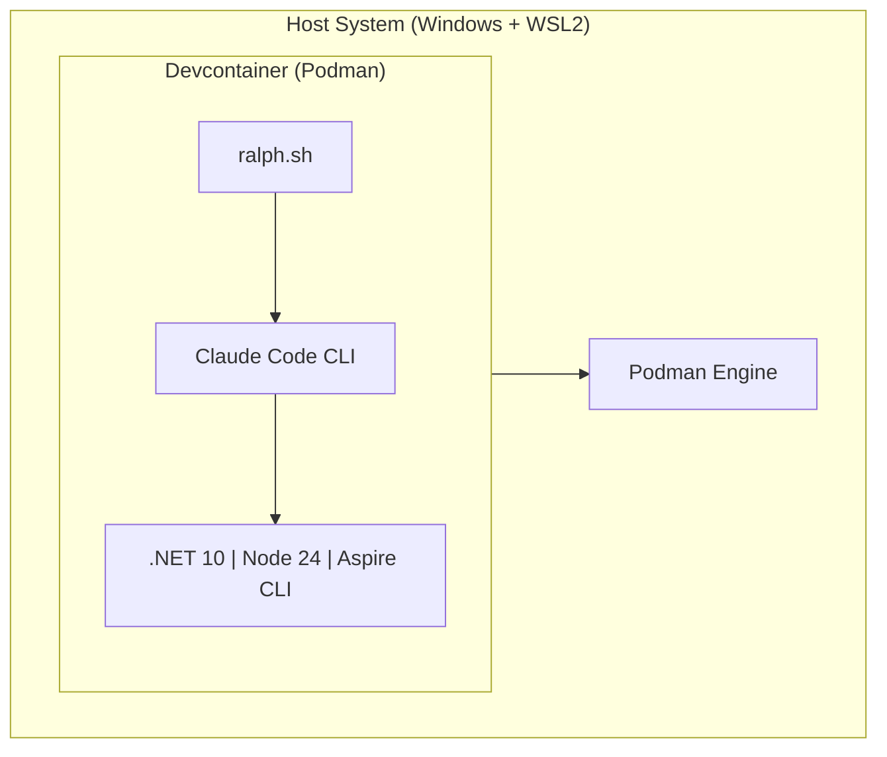
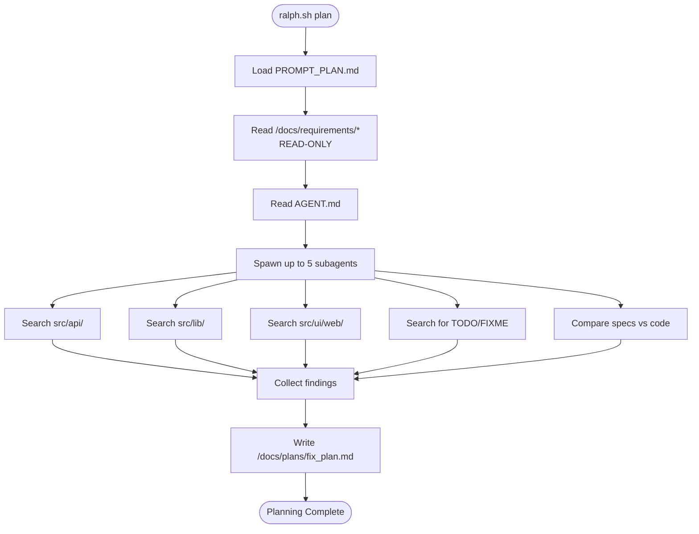
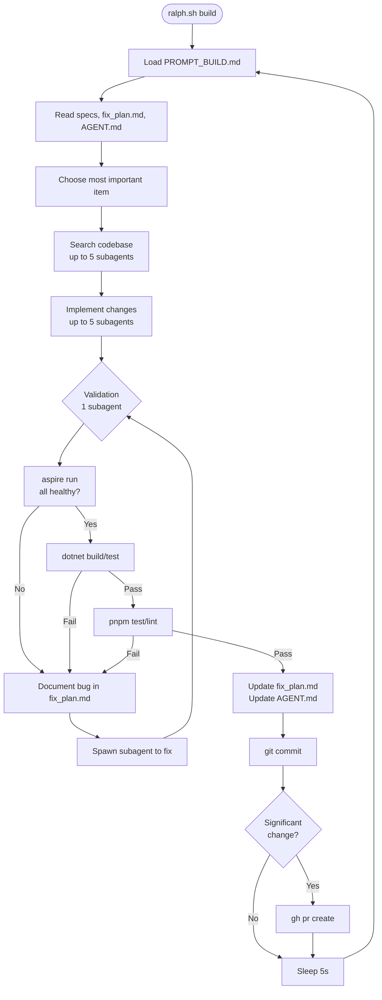
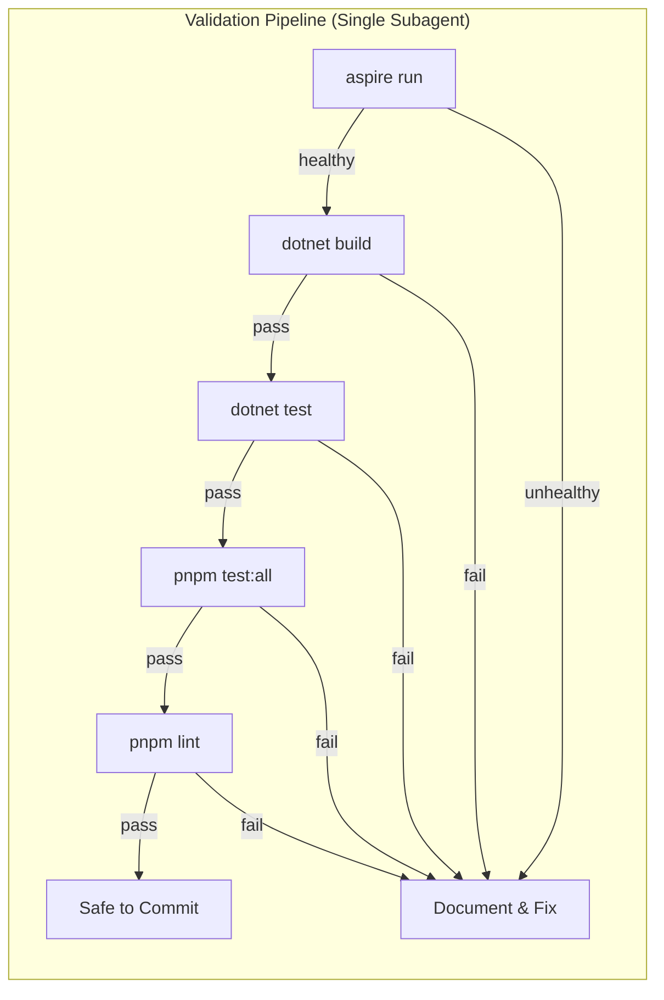
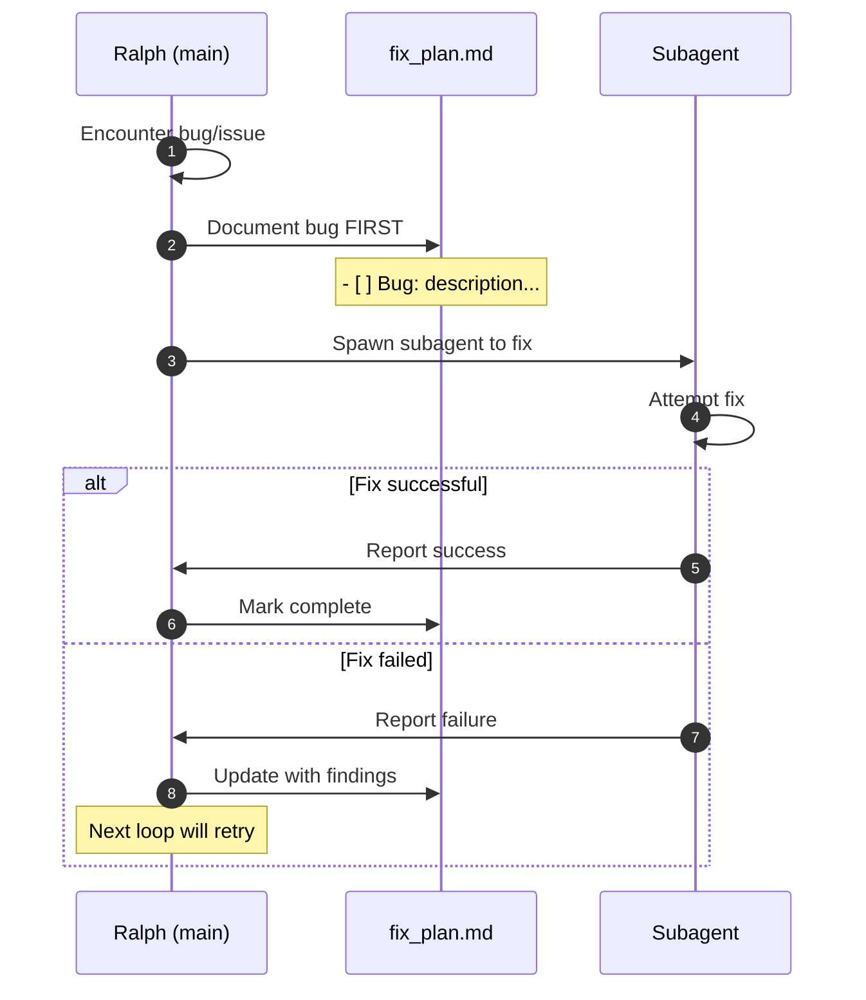
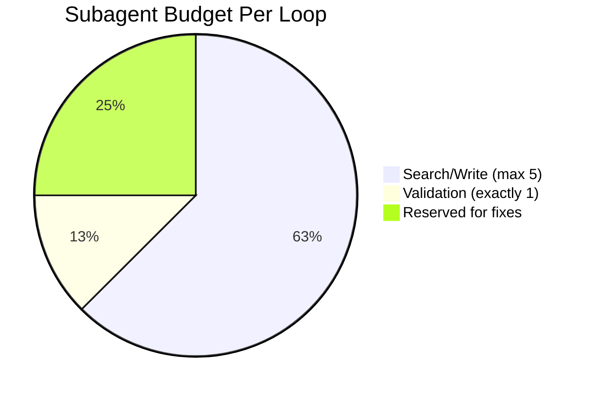
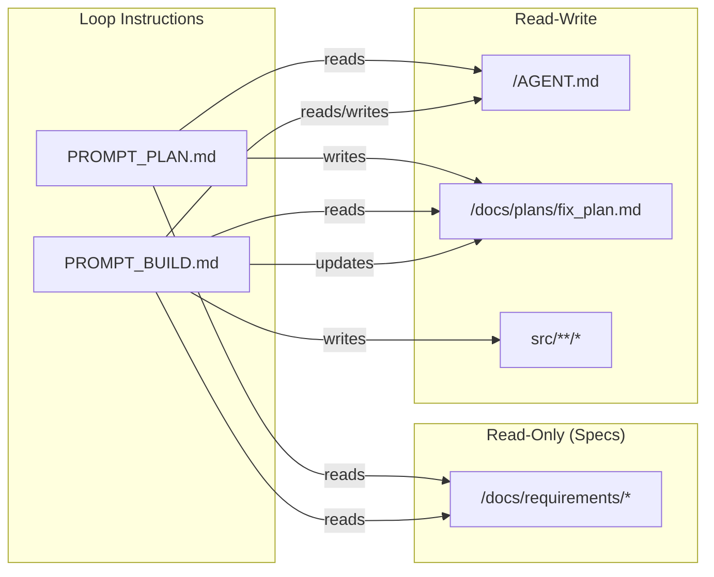

# Ralph Orchestration Loop - Flow Diagram

## High-Level Architecture

## Planning Loop Flow

## Building Loop Flow

## Validation Back Pressure

## Bug Handling Workflow

## Subagent Limits (Claude Pro)

## File Relationships

