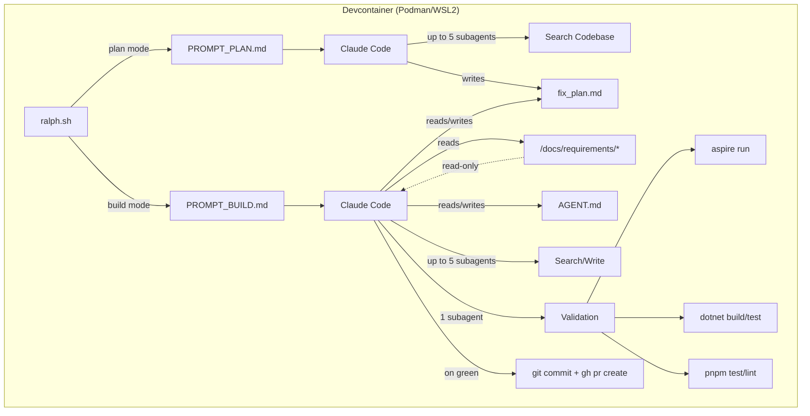
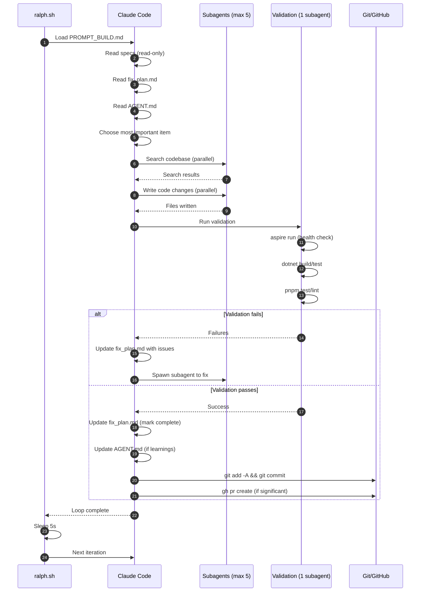

# Implementation Plan: Ralph Orchestration Loop

## Overview

Set up the infrastructure and workflow for running Claude Code in an autonomous loop (Ralph Wiggum technique) that implements features, fixes bugs, and evolves the Menlo codebase.

## Components

- Devcontainer: Podman-compatible sandbox with all required tooling
- AGENT.md: Minimal runtime context file (self-improving)
- PROMPT_PLAN.md: Planning loop instruction
- PROMPT_BUILD.md: Building loop instruction
- fix_plan.md: Living TODO list
- ralph.sh: Loop runner script

## Architecture



## Sequence: Build Loop



## File Artifacts

### /.devcontainer/devcontainer.json

```json
{
  "name": "Menlo Ralph",
  "build": {
    "dockerfile": "Dockerfile"
  },
  "containerUser": "vscode",
  "features": {
    "ghcr.io/devcontainers/features/dotnet:3": {
      "version": "10.0"
    },
    "ghcr.io/devcontainers/features/github-cli:1": {},
    "ghcr.io/devcontainers-extra/features/mise:1": {}
  },
  "customizations": {
    "vscode": {
      "extensions": [
        "ms-dotnettools.csdevkit",
        "ms-azuretools.vscode-dotnet-aspire",
        "angular.ng-template",
        "esbenp.prettier-vscode",
        "dbaeumer.vscode-eslint"
      ]
    }
  },
  "postCreateCommand": "bash .devcontainer/post-create.sh",
  "runArgs": [
    "--memory=16g",
    "--cpus=8"
  ],
  "remoteUser": "vscode",
  "containerEnv": {
    "DOTNET_CLI_TELEMETRY_OPTOUT": "1",
    "ASPIRE_ALLOW_UNSECURED_TRANSPORT": "true"
  }
}
```

### /.devcontainer/Dockerfile

```dockerfile
FROM mcr.microsoft.com/devcontainers/base:ubuntu

# Install dependencies for mise and builds
RUN apt-get update && apt-get install -y \
    curl \
    git \
    build-essential \
    && rm -rf /var/lib/apt/lists/*

# Note: .NET, GitHub CLI, and mise are installed via devcontainer features
# Node.js and pnpm are managed by mise (configured in repo's mise.toml)
```

### /.devcontainer/post-create.sh

```bash
#!/bin/bash
set -e

echo "=== Setting up Menlo Ralph devcontainer ==="

# Trust the workspace for mise
cd /workspaces/menlo
mise trust

# Install tools defined in mise.toml (Node.js + corepack for pnpm)
echo "Installing mise tools..."
mise install

# Enable corepack for pnpm (as defined in mise.toml hooks)
echo "Enabling corepack..."
corepack enable

# Install Aspire CLI (standalone, not dotnet tool)
echo "Installing Aspire CLI..."
curl -sSL https://aspire.dev/install.sh | bash

# Install Claude Code CLI globally
echo "Installing Claude Code CLI..."
npm install -g @anthropic-ai/claude-code

# Restore .NET dependencies
echo "Restoring .NET dependencies..."
dotnet restore Menlo.slnx

# Install frontend dependencies
echo "Installing frontend dependencies..."
pnpm --dir src/ui/web install

# Verify all tools are available
echo ""
echo "=== Verifying tools ==="
echo "dotnet: $(dotnet --version)"
echo "aspire: $(aspire --version)"
echo "node: $(node --version)"
echo "pnpm: $(pnpm --version)"
echo "gh: $(gh --version | head -1)"
echo "claude: $(claude --version 2>/dev/null || echo 'installed (run claude --help to verify)')"
echo "git: $(git --version)"
echo "mise: $(mise --version)"

echo ""
echo "=== Devcontainer ready for Ralph! ==="
echo "Run './ralph.sh plan' to generate initial fix_plan.md"
echo "Run './ralph.sh build' to start the build loop"
```

### /AGENT.md

```markdown
# Menlo - AGENT.md

## Quick Start
```bash
aspire run  # Starts full stack: PostgreSQL, API, Web UI
```
Wait for all resources to report healthy before proceeding.

## Validation Commands
```bash
# Must all pass before committing
aspire run                          # All resources healthy
dotnet build Menlo.slnx             # Build succeeds
dotnet test Menlo.slnx              # All tests pass
pnpm --dir src/ui/web test:all      # Frontend tests pass
pnpm --dir src/ui/web lint          # No lint errors
```

## Where Things Live
- **Backend**: `src/api/` (Menlo.Api, Menlo.AppHost) and `src/lib/` (Menlo.Lib, Menlo.AI)
- **Frontend**: `src/ui/web/projects/` (menlo-app, menlo-lib, data-access)
- **Specs**: `docs/requirements/` (READ-ONLY - do not modify)
- **Plan**: `docs/plans/fix_plan.md` (your working TODO list)

## Tech Stack
- .NET 10, C# 12, Entity Framework Core, PostgreSQL
- Angular 21, TypeScript, Vite, Vitest
- Aspire 13.1 for orchestration

## Learnings
<!-- Ralph updates this section with discoveries - keep brief -->
```

### /PROMPT_PLAN.md

```markdown
Study @docs/requirements/* to learn specifications (READ-ONLY, do not modify).
Study @AGENT.md for build/test commands.

Use up to 5 parallel subagents to study existing source code:
- src/api/ and src/lib/ for backend
- src/ui/web/projects/ for frontend

Compare implementation against specifications.

Create/update @docs/plans/fix_plan.md as a prioritized bullet list:
- Features not yet implemented (compare specs vs code)
- Search for: TODO, FIXME, NotImplementedException, placeholder
- Gaps between specifications and current implementation
- Failing tests or lint errors

Think hard. The plan must be actionable and prioritized by importance.
Do not modify any files in docs/requirements/ - they are read-only specifications.
```

### /PROMPT_BUILD.md

```markdown
Study @docs/requirements/* for specifications (READ-ONLY, do not modify).
Study @docs/plans/fix_plan.md for current plan.
Study @AGENT.md for build/test commands and learnings.

Your task: Choose the most important item from fix_plan.md and implement it.

## Rules

### Searching
- Search before assuming not implemented (use parallel subagents, max 5)
- Do not duplicate existing functionality

### Implementation
- Use up to 5 parallel subagents for searching and writing
- Use exactly 1 subagent for validation operations

### Bug Handling (CRITICAL)
- When you encounter ANY bug or issue: FIRST document it in @docs/plans/fix_plan.md
- THEN spin up a subagent to fix it
- Never attempt to fix without documenting first

### Validation (Back Pressure)
Run these in order, stop if any fail:
1. `aspire run` - verify ALL resources report healthy (PostgreSQL, API, Web)
2. `dotnet build Menlo.slnx` - must pass
3. `dotnet test Menlo.slnx` - must pass
4. `pnpm --dir src/ui/web test:all` - must pass
5. `pnpm --dir src/ui/web lint` - must pass

Do not proceed to git operations until ALL validation passes.

### Plan Maintenance
- Mark items complete in fix_plan.md when done (use subagent)
- When fix_plan.md exceeds 100 items, use a subagent to clean it up:
  - Remove completed items
  - Consolidate duplicate/related items
  - Re-prioritize remaining work

### Learnings
- Update @AGENT.md with useful learnings (keep brief, no status reports)
- Only add genuinely useful information for future loops

### Git (Only After All Validation Passes)
- `git add -A && git commit -m "descriptive message"`
- For significant changes: `gh pr create --title "..." --body "..."`
- Never push directly to main

### Specs Protection
- Files in @docs/requirements/* are READ-ONLY
- Implement TO the specs, never modify them
- If specs seem wrong, document the discrepancy in fix_plan.md for human review
```

### /docs/plans/fix_plan.md

```markdown
# Fix Plan

This file is maintained by Ralph. Run `ralph.sh plan` to regenerate.

## Priority Items

<!-- Items are added by the planning loop -->
<!-- Format: - [ ] Brief description of work needed -->

## Completed

<!-- Move items here when done, periodically clean up -->
```

### /ralph.sh

```bash
#!/bin/bash
set -e

MODE=${1:-build}

echo "Ralph Wiggum Loop - Mode: $MODE"
echo "================================"

if [ "$MODE" = "plan" ]; then
    echo "Running planning loop (single execution)..."
    claude --dangerously-skip-permissions < PROMPT_PLAN.md
    echo "Planning complete. Check docs/plans/fix_plan.md"
elif [ "$MODE" = "build" ]; then
    echo "Starting build loop (continuous)..."
    echo "Press Ctrl+C to stop"
    while :; do
        echo ""
        echo "=== New Loop Iteration ==="
        date
        claude --dangerously-skip-permissions < PROMPT_BUILD.md
        echo "Loop iteration complete. Sleeping 5s..."
        sleep 5
    done
else
    echo "Usage: ralph.sh [plan|build]"
    echo "  plan  - Generate/regenerate fix_plan.md (single run)"
    echo "  build - Continuous implementation loop"
    exit 1
fi
```

## Step-by-step Tasks

1. **Create devcontainer configuration**
   - Create `/.devcontainer/devcontainer.json`
   - Create `/.devcontainer/Dockerfile`
   - Create `/.devcontainer/post-create.sh`
   - Test container builds and starts with Podman

2. **Create AGENT.md**
   - Create `/AGENT.md` with minimal context
   - Include validation commands
   - Include location references
   - Leave learnings section empty for Ralph to populate

3. **Create prompt files**
   - Create `/PROMPT_PLAN.md` with conservative subagent limits (5)
   - Create `/PROMPT_BUILD.md` with full workflow rules
   - Ensure specs are marked as read-only in both

4. **Create plans directory and fix_plan.md**
   - Create `/docs/plans/` directory
   - Create `/docs/plans/fix_plan.md` with empty template

5. **Create loop runner script**
   - Create `/ralph.sh` with plan and build modes
   - Make executable (`chmod +x ralph.sh`)

6. **Validate setup**
   - Build devcontainer with Podman
   - Run `ralph.sh plan` to generate initial fix_plan.md
   - Run single iteration of `ralph.sh build` to verify workflow
   - Verify no modifications to `/docs/requirements/` files

7. **Documentation**
   - Update `/docs/README.md` to reference ralph-orchestration-loop requirement
   - Ensure all diagrams render correctly

## DoD (Definition of Done)

- [ ] Devcontainer starts with Podman and all tools available:
  - [ ] dotnet (CLI v10.0)
  - [ ] aspire (self-updating)
  - [ ] node (via mise)
  - [ ] pnpm (via corepack)
  - [ ] gh (GitHub CLI)
  - [ ] claude (Claude Code CLI)
  - [ ] git
  - [ ] mise
- [ ] VS Code extensions load: C# Dev Kit, Aspire, Angular, Prettier, ESLint
- [ ] AGENT.md exists and is under 100 lines
- [ ] PROMPT_PLAN.md generates valid fix_plan.md
- [ ] PROMPT_BUILD.md respects subagent limits (5 search/write, 1 validation)
- [ ] Bug handling workflow documented and enforced (document first, then fix)
- [ ] fix_plan.md cleanup triggers at 100 items
- [ ] Validation back pressure prevents bad commits
- [ ] Git operations create commits and PRs (not direct push)
- [ ] Specs in /docs/requirements/ remain unmodified
- [ ] ralph.sh runs both plan and build modes correctly

## Risks

- Claude Pro limits may be hit mid-loop; mitigate with conservative subagent counts
- Aspire health checks may be slow; consider timeout configuration
- fix_plan.md could grow unbounded; enforce cleanup at 100 items
- Ralph may attempt spec modifications; explicit read-only instructions in prompts

## Security

- Devcontainer isolates Ralph from host system
- Git operations limited to commits and PRs (no force push, no main push)
- No credentials stored in container; use gh auth login interactively
