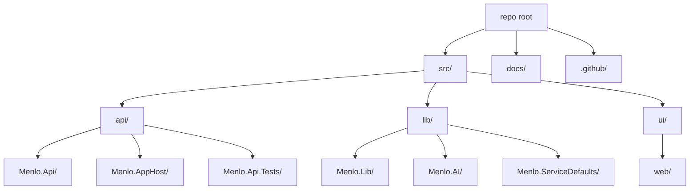

# Repo Structure (Scaffold)

Notes:

- Target framework: .NET 9 for all projects per architecture document.
- Central package management via Directory.Packages.props.
- API wired with ServiceDefaults and default health endpoints (development).
- Aspire AppHost references Menlo.Api as a distributed resource.
- Initial API smoke test verifies startup and basic endpoint.
