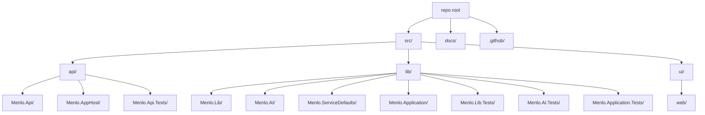

# Repo Structure (Scaffold)

```mermaid
flowchart TD
  A[repo root] --> B[src/]
  A --> C[docs/]
  A --> D[.github/]
  B --> B1[api/]
  B --> B2[lib/]
  B --> B3[ui/]
  B1 --> B11[Menlo.Api/]
  B1 --> B12[Menlo.AppHost/]
  B1 --> B13[Menlo.Api.Tests/]
  B2 --> B21[Menlo.Lib/]
  B2 --> B22[Menlo.AI/]
  B2 --> B23[Menlo.ServiceDefaults/]
  B2 --> B24[Menlo.Application/]
  B2 --> B25[Menlo.Lib.Tests/]
  B2 --> B26[Menlo.AI.Tests/]
  B2 --> B27[Menlo.Application.Tests/]
  B3 --> B31[web/]
```

Notes:

- Target framework: .NET 10 for all projects per architecture document.
- Central package management via Directory.Packages.props.
- API wired with ServiceDefaults and default health endpoints (development).
- Aspire AppHost references Menlo.Api as a distributed resource.
- `Menlo.Application` owns EF Core DbContext, migrations, interceptors, and slice context interfaces.
- `Menlo.Application.Tests` contains persistence integration tests using TestContainers.
- Initial API smoke test verifies startup and basic endpoint.
