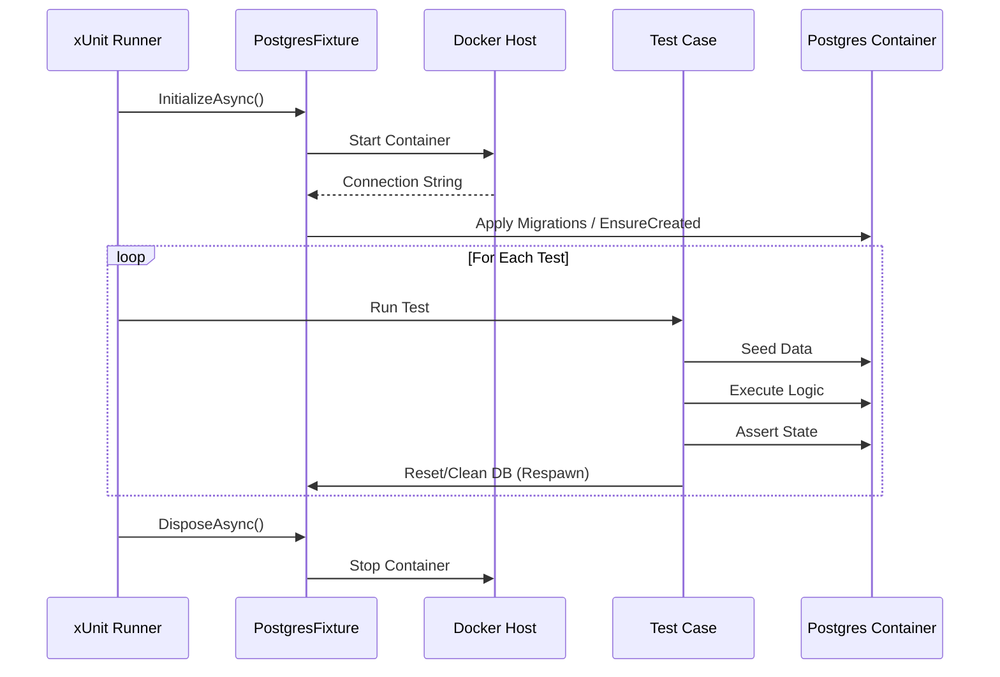

# Requirements: In-Memory to TestContainers Migration

## 1. Executive Summary

This document outlines the requirements for migrating the `Menlo.Api.Tests` project from using the `Microsoft.EntityFrameworkCore.InMemory` provider to `Testcontainers` with PostgreSQL. This initiative aims to align the codebase with project standards (as defined in `csharp.instructions.md`) and improve test reliability by verifying logic against the actual production database engine.

## 2. Problem Statement

The project currently uses the EF Core In-Memory database provider for several integration tests within `Menlo.Api.Tests`. While fast, the In-Memory provider is not a relational database and behaves differently from PostgreSQL in critical areas:
- It does not enforce relational constraints (foreign keys, unique constraints).
- It behaves differently regarding case sensitivity and string comparisons.
- It does not support transactions in the same way as a real relational database.
- It allows saving data that would throw exceptions in production.

Furthermore, the project's architectural guidelines explicitly mandate the use of `TestContainers` for database-dependent tests to ensure high fidelity validation.

## 3. Goals & Success Criteria

### 3.1. Goals
- Eliminate the dependency on `Microsoft.EntityFrameworkCore.InMemory`.
- Ensure strict adherence to testing standards.
- Increase confidence in the data access layer by testing against real PostgreSQL instances.

### 3.2. Success Criteria
- The `Microsoft.EntityFrameworkCore.InMemory` package is removed from `Menlo.Api.Tests.csproj`.
- All tests previously using `UseInMemoryDatabase` invoke a PostgreSQL container via usage of `Testcontainers`.
- All affected tests pass in the CI/CD pipeline.
- Test execution time remains within acceptable limits (typically < 2x increase for the affected suite).

## 4. Scope

### 4.1. In-Scope Components
The following files in `src/api/Menlo.Api.Tests/` require modification:
- **Project File**: `Menlo.Api.Tests.csproj` (Remove InMemory package, add Testcontainers.PostgreSql and Respawn).
- **Test Fixtures**: `Persistence/Fixtures/DbContextFixture.cs` (Replace setup logic with PostgreSQL container).
- **Configuration Tests**: `Persistence/Configurations/EntityConfigurationTests.cs` (Refactor `DbContextOptions`).
- **Interceptor Tests**:
    - `Persistence/Interceptors/AuditingInterceptorTests.cs`
    - `Persistence/Interceptors/SoftDeleteInterceptorTests.cs`

### 4.2. Out of Scope
- Migrating `TestWebApplicationFactory` (currently explicitly using SQLite In-Memory with known limitations).
- Modifying behavior of domain business logic (unless bugs are uncovered by the migration).

## 5. Requirements Specifications

### 5.1. Business Requirements

| ID | Title | Description | Priority |
| :--- | :--- | :--- | :--- |
| **BR-001** | Production-Parity Testing | Database tests MUST execute against the same database engine used in production (PostgreSQL). | Critical |
| **BR-002** | Standards Compliance | The solution MUST adhere to the "Testing" section of `csharp.instructions.md` regarding `TestContainers`. | High |
| **BR-003** | Dependency Clean-up | The `Microsoft.EntityFrameworkCore.InMemory` NuGet package MUST be completely removed from the solution (if not used by other projects). | Medium |
| **BR-004** | Central Package Management | The `Testcontainers` and `Testcontainers.PostgreSql` packages MUST be added to `Directory.Packages.props` for version management. | High |

### 5.2. Functional Requirements

| ID | Title | Description | Acceptance Criteria |
| :--- | :--- | :--- | :--- |
| **FR-001** | Container Integration | Integrate `Testcontainers.PostgreSql` into the `Menlo.Api.Tests` project. | AC-001: A fixture exists that manages the lifecycle of a PostgreSQL container. AC-002: Automation handles pulling and starting the container before tests run. |
| **FR-002** | DbContext Configuration | Update `DbContext` usage to connect to the containerized database connection string. | AC-003: `UseNpgsql` is used instead of `UseInMemoryDatabase`. AC-004: Migrations (or `EnsureCreated`) are applied to the containerized DB. |
| **FR-003** | Test Isolation | Ensure state from one test does not interfere with others. | AC-005: Each test runs in an isolated context (e.g., using `Respawn` to wipe tables or transactions that roll back). |

### 5.3. non-Functional Requirements

- **NFR-001 Performance**: Test suite execution time should not degrade significantly. Reuse containers where possible (using `IAsyncLifetime` and class fixtures).
- **NFR-002 Reliability**: Tests must not be flaky due to container startup timeouts.

## 6. Risks & Mitigations

| Risk | Impact | Mitigation |
| :--- | :--- | :--- |
| **Slower Test Execution** | Increased CI feedback time. | Use a shared container instance (Singleton/Collection fixture) and clean data between tests using `Respawn`. |
| **Constraint Violations** | Existing tests might rely on loose In-Memory behavior and fail against Postgres. | Fix the test data setup to valid, referentially integrity-compliant data. |
| **Docker Dependency** | Tests fail if Docker is not available. | Ensure DevContainers and CI runners have strictly properly configured Docker environments (already standard for this repo). |

## 7. Diagrams

### 7.1. Proposed Test Lifecycle

