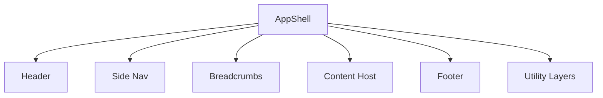

# Implementation Plan: UI Layout (Application Shell)

## Summary

Implement a resilient, accessible application shell in Angular using standalone components and signals. The shell hosts feature views via routing and remains static across navigation.

## Steps

1. Shell Composition

- Create a top-level `AppShellComponent` with sections: header, side nav, breadcrumbs, content host (router-outlet), footer, utility hosts (toasts/dialogs)
- Use Angular CDK for layout primitives where helpful

1. Navigation Model

- Define a typed nav config (feature groups, route links, feature toggle guards)
- Bind to router for active state highlighting

1. Responsiveness

- Apply responsive CSS (Flex/Grid); side nav collapses to drawer on small screens
- Header provides hamburger to toggle drawer

1. Accessibility

- Add ARIA roles: header=banner, nav=navigation, main=main, footer=contentinfo
- Provide a skip-to-content link targeting the main content host
- Manage focus on route changes (set focus to heading/main)

1. Observability

- Hook into router events and emit navigation telemetry
- Log shell init errors without PII

1. Testing

- Unit test shell composition and responsive toggling logic
- E2E/smoke test that routes render within the content host and a11y landmarks exist

## Diagram

## Risks

- Overly complex nav config; keep types simple and testable
- Accessibility regressions; add a11y checks in CI

## Definition of Done

- Shell sections implemented with responsive and a11y behaviours
- Navigation config supports feature toggles
- Telemetry hooks wired
- Tests pass for composition, responsiveness, and accessibility landmarks
