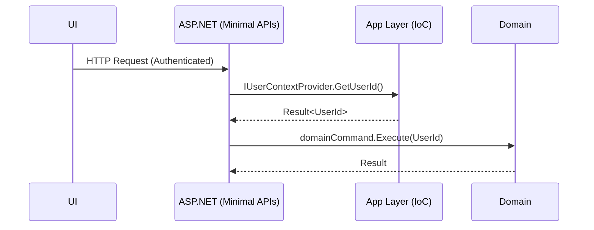

# Implementation Plan: UserId Resolution via IoC

## Summary

Implement an application-layer abstraction for current user context that resolves a strongly-typed UserId from ClaimsPrincipal via IoC. Keep the domain independent from ASP.NET and Claims.

## Steps

1. Abstractions

- Define IUserContextProvider (or IUserContext) exposing `Result<UserId, UserError> GetUserId()` (optionally async variant)

1. ASP.NET Adapter

- Implement UserContextProviderAspNet using IHttpContextAccessor to read ClaimsPrincipal
- Configurable claim precedence: `sub` → `oid` → `nameidentifier` → `appid` (daemon/app-only) → `azp` (authorised party fallback)
- Validate GUID; map to strongly-typed UserId

1. Error Handling

- Provide Result-based failures for missing/invalid claims with clear error codes
- Log minimal, non-PII diagnostics

1. Registration

- Wire via DI (e.g., AddUserContextProvider)
- Provide configuration options for claim precedence and custom claim types

1. Tests

- Unit tests for mapping precedence including `appid` (daemon) and invalid/missing claims
- Integration test using a fake ClaimsPrincipal and IHttpContextAccessor

## Diagram

## Risks

- Identity provider variability (non-GUID ids) → consider mapping hook if needed later
- Daemon contexts may lack user-centric claims; ensure `appid` handling is enabled

## Definition of Done

- Specs, test cases, and diagrams updated
- Abstraction and ASP.NET adapter implemented and registered
- Tests cover precedence (including `appid`) and error paths
