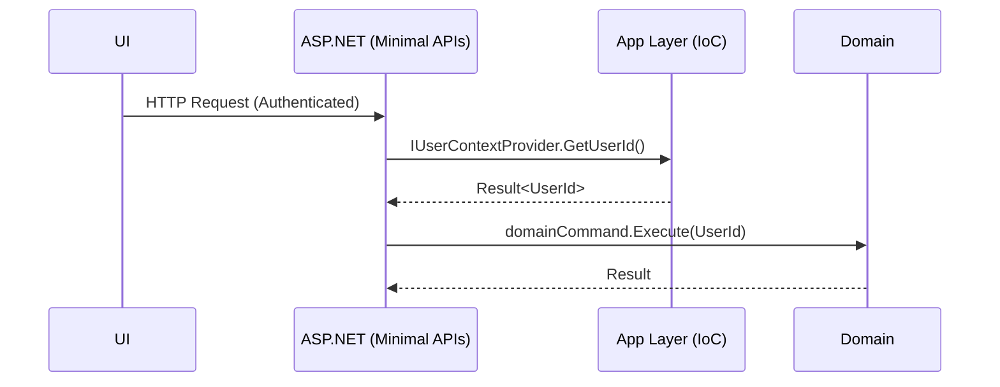

# Implementation Plan: UserId Resolution via IoC

## Summary

Implement an application-layer abstraction for current user context that resolves a strongly-typed UserId from ClaimsPrincipal via IoC. Keep the domain independent from ASP.NET and Claims.

## Steps

1. Abstractions (Contracts)

- Define `IUserContextProvider` (or `IUserContext`) exposing `Result<UserId, UserError> GetUserId()`.
- Define `UserError` as a small, strongly typed error with `Code` and `Message`.
- Keep contracts free of ASP.NET and Claims dependencies.

1. Options (Configuration)

- Add `UserIdResolutionOptions` with:
  - `ClaimPrecedence` (default: `["sub", "oid", "http://schemas.xmlsoap.org/ws/2005/05/identity/claims/nameidentifier", "appid", "azp"]`)
  - `StrictGuidOnly` (default: `true`)
- Support override via DI configuration or appsettings.

1. ASP.NET Adapter

- Implement `UserContextProviderAspNet` using `IHttpContextAccessor` to read `ClaimsPrincipal`.
- Iterate `ClaimPrecedence` in order; select the first present, non-empty value.
- Validate `Guid.TryParse(...)` (when `StrictGuidOnly=true`); map to strongly-typed `UserId`.
- Return `Result.Success(UserId)` on success; otherwise return failure with a clear code.

1. Error Handling

- Missing all supported claims → `user.missing-id-claim`.
- First matching claim with invalid GUID → `user.invalid-id-format`.
- No `HttpContext`/`User` available → `user.context-unavailable`.
- Log minimal, non-PII diagnostics (claim types considered, result code; never log raw claim values).

1. Registration (DI)

- Provide `IServiceCollection AddUserContextProvider(Action<UserIdResolutionOptions>? configure = null)`.
- Register `IUserContextProvider` → `UserContextProviderAspNet` as Scoped.
- Apply default `UserIdResolutionOptions` when not configured.

1. Tests (TDD)

- Unit tests for precedence and errors:
  - `sub` success
  - `oid` success fallback
  - `nameidentifier` success fallback
  - `appid` success (daemon/service principal)
  - `azp` success (optional fallback)
  - invalid GUID in first matching claim → `user.invalid-id-format`
  - missing all supported claims → `user.missing-id-claim`
  - null `HttpContext` or missing `User` → `user.context-unavailable`
- Integration test using a fake `ClaimsPrincipal` and `IHttpContextAccessor` within a minimal host.

## Diagram



## Risks

- Identity provider variability (non-GUID ids) → consider mapping hook if needed later
- Daemon contexts may lack user-centric claims; ensure `appid` handling is enabled

## Definition of Done

- Specs, test cases, and diagrams updated
- Abstraction and ASP.NET adapter implemented and registered
- Tests cover precedence (including `appid`) and error paths

## Error Codes

- `user.missing-id-claim`: No supported identity claims found.
- `user.invalid-id-format`: A candidate claim exists but value is not a valid GUID.
- `user.context-unavailable`: No `HttpContext` or `ClaimsPrincipal` available.

## Configuration Examples

Appsettings.json (optional):

```json
{
    "UserIdResolution": {
        "ClaimPrecedence": [
            "sub",
            "oid",
            "http://schemas.xmlsoap.org/ws/2005/05/identity/claims/nameidentifier",
            "appid",
            "azp"
        ],
        "StrictGuidOnly": true
    }
}
```

DI registration (illustrative C#):

```csharp
services.AddUserContextProvider(options =>
{
        options.ClaimPrecedence = new[]
        {
                "sub",
                "oid",
                System.Security.Claims.ClaimTypes.NameIdentifier,
                "appid",
                "azp"
        };
        options.StrictGuidOnly = true;
});
```

## Observability

- Emit a debug-level log with the outcome code (no PII) on failures.
- Consider a lightweight metric for resolution failures to aid diagnostics.

## Quality Gates

- Build: All projects compile with the new contracts and adapter.
- Lint/Analyzers: No references to `System.Security.Claims` in domain contracts.
- Tests: Unit + integration tests pass for success and failure paths.
